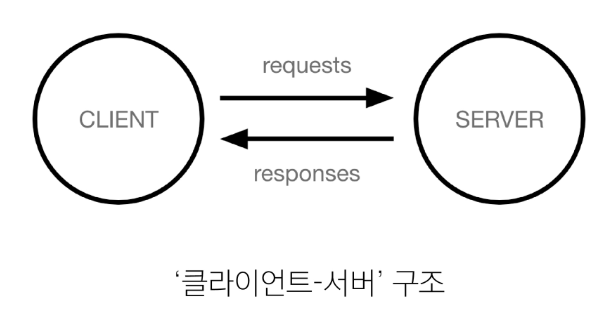

# Django01

날짜: 2024년 9월 13일

# Intro & Design Pattern

## Web Application

### 웹 동작 방식



### Client (클라이언트)

서비스를 **요청**하는 주체 (웹 사용자의 인터넷이 연결된 장치, 웹 브라우저)

### Server (서버)

클라이언트의 요청에 응답하는 주체 (웹 페이지, 앱을 저장하는 컴퓨터)

### 우리가 웹 페이지를 보게 되는 과정

1. 웹 브라우저(클라이언트)에서 ‘google.com’을 입력 후 엔터
2. 웹 브라우저는 인터넷에 연결된 전세계 어딘가에 있는 구글 컴퓨터(서버)에게 ‘메인 홈페이지.html’ 파일을 달라고 요청
3. 요청을 받은 구글 컴퓨터는 데이터베이스에서 ‘메인 홈페이지.html’ 파일을 찾아 응답
4. 웹 브라우저는 전달 받은  ‘메인 홈페이지.html’  파일을 사람이 볼 수 있도록 해석해주고 사용자는 구글의 메인 페이지를 보게 됨

## Frontend와 Backend

- Frontend(프론트엔드)
    - 사용자 인터페이스를 구성하고, 사용자가 애플리케이션과 상호작용할 수 있도록 함.
- Backend(백엔드)
    - 서버 측에서 동작하며, 클라이언트의 요청에 대한 처리와 데이터베이스와의 상호작용 등을 담당
        - 서버 언어(python, Java) 및 백엔드 프레임워크, 데이터베이스, API, 보안 등

## Framework

### 웹 서비스 개발에 필요한 것

- 웹 서비스 개발에 필요한 다양한 기술
    - 로그인/로그아웃, 회원관리, 데이터베이스, 보안 등
- 모든 기능을 직접 개발하기에는 현실적 어려움 존재
- 현대 웹 개발의 핵심
    - 잘 만들어진 도구를 효과적으로 활용하는 능력

### Web Framework

웹 어플리케이션을 빠르게 개발할 수 있도록 도와주는 도구

(개발에 필요한 기본 구조, 규칙, 라이브러리 등을 제공) 

## Django Framework

python 기반의 대표적인 웹 프레임워크

### 사용하는 이유

- 다양성
    - 파이썬 기반으로 웹, 모바일 앱 백엔드
- 확장성
- 보안
- 커뮤니티 지원

→ 대규모 트래픽 서비스에서도 안정적인 서비스 제공

(ex) spotify, Instagram, Dropbox 등

## 가상 환경

python 애플리케이션과 그에 따른 패키지들을 격리하여 관리할 수 있는 **독립적인 실행 환경**

### python 환경 구조 예시


### 1. 가상 환경 venv 생성

```bash
 $ python -m venv venv
```

- venv라는 이름의 가상환경생성
- 임의 이른으로 생성이 가능하나 관례적으로 venv 이름을 사용

### 2. 가상 환경 활성화

```bash
$ source venv/Scripts/activate
(venv)
```

- 활성화 명령어가 OS에 따라 다름에 주의
    - macOS/Linux : source venv/bin/activate

### 3. 환경에 설치된 패키지 목록 확인

```bash
SSAFY@2▒▒PC173 MINGW64 ~/Desktop/냠
$ pip list
Package    Version
---------- -------
pip        22.0.4
setuptools 58.1.0
WARNING: You are using pip version 22.0.4; however, version 24.2 is available.
You should consider upgrading via the 'C:\Users\SSAFY\Desktop\▒▒\venv\Scripts\python.exe -m pip install --upgrade pip' command.
(venv)
```

- 2개만 뜨는 걸 확인할 수 있음!
- (venv) 없으면 설치된 패키지 짱많음!

### 4. 설치된 패키지 목록 생성

- 현재 파이썬에 설치된 모든 패키지와 그 버전을 텍스트 파일로 저장
- requirements.txt를 만들면서 freeze 내용을 넣겠다!

### 패키지 목록이 필요한 이유

- 협업 시 가상환경 생성 후 프로젝트 설정할 때 프로젝트의 가상환경 상황을 알 수 없다.
    
    ⇒ 패키지 목록을 기록하는 게 필요함.
    
- venv 파일을 같이 올리는 것은?
    - 용량 커서 venv를 직접적으로 공유하지 않고 패키지 목록을 전송하는 것

### [번외] 패키지 목록 기반 설치

```bash
pip install -r requirements.txt
```

- 이거 하면 다 설치 가능

### 의존성 패키지 예시

- requests 설치 후 설치되는 패키지 목록 변화
    - 단순히 1개만 설치되는 것이 아님
- 한 소프트웨어 패키지가 다른 패키지의 기능이나 코드를 사용하기 때문에 그 패키지가 존재해야만 제대로 작동하는 관계
- 사용하려는 패키지가 설치되지 않았거나, 호환되는 버전이 아니면 오류가 발생하거나 예상치 못한 동작을 보일 수 있음

### 패키지 목록 파일 특징 및 주의사항

- 주요 특징
    - 가상환경의 패키지 목록을 쉽게 공유 가능
    - 프로젝트의 의존성을 명확히 문서화
    - 동일한 개발 환경을 다른 시스템에서 재현 가능
- 사용 시 주의 사항
    - 활성화된 가상환경에서 실행해야 정확한 패키지 목록 생성
    - 시스템 전역 패키지와 구분 필요

```bash
$ pip freeze > requirements.txt
```

### 가상환경 비활성화

```bash
$ deactivate
```

### 가상환경 주의사항 및 권장사항

1. 사용할 python 환경을 “On/Off”로 전환하는 개념
2. 가상환경은 “방”이 아니라 “도구 세트”
3. 프로젝트마다 별도의 가상환경 사용
4. 일반적으로 가상환경 폴더 venv는 관련된 프로젝트와 동일한 경로에 위치
5. 가상환경 venv는 gitignore에 작성되어 원격 저장소에 공유되지 않음

### 의존성 패키지 관리의 중요성

개발 환경에서는 각각의 프로젝트가 사용하는 패키지와 그 버전을 정확히 관리하는 것이 중요

## Django 프로젝트

### 생성 및 서버 실행

1. Django 프로젝트 생성
    
    ```bash
    $ Django-admin startproject firstpjt .
    ```
    
2. Django 서버 실행
    
    ```bash
    $ python manage.py runserver
    ```
    


- 아래 http~~ 서버 주소 ctrl 클릭


- ctrl + C 누르면 서버 꺼짐

## Django Design Pattern

### 디자인 패턴

소프트웨어 설계에서 발생하는 문제를 해결하기 위한 일반적인 해결책

(공통적인 문제를 해결하는 데 쓰이는 형식화 된 관행)

→ “애플리케이션 구조는 이렇게 구성하자” 라는 관행

### MVC 디자인 패턴

(Model, Veiw, Controller)

애플레케이션을 구조화 하는 대표적인 패턴

(데이터 & 사용자 인터페이스 % 비지니스 로직을 분리)

→ 시각적인 요소와 뒤에서 실행되는 로직을 서로 영향 없이, 독립적이고 쉽게 유지 보수 할 수 있는 애플리케이션을 만들기 위해

### MTV 디자인 패턴

(Model, Template, Veiw)

Django에서 애플리케이션을 구조화하는 패턴

(기존 MVC 패턴과 동일하나 단순히 명칭을 다르게 정의한 것)

## Project & App

### Django project

애플리케이션의 집합 (DB 설정, URL 연결, 전체 앱 설정 등을 처리)

### Django application

독립적으로 작동하는 기능 단위 모듈

(각자 특정한 기능을 담당하며 다른 앱들과 함께 하나의 프로젝트를 구성)

### 앱을 사용하기 위한 순서

1. 앱 생성
    - 앱의 이름은 ‘복수형’으로 지정하는 것을 권장
    
    ```bash
    $ python manage.py startapp articles
    ```
    
2. 앱 등록
    - 반드시 앱을 생성(1)한 후에 등록(2) 해야함
    - 등록 후 생성은 불가능
    
    
    
    - setting file 들어가면 이렇게 있음
    - 내장된 앱이 가장 마지막에 구동되게 우리가 customize 한 app(프로그래밍) 한 거가 저 코드 위로 올라가는게 해야함

### 프로젝트 구조


- settings.py
    - 프로젝트의 모든 설정을 관리
- [urls.py](http://urls.py)
    - 요청 들어오는 URL에 따라 이에 해당하는 적절한 views를 연결
- 위 두가지 이외에 파일은 수업 과정에서 수정할 일 없음
    - wsgi.py
        - 웹 서버와의 연결 관련 설정
    - manage.py
        - Django프로젝트와 다양한 방법으로 상호작용하는 커맨드의 유틸리티
        

### 앱 구조


- [admin.py](http://admin.py)
    - 관리자용 페이지 설정
- [models.py](http://models.py)
    - **DB**와 관련된 Model을 정의
    - MTV 패턴의 M
- [views.py](http://views.py) (로직을 매우 중요)
    - HTTP 요청을 처리하고 해당 요청에 대한 **응답을 반환**
    - (url, modelm template)과의 관계
    - MTV 패턴의 V
- 이 외의 것은 수업 과정에서 수정할 일 없음
    - [apps.py](http://apps.py)
        - 앱의 정보가 작성한 곳
    - test.py
        - 프로젝트 테스트 코드를 작성하는 곳

## 요청과 응답

### Django에서의 요청과 응답


- 흐름을 잘 기억하기!!


$ python [manage.py](http://manage.py/) runserver

- server 키고 url에 /admin/ 입력하기

### 1. URLs

- articles 패키지에서 views 모듈을 가져오는 것
- url 경로는 반드시 ‘/’ slash로 끝나야함

### 2. View

- view 함수가 정의되는 곳
- 특정 경로에 있는 template과 request 객체를 결합해 응답 객체를 반환
    - 모든 view 함수는 첫번째 인자로 요청 객체를 필수적으로 받음
    - 매개변수 이름이 request가 아니어도 되지만 그렇게 작성하지 않음

### 3. Template

1. articles 앱 폴더 안에 templates 폴더 생성
2. tempates 폴더 안에 articles 폴더 생성
3. articles 폴더 안에 템플릿 파일 생성

### 요청과 응답 과정 정리


## 참고

### Django 프로젝트 생성 전 루틴

1. 가상환경 생성
2. 가상환경 활성화
3. Django 설치
4. 패키지 목록 파일 생성 (패키지 설치마다 진행)
5. .gitignore 파일 생성 (첫 add 전)
6. git 저장소 생성 (git init)
7. Django 프로젝트 생성 

### LTS(Long-Tern Support)

- 프레임워크나 라이브러리 등의 소프트웨어에서 장기간 지원되는 안정적인 버전을 의미할 때 사용
- 기업이나 대규모 프로젝트에서는 소프트웨어 업그레이드에 많은 비용과 시간이 필요하기 때문에 안정적이고 장기간 지원되는 버전이 필요

### render 함수

- 주어진 템플릿을 주어진 컨텍스트 데이터와 결합하고 렌더링 된 텍스트와 함께 HttpResponse 응답 객체를 반환하는 함수
1. request
    - 응답을 생성하는 데 사용되는 요청 객체
2. template_name
    - 템플릿 이름의 경로
3. context
    - 템플릿에서 사용할 데이터 (딕셔너리 타입으로 작성)

```bash
render(request, template_name, context) 
```