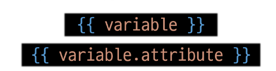

# Django02

날짜: 2024년 9월 19일

# Template System

## Django Template system

데이터 표현을 제어하면서, 표현과 관련된 부분을 담당

## Django Template Language (DTL)

Template에서 조건, 반복, 변수 등의 프로그래밍적 기능을 제공하는 시스템

### DTL Syntax

1. variable
    - render 함수의 세번째 인자로 딕셔너리 데이터를 사용
    - 딕셔너리 key에 해당하는 문자열이 template에서 사용 가능한 변수명이 됨
    - dot(’.’)을 사용하여 변수 속성에 접근할 수 있음
        
        
        
2. Filters
    - 표시할 변수를 수정할 때 사용 (변수 + | + 필터)
    - chained(연결)이 가능하며 일부 필터는 인자를 받기도 함
    - 약 60개의 built-in template filters를 제공
        
        
        
3. Tags
    - 반복 또는 논리를 수행하여 제어 흐름을 만듦
    - 일부 태그는 시작과 종료 태그가 필요
    - 약 24개의 built-in template tags를 제공
        
        
        
4. Comments
    - DTL에서의 주석
        
        
        

### 실습 코드

```bash
# url 파일
from django.contrib import admin
from django.urls import path
from articles import views

urlpatterns = [
    path("admin/", admin.site.urls),
    path('index/', views.index),
    path('dinner/', views.dinner),
    # path('search/', views.search),
    # path('throw/', views.throw),
    # path('catch/', views.catch),
]

# view 파일
def dinner(request):
    foods = ['국밥', '국수', '카레', '탕수육',]
    picked = random.choice(foods)
    context = {
        'foods' : foods,
        'picked' : picked,
    }
    return render(request, 'articles/dinner.html', context)
```

```html
<!DOCTYPE html>
<html lang="en">
<head>
  <meta charset="UTF-8">
  <meta name="viewport" content="width=device-width, initial-scale=1.0">
  <title>Document</title>
</head>
<body>
  <h1>dinner</h1>
  <p>{{ picked }} 메뉴는 {{picked | length}}글자 입니다.</p>
  <ul>
    
      <li>{{ food }}</li>
    
  </ul>

  
    <p>메뉴가 소진 되었습니다.</p>
  
    <p>아직 메뉴가 남았습니다.</p>
  
</body>
</html>
```

## 템플릿 상속

### 기본 템플릿 구조의 한계

- 만약 모든 템플릿에 bootstrap을 적용하려면?
    
    → CDN에 head/body를 적어야함
    

### 템플릿 상속 (Template inheritance)

페이지의 공통요소를 포함하고, 하위 템플릿이 재정의 할 수 있는 공간을 정의하는 기본 ‘skeleton’ 템플릿을 작성하여 상속 구조를 구축

### 상속 구조 만들기

[base.html]

```html
<!doctype html>
<html lang="en">
  <head>
    <meta charset="utf-8">
    <meta name="viewport" content="width=device-width, initial-scale=1">
    <title>Bootstrap demo</title>
    <link href="https://cdn.jsdelivr.net/npm/bootstrap@5.3.3/dist/css/bootstrap.min.css" rel="stylesheet" integrity="sha384-QWTKZyjpPEjISv5WaRU9OFeRpok6YctnYmDr5pNlyT2bRjXh0JMhjY6hW+ALEwIH" crossorigin="anonymous">
  </head>
  <body>
    
    
    <script src="https://cdn.jsdelivr.net/npm/bootstrap@5.3.3/dist/js/bootstrap.bundle.min.js" integrity="sha384-YvpcrYf0tY3lHB60NNkmXc5s9fDVZLESaAA55NDzOxhy9GkcIdslK1eN7N6jIeHz" crossorigin="anonymous"></script>
  </body>
</html>
```

[index.html_기존 실습 코드]

```html
<!DOCTYPE html>
<html lang="en">
<head>
  <meta charset="UTF-8">
  <meta name="viewport" content="width=device-width, initial-scale=1.0">
  <title>Document</title>
</head>
<body>
  <h1>안녕하세요!{{name}}</h1>
</body>
</html>
```

[index.html_상속 받을 때 코드]

```html



  <h1>Hello, {{name}}</h1>

```

[dinner.html_기존 실습 코드]

```html
<!DOCTYPE html>
<html lang="en">
<head>
  <meta charset="UTF-8">
  <meta name="viewport" content="width=device-width, initial-scale=1.0">
  <title>Document</title>
</head>
<body>
  <h1>dinner</h1>
  <p>{{ picked }} 메뉴는 {{picked | length}}글자 입니다.</p>
  <ul>
    
      <li>{{ food }}</li>
    
  </ul>

  
    <p>메뉴가 소진 되었습니다.</p>
  
    <p>아직 메뉴가 남았습니다.</p>
  
</body>
</html>
```

[dinner.html_상속 받았을 때 코드]

```html



  <h1>dinner</h1>
  <p>{{ picked }} 메뉴는 {{picked | length}}글자 입니다.</p>
  
  <ul>
    
      <li>{{ food }}</li>
    
  </ul>

  
    <p>메뉴가 소진 되었습니다.</p>
  
    <p>아직 메뉴가 남았습니다.</p>
  


```

## 상속 관련 DTL 태그

### ‘extends’ tag

자식 템플릿이 부모 템플릿을 확장한다는 것을 알림

- 반드시 자식 템플릿 최상단에 작성되어야 함 (2개 이상 사용 불가)

### ‘block’ tag

하위 템플릿에서 재정의 할 수 있는 블록을 정의

(상위 템플릿에 작성하며 하위 템플릿이 작성할 수 있는 공간을 지정하는 것)

# HTML form

### 데이터를 보내고 가져오기 (Sending and Retrieving form data)

HTML ‘form’ element를 통해 사용자와 애플리케이션 간의 상호작용 이해하기

## 요청과 응답

HTML ‘form’은 HTTP 요청을 서버에 보내는 가장 편리한 방법


### ‘form’ element

사용자로부터 할당된 데이터를 서버로 전송

→ 웹에서 사용자 정보를 입력하는 여러 방식 (text, password, checkbox 등)을 제공

### fake Naver 실습

```html



  <form action="https://www.naver.com/search.naver/" method="GET">
    <label for="message">검색어</label>
    <input type="text" name="query" id="message">
    <input type="submit" value="submit">
  </form>

```

### action & method

- action
    - 입력 데이터가 전송될 URL을 지정(목적지)
    - 만약 이 속성을 지정하지 않으면 데이터는 현재 form이 있는 페이지의 URL로 보내짐
- method
    - 데이터를 어떤 방식으로 보낼 것인지 정의
    - 데이터의 HTTP request methods (GET, POST)를 지정

### input element

사용자의 데이터를 입력 받을 수 있는요소

(type 속성 값에 따라 다양한 유형의 입력 데이터를 받음)

→ 핵심 속성 - ‘name’

- ‘name’ attribute
    - input의 핵심 속성
    - 사용자가 입력한 데이터에 붙이는 이름(key)

### Query String Parameters

- 사용자의 입력 데이터를 URL 주소에 파라미터를 통해 서버를 보내는 방법
- 문자열은 앰퍼샌드(’&’)로 연결된 key = value 쌍으로 구성되며, 기본 URL과는 물음표(’?’)로 구분됨
- 예
    - [https://search.naver.com/search.naver?where=nexearch&sm=top_sug.pre&fbm=0&acr=1&acq=ㅇ&qdt=0&ie=utf8&query=ㅇ](https://search.naver.com/search.naver?where=nexearch&sm=top_sug.pre&fbm=0&acr=1&acq=%E3%85%87&qdt=0&ie=utf8&query=%E3%85%87)

## form 활용

### 1. throw 로직 작성

```html
# url 파일
path('throw/', views.throw),

# view 파일
def throw(request) :
    return render(request, 'articles/throw.html')
```

```html
# html 파일



  <h1>Throw</h1>
  <form action="/catch/" method="GET">
    <input type="text" name="message" id="message">
    <input type="submit">
  </form>

```

## HTTP request 객체

form으로 전송한 데이터 뿐만 아니라 Django로 들어오는 모든 요청 관련 데이터가 담겨 있음 (view 함수의 첫번째 인자로 전달됨)

### request 객체에서 form 데이터 추출

```html
request.GET.get('message')
# get은 딕셔너리 메서드를 통한 키의 값 조회
# GET은 form 데이터 추출
```

### 2. catch 로직 설계

# Django URLs

## URL dispatcher (운항 관리자, 분배기)

URL 패턴을 정의하고 해당 패턴이 일치하는 요청을 처리할 view 함수를 연결(매핑)

## Variable Routing

URL 일부에 변수를 포함시키는 것 (변수는 view 함수의 인자로 전달 할 수 있음)

### Variable routing 작성법

<path_converter: variable_name>

```html
# url 파일
path('hello/<str:name>/', views.greeting),

# view 파일
def greeting(request, name) :
    context = {
        'name' : name,
    }

    return render(request, 'articles/greeting.html', context)
```

```html



  <h1>Greeting</h1>
  <h3>{{name}}님 안녕하세요 !</h3>


```

### path converters

URL 변수의 타입을 지정 (str, int 등 5가지 타입 지원)

## APP과 URL

### App URL mapping

각 앱에 URL을 정의하는 것

→ 프로젝트와 각 앱이 URL을 나누어 관리를 편하게 하기 위함

⇒ URL을 각자 app에서 관리하자

### 기존 서버 구조


### 변경된 url 구조


### include()

프로젝트 내부 앱들의 URL을 참조할 수 있도록 매핑하는 함수

→ URL의 일치하는 부분까지 잘라내고, 남은 문자열 부분은 후속 처리를 위해 include된 URL로 전달

```python
# url 파일
urlpatterns = [
    path("admin/", admin.site.urls),
    path('articles/', include('articles.urls')),
    path('page/', include('pages.urls')),
]
```

# URL 이름 지정

## Naming URL patterns

URL에 이름을 지정하는 것

(path 함수의 name 인자를 정의해서 사용)

### 실습

```html
# html 파일



  <h1>Hello, {{name}}</h1>
  <a href="{# url 'dinner'}">dinner</a>
  <a href="{# url 'search'}">search</a>
  <a href="{# url 'throw'}">throw</a>


```

```python
# url 파일
urlpatterns = [
    path("admin/", admin.site.urls, name='index'),
    path('index/', views.index, name='index'),
    path('dinner/', views.dinner, name = 'search'),
    path('search/', views.search, name = 'throw'),
    path('throw/', views.throw, name = 'thrwo'),
    path('catch/', views.catch, name = 'catch'),
    path('hello/<str:name>/', views.greeting, name = 'greeting'),
]

```

## DTL URL tag

### ‘url’ tag

주어진 URL 패턴의 이름과 일치하는 절대 경로 주소를 반환

```html

```

## app_name 속성

이름에 성(key)를 붙이자

```html
# pages/urls.py
app_name = 'pages'
urlpatterns = [
    path('index/', views.index, name = 'index'),
]
# articles/urls.py
app_name = 'articles'
urlpatterns = [
    path("admin/", admin.site.urls, name='index'),
    path('index/', views.index, name='index'),
```

### URL tag의 최종 변화

마지막으로 url 태그가 사용하는 모든곳의 표기 변경하기

```html

```