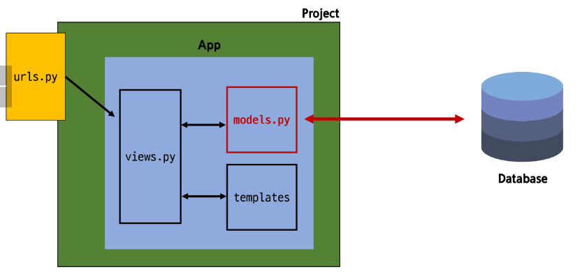

# Django03

날짜: 2024년 9월 20일

# Model

## model class

### Model을 통한 DB(데이터베이스) 관리



## Django Model

DB 테이블을 정의하고 데이터를 조작할 수 있는 기능들을 제공

→ 테이블 구조를 설계하는 ‘청사진(bluepirnt)’

### model 클래스 작성

```python
from django.db import models

# Create your models here.
# 클래스 안에 상위 클래스 필요
# model을 상속 받자나! 쟤가 엄청 코딩 되어있을거야!(약 2000줄)
class Article(models.Model):
    title = models.CharField(max_length=10)  # 클래스임 (대문자자나)
    content = models.TextField()             # 이것도 클래스
# 이 세줄로 기능이 되는거 보면 Model 클래스에 많은게 작성 되어 있을 것임
```

작성한 모델 클래스는 최종적으로 DB에 다음과 같은 **테이블 구조를 만듦**


- id 필드는 Django가 자동 생성
- django.db.models 모듈의 Model이라는 부모 클래스를 상속 받음
- Model은 model에 관련된 모든 코드가 이미 작성 되어 있는 클래스
    
    → 개발자는 가장 중요한 테이블 구조를 어떻게 설계할지에 대한 코드만 작성하도록 하기 위한 것 (상속을 활용한 프레임워크의 기능 제공) 
    
- 클래스 변수명
    - 테이블의 각 “필드(열) 이름”
- Model Field
    - 데이터베이스 테이블의 열(column)을 나타내는 중요한 구성 요소
    - “데이터의 유형”과 “제약 조건”을 정의

# Model Field

DB 테이블의 필드(열)을 정의하며, 해당 필드에 저장되는 데이터 타입(Feild type)과 제약조건(Field option)을 정의

## Field Types

데이터 베이스에 저장될 “데이터의 종류”를 정의 (models 모듈의 클래스로 정의되어 있음)

- 문자열 필드
    - CharField, TextField
- 숫자 필드
    - IntegerField, FloatField
- 날짜/시간 필드
    - DataField, TimeField, DataTimeField
- 파일 관련 필드
    - FileField, ImageField

### CharField()

제한된 길이의 문자열을 저장 (필드의 최대 길이를 결정하는 max_length는 필수 옵션) → 제목 쓸 때 자주 씀!

### TextField()

길이 제한이 없는 대용량 텍스트를 저장 (무한대는 아니며 사용하는 시스템에 따라 달라짐) 

## Field Options

필드의 ‘동작’과 ‘제약 조건’을 정의

- null
    - 데이터베이스에서 NULL 값을 허용할지 여부를 결정 (기본값 : False)
- blank
    - form에서 빈 값을 허용할지 여부를 결정 (기본값 : False)
- default
    - 필드의 기본값을 설정

### 제약 조건 (constraint)

특정 규칙을 강제하기 위해 테이블의 열이나 행에 적용되는 규칙이나 제한 사항

→ ex) 숫자만 저장되도록, 문자가 100자 까지만 저장되도록 하는 등

# Migrations

model 클래스의 변경사항(필드 생성, 수정 삭제 등)을 DB에 최종 반영하는 방법


- makemigration 과정은 django가 알아서 해줌!

## Migration 핵심 명령어 2가지

```html
# 최종 설계도 만들기
$ python manage.py makemigrations
Migrations for 'articles':
  articles\migrations\0001_initial.py
    - Create model Article
(venv) 
```

- model class를 기반으로 최종 설계도(migration) 작성

```python
# 0001_initial.py
# Generated by Django 4.2.16 on 2024-09-20 00:43

from django.db import migrations, models

class Migration(migrations.Migration):

    initial = True

    dependencies = [
    ]

    operations = [
        migrations.CreateModel(
            name='Article',
            fields=[
                ('id', models.BigAutoField(auto_created=True, primary_key=True, serialize=False, verbose_name='ID')),
                ('title', models.CharField(max_length=10)),
                ('content', models.TextField()),
            ],
        ),
    ]

# 3가지 필드가 생성된 것을 확인할 수 있음 (id 자동생성)
```

```html
$ python manage.py migrate
Operations to perform:
  Apply all migrations: admin, articles, auth, contenttypes, sessions
Running migrations:
  Applying contenttypes.0001_initial... OK
  Applying auth.0001_initial... OK
  Applying admin.0001_initial... OK
  Applying admin.0002_logentry_remove_auto_add... OK
  Applying admin.0003_logentry_add_action_flag_choices... OK
  Applying articles.0001_initial... OK    # 우리가 만든 것
  Applying contenttypes.0002_remove_content_type_name... OK
  Applying auth.0002_alter_permission_name_max_length... OK
  Applying auth.0003_alter_user_email_max_length... OK
  Applying auth.0004_alter_user_username_opts... OK
  Applying auth.0005_alter_user_last_login_null... OK
  Applying auth.0006_require_contenttypes_0002... OK
  Applying auth.0007_alter_validators_add_error_messages... OK
  Applying auth.0008_alter_user_username_max_length... OK
  Applying auth.0009_alter_user_last_name_max_length... OK
  Applying auth.0010_alter_group_name_max_length... OK
  Applying auth.0011_update_proxy_permissions... OK
  Applying auth.0012_alter_user_first_name_max_length... OK
  Applying sessions.0001_initial... OK
  # 나는 하나만 만들었는데 설계도가 완전 많이 생김
  # settig.py 들어가면 INSTALLED_APPS에 설계도가 있음
  # 처음에는 이것들이 다 migrate 되서 많아짐!
  # 내가 만든 것이 제대로 있는지만 잘 확인하기!
```

- 최종 설계도를 DB에 전달하여 반영

# 추가 Migrations

이미 생성된 테이블에 필드를 추가해야한다면? 두 개가 더 필요! (날짜,시간)


## 추가 모델 필드 작성

```python
from django.db import models

# Create your models here.
# 클래스 안에 상위 클래스 필요
# model을 상속 받자나! 쟤가 엄청 코딩 되어있을거야!
class Article(models.Model):
    title = models.CharField(max_length=10)  # 클래스임 (대문자자나)
    content = models.TextField()             # 이것도 클래스임
    created_at = models.DateTimeField(auto_now_add=True)    #  작성일
    updated_at = models.DateTimeField(auto_now=True)    # 수정일
```

### DataTimeField의 필드 옵션 (optional)

**시험 반드시**

- auto_now
    - 데이터가 저장될 때마다 자동으로 현재 날짜 시간을 저장
- auto_now_add
    - 데이터가 처음 생성될 때만 자동으로 현재 날짜 시간을 저장

```html
**$ python manage.py makemigrations
It is impossible to add the field 'created_at' with 'auto_now_add=True' to article without providing a default. This is because the database needs something to populate existing rows.
 1) Provide a one-off default now which will be set on all existing rows
 2) Quit and manually define a default value in models.py.
Select an option:
# 기본 값 없이는 추가 못한다는 안내문. (빈 값으로 새롭게 못 만든다.)
# 2가지 선택권
# 2. defualt 값을 정해서 와
# 1. 나랑 지금 부터 떠나보자.

Select an option: 1
Please enter the default value as valid Python.
Accept the default 'timezone.now' by pressing 'Enter' or provide another value.
The datetime and django.utils.timezone modules are available, so it is possible to provide e.g. timezone.now as a value.
Type 'exit' to exit this prompt
[default: timezone.now] >>>
Migrations for 'articles':
  articles\migrations\0002_article_created_at_article_updated_at.py
    - Add field created_at to article
    - Add field updated_at to article**
```

```python
# 0002_article_created_at_articles_article.py
# Generated by Django 4.2.16 on 2024-09-20 01:23

from django.db import migrations, models
import django.utils.timezone

class Migration(migrations.Migration):

    dependencies = [
        ('articles', '0001_initial'),    # 0001에 의존 중
    ]
		# 2개의 필드만 추가됨!
		# AddFields
		# 괜히 앞에 0001.py 지우지 마세요!
    operations = [
        migrations.AddField(
            model_name='article',
            name='created_at',
            field=models.DateTimeField(auto_now_add=True, default=django.utils.timezone.now),
            preserve_default=False,
        ),
        migrations.AddField(
            model_name='article',
            name='updated_at',
            field=models.DateTimeField(auto_now=True),
        ),
    ]
```

- 이미 기존 테이블이 존재하기 때문에 필드를 추가 할 때 필드이 기본 값 설정이 필요
- 1번은 현재 대화를 유지하면서 직접 기본 값을 입력하는 방법
- 2번은 현재 대화에서 나간 후 [model.py](http://model.py)에 기본 값 관련 설정을 하는 방법
- 파일 번호가 최신 버전을 의미하는 것은 아님
- 생긴 순서대로 생김

```html
# 찐 최종 생성
$ python manage.py migrate
Operations to perform:
  Apply all migrations: admin, articles, auth, contenttypes, sessions
Running migrations:
  Applying articles.0002_article_created_at_article_updated_at... OK
(venv) 
```

### 정리하고 넘어갈게요

model class에 변경사항(1)이 생겼다면, 반드시 새로운 설계도를 생성(2)하고, 이를 DB에 반영(3)해야 한다.

1. model class 변경 → 2. makemigrations → 3. migrate

# Admin site

## Automatic admin interface

Django가 추가 설치 및 설정 없이 자동으로 제공하는 관리자 인터페이스

→ 데이터 확인 및 테스트 등을 진행하는데 매우 유용

### 1. admin 계정 생성

- email은 선택사항이기 때문에 입력하지 않고 진행 간으
- 비밀번호 입력 시 보안상 터미널에 출력되지 않으니 무시하고 입력 이어가기

```html
$ python manage.py createsuperuser
Username (leave blank to use 'ssafy'): admin
Email address: 
Password: 
Password (again):
This password is too short. It must contain at least 8 characters.
This password is too common.
This password is entirely numeric.
Bypass password validation and create user anyway? [y/N]: y
Superuser created successfully.
(venv) 
```

- DB의 auth_user 파일에 생성된 것을 확인할 수 있음.

### 2. DB에 생성된 admin 계정 확인

### 3. admin에 모델 클래스 등록

[admin.py](http://admin.py)에 작성한 모델 클래스를 등록해야만 admit site에서 확인 가능

```python
# articles/admin.py
from django.contrib import admin
from .models import Article

# Register your models here.
# admin 사이트에 등록한다.
# register()은 메서드
admin.site.register(Article)
```

# 참고

## 데이터베이스 초기화

1. migration 파일 삭제
2. db.sqlite3 파일 삭제


- 제발 빨간색만 지우세요! 다른 거 건들지 마세요…

## Migration 관련

### Migrations 기타 명령어

```html
$ python manage.py showmigrations
admin
 [X] 0001_initial
 [X] 0002_logentry_remove_auto_add
 [X] 0003_logentry_add_action_flag_choices
articles
 [X] 0001_initial
 [X] 0002_article_created_at_article_updated_at
auth
 [X] 0001_initial
 [X] 0002_alter_permission_name_max_length
 [X] 0003_alter_user_email_max_length
 [X] 0004_alter_user_username_opts
 [X] 0005_alter_user_last_login_null
 [X] 0006_require_contenttypes_0002
 [X] 0007_alter_validators_add_error_messages
 [X] 0008_alter_user_username_max_length
 [X] 0009_alter_user_last_name_max_length
 [X] 0010_alter_group_name_max_length
 [X] 0011_update_proxy_permissions
 [X] 0012_alter_user_first_name_max_length
contenttypes
 [X] 0001_initial
 [X] 0002_remove_content_type_name
sessions
 [X] 0001_initial
```

- migrations 파일들이 migrate 됐는지 안됐는지 여부를 확인하는 명령어
- [X] 표시가 있으면 migrate가 완료되었음을 의미

```html
$ python manage.py sqlmigrate articles 0001
BEGIN;
--
-- Create model Article
--
CREATE TABLE "articles_article" ("id" integer NOT NULL PRIMARY KEY AUTOINCREMENT, "title" varchar(10) NOT NULL, "content" text NOT NULL);
COMMIT;
```

- 해당 migrations 파일이 SQL 언어(DB에서 사용하는 언어)로 어떻게 번역 되어 DB에 전달되는지 확인하는 명령어