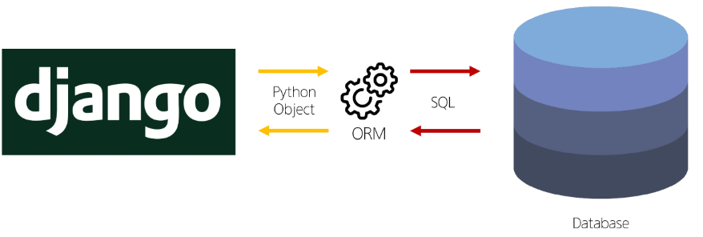

# Django_04

날짜: 2024년 9월 23일

# ORM(Object-Relational-Mapping)

객체 지향 프로그래밍 언어를 사용하여 호환되지 않는 유형의 시스템 간에 데이터를 변환하는 기술

## ORM의 역할

Django와 DB간에 사용하는 언어가 다르기 때문에 소통 불가



Django에 내장된 ORM이 중간에서 이를 해석

# QuerySet API

ORM에서 데이터를 검색, 필터링, 정렬 및 그룹화 하는데 사용하는 도구

→ API를 사용하여 SQL이 아닌 Python 코드로 데이터를 처리


## Query API 구문

```jsx
Article.object.all()
```

→ 순서대로 Model class, Manager, Queryset API 역할


### Query

- 데이터베이스에 특정한 데이터를 보여 달라는 요청
- “쿼리문을 작성한다”
    - 원하는 데이터를 얻기 위해 데이터베이스에 요청을 보낼 코드를 작성한다.
- 파이썬으로 작성한 코드가 ORM에 의해 SQL로 변환되어 데이터베이스에 전달되며, 데이터베이스의 응답 데이터를 ORM이 QuerySet이라는 자료 형태로 변환하여 우리에게 전달
- 데이터베이스에게서 전달 받은 객체 목록(데이터 모음)
    - 순회가 가능한 데이터로써 1개 이상의 데이터를 불러와 사용할 수 있음
- Django ORM을 통해 만들어진 자료형
- 단, 데이터베이스가 단일한 객체를 반환 할 때는 QuerySet이 아닌 모델(Class)의 인스턴스로 반환됨

# Queryset API

python의 모델 클래스와 인스턴스를 활용해 DB에 데이터를 저장, 조회, 수정, 삭제하는 것

## CRUD

소프트웨어가 가지는 기본적이 데이터 처리 기능

- Create (저장)
- Read (조회)
- Update (갱신)
- Delete (삭제)

## 실습

1. 외부 라이브러리 설치 및 설정

```bash
$ pip install ipython
```

```bash
$ pip install django-extensions
```

1. migration

```bash
$ python manage.py migrate
```

- DB는 원격 저장소에 저장되지 않음(.gitignore)
1. Django shell 실행

```bash
$ python manage.py shell_plus
```

- Django shell
    - Django 환경 안에서 실행되는 python shell
    - 입력하는 QuerySet API 구문이 Django 프로젝트에 영향을 미침

### Create

[데이터 객체를 만드는(생성하는) 3가지 방법]

1. Class 먼저 생성 후 Instance 설정하기

```bash
In [1]: article = Article()

In [2]: article
Out[2]: <Article: Article object (None)>

In [3]: article.title = 'first'

In [4]: article.content = 'django!'

In [5]: article.title
Out[5]: 'first'

In [6]: article.con
---------------------------------------------------------------------------
AttributeError                            Traceback (most recent call last)
Cell In[6], line 1
----> 1 article.con

AttributeError: 'Article' object has no attribute 'con'

In [7]: article.content
Out[7]: 'django!'

In [8]: Article.objects.all()
Out[8]: <QuerySet []>      # 빈 Queryset -> 저장을 해야함

In [9]: article.save()     # 저장하기

In [10]: article
Out[10]: <Article: Article object (1)>    # primary key가 생김(ID)

In [11]: article.id
Out[11]: 1                  # id를 확인할 수 있음

In [12]: article.pk
Out[12]: 1                  # .pk로 확인하기 (id X)

In [13]: Article.objects.all()
Out[13]: <QuerySet [<Article: Article object (1)>]>  # 대괄호 안에 객체 존재

```

1. 생성 시 초기 값 제공
    - save 메서드를 호출해야 비로소 DB에 데이터가 저장됨
    - 테이블에 한 행이 쓰여진 것

```bash
In [14]: article = Article(title='second',content = 'django!')

In [15]: article
Out[15]: <Article: Article object (None)>    # id 값이 없음

In [16]: article.id

In [17]: article.title
Out[17]: 'second'

In [18]: article.content
Out[18]: 'django!'

In [19]: article.save()

In [20]: article
Out[20]: <Article: Article object (2)>

In [21]: article.pk
Out[21]: 2

In [22]: article.created_at
Out[22]: datetime.datetime(2024, 9, 23, 0, 40, 32, 556017, tzinfo=datetime.timezone.utc)

In [23]: Article.objects.all()
Out[23]: <QuerySet [<Article: Article object (1)>, <Article: Article object (2)>]>
```

1. QuerySet API 중 create() 메서드를 활용
- 바로 저장 이후 바로 생성된 데이터 반환

```bash
In [24]: Article.objects.create(title='third',content='django!')
Out[24]: <Article: Article object (3)>
```

1. 추가 내용 정리
- save() : 객체를 데이터베이스에 저장하는 인스턴스 메서드

### Read

[대표적인 조회 메서드]

- Retrun new QuerySets
    - all() : 전체 데이터 조회
        
        ```bash
        >>>Article.objects.all()
        <QuerySet [<Article: Article object (1)>, <Article: Article object (2)>]>
        ```
        
    - filter() : 주어진 매개변수와 일치하는 객체를 포함하는 QuerySet 반환
        
        ```bash
        In [25]: Article.objects.filter(content='django!')
        Out[25]: <QuerySet [<Article: Article object (1)>, <Article: Article object (2)>, <Article: Article object (3)>]>
        
        In [26]: Article.objects.filter(title='abc')
        Out[26]: <QuerySet []>      # 없어도 빈 QuerySet 반환
        
        In [27]: Article.objects.filter(title='first')
        Out[27]: <QuerySet [<Article: Article object (1)>]>
        ```
        
        ```bash
        In [35]: article = Article.objects.filter(title='first')
        
        In [36]: article
        Out[36]: <QuerySet [<Article: Article object (1)>]>
        
        In [37]: article[0]
        Out[37]: <Article: Article object (1)>
        
        In [38]: article[0].content
        Out[38]: 'django!'
        ```
        
- Do not return QuerySets
    - get() : 주어진 매개변수와 일치하는 객체를 반환
        
        ```bash
        In [28]: Article.objects.get(pk=1)
        Out[28]: <Article: Article object (1)>
        
        In [29]: Article.objects.get(pk=100)  # 존재하지 않으면 오류
        ---------------------------------------------------------------------------
        DoesNotExist           
                           Traceback (most recent call last)
                           
        In [31]: Article.objects.get(content='django!')  # 여러 개 조회 X
        ---------------------------------------------------------------------------
        MultipleObjectsReturned                   Traceback (most recent call last)
        ```
        
        - 위와 같은 특징을 가지고 있기 때문에 primary key와 같이 고유성을 보장하는 조회에서 사용해야 함

### update

- 인스턴스 변수를 변경 후 save 메서드 호출
    
    ```bash
    In [40]: article= Article.objects.get(pk=2)    # 조회 먼저
    
    In [41]: article
    Out[41]: <Article: Article object (2)>
    
    In [42]: article.content
    Out[42]: 'django!'
    
    In [43]: article.content = 'ssafy!'    #  내용 변환
    
    In [44]: article.content
    Out[44]: 'ssafy!'
    
    In [45]: article.save()   # 저장 필수
    ```
    

### Delete

- 삭제하려는 데이터 조회 후 delete 메서드 호출
    
    ```bash
    	In [46]: article = Article.objects.get(pk = 2)   # 조회 먼저
    
    In [47]: article.delete()
    Out[47]: (1, {'articles.Article': 1})
    
    In [48]: Article.objects.get(pk=2)
    ---------------------------------------------------------------------------
    DoesNotExist                              Traceback (most recent call last)
    ```
    
- 실행 결과
    
    
    
    - 2번이 사라져도 3번 PK 그대로 가져감.
- Django는 PK 번호를 재사용하지 않음
    
    ```bash
    In [51]: article = Article.objects.get(pk=3)
    
    In [52]: article
    Out[52]: <Article: Article object (3)>   # 3번을 지워도
    
    In [54]: article.delete()
    Out[54]: (1, {'articles.Article': 1})
    
    In [55]: Article.objects.create(title='aaaa', content='bbbb')
    Out[55]: <Article: Article object (4)>    # 4번으로 생성됨
    ```
    

# ORM with view

## 전체 게시글 조회

1. project의 url 함수
    
    ```python
    from django.contrib import admin
    from django.urls import path, include
    
    urlpatterns = [
        path('admin/', admin.site.urls),
        path('articles/,', include('article.urls')), 
    ]
    ```
    
2. app에서 [url.py](http://url.py) 작성
    
    ```python
    from django.urls import path
    from . import views
    
    app_name = 'articles'
    
    urlpatterns = [
        # 여기까지 오는게 article이라 빈 url 사용 
        path('', views.index, name = 'index'), 
    ]
    ```
    
3. view 함수 작성
    
    ```python
    from django.shortcuts import render
    # 모델 클래스 가져오기
    from .models import Article
    
    # Create your views here.
    def index(request) :
        # 게시글 전체 조회 요청 to DB
        articles = Article.objects.all()
        context = {
            'articles' : articles,
        }
        return render(request, 'articles/index.html', context)
    ```
    
4. templates 작성
    
    ```html
    <!DOCTYPE html>
    <html lang="en">
    <head>
        <meta charset="UTF-8">
        <meta name="viewport" content="width=device-width, initial-scale=1.0">
        <title>Document</title>
    </head>
    <body>
        <h1>Articles</h1>
        <p>{{ articles }}</p>
        
            <p>글 번호 : {{ article.pk }}</p>
            <p>글 제목 : {{ article.title }}</p>
            <p>글 내용 : {{ article.content }}</p>
            <hr>
        
        
    </body>
    </html>
    
    ```
    

# 참고

## Field lookups

- Query에서 조건을 구성하는 방법
- QuerySet 메서드 filter(), exclude() 및 get()에 대한 키워드 인자로 지정됨
    - [https://docs.djangoproject.com/en/5.1/ref/models/querysets/#gt](https://docs.djangoproject.com/en/5.1/ref/models/querysets/#gt)

## QRM, QuerySet API를 사용하는 이유

1. 데이터베이스 추상화
    - 개발자는 특정 데이터베이스 시스템에 종속되지 않고 일관된 방식으로 데이터를 다룰 수 있음
2. 생산성 향상
    - 복잡한 SQL 쿼리를 직접 작성하는 대신 Python 코드로 데이터베이스 작업을 수행할 수 있음
3. 객체 지향적 접근
    - 데이터베이스 테이블을 python 객체로 다룰 수 있어 객체 지향 프로그래밍의 이점을 활용할 수 있음