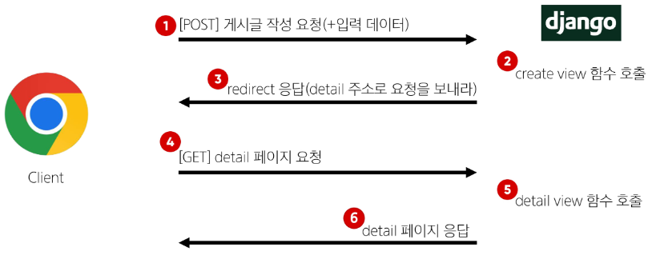

# Django_05

날짜: 2024년 9월 24일

# ORM with view

### 단일 게시글 조회 프로젝트

1. articles/model.py

```
from django.db import models

# Create your models here.
class Article(models.Model):
    title = models.CharField(max_length=10)
    content = models.TextField()
    created_at = models.DateTimeField(auto_now_add=True)
    updated_at = models.DateTimeField(auto_now=True)

```

1. crud/urls.py

```python
from django.contrib import admin
from django.urls import path, include
from articles import views

urlpatterns = [
    path('admin/', admin.site.urls),
    path('articles/', include('articles.urls')),
    
]
```

### Read

1. articles/urls.py
    
    ```python
    from django.urls import path
    from . import views
    
    app_name = 'articles'
    urlpatterns = [
        path('', views.index, name='index'),
        path('<int:pk>/', views.detail, name= 'detail'),
    ]   
    ```
    
    - main페이지, 경로 필요 X(위에서 분리)
2. articles/views.py
    
    ```python
    from django.shortcuts import render, redirect
    # 모델 클래스 가져오기
    from .models import Article
    
    # Create your views here.
    def index(request):
        # 게시글 전체 조회 요청 to DB
        articles = Article.objects.all()
        context = {
            'articles': articles,
        }
        return render(request, 'articles/index.html', context)
    
    def detail(request, pk) :
        # url로 부터 전달받은 pk를 활용해 데이터를 조회
        #article = Article.objects.get(id=pk)
        article = Article.objects.get(pk=pk)
        context = {
            'article' : article,
        }
        return render(request, 'articles/detail.html',context)
    ```
    
3. index.html
    
    ```html
    <!DOCTYPE html>
    <html lang="en">
    <head>
      <meta charset="UTF-8">
      <meta name="viewport" content="width=device-width, initial-scale=1.0">
      <title>Document</title>
    </head>
    <body>
      <h1>Articles</h1>
      <a href="">NEW</a>
    
       <p>{{ articles }}</p> 
      
        <p>글 번호: {{ article.pk }}</p>
        <p>글 제목: {{ article.title }}</p>
        <p>글 내용: {{ article.content }}</p>
        <hr>
      
    
    </body>
    </html>
    ```
    
4. detail.html
    
    ```html
    <!DOCTYPE html>
    <html lang="en">
    <head>
        <meta charset="UTF-8">
        <meta name="viewport" content="width=device-width, initial-scale=1.0">
        <title>Document</title>
    </head>
    <body>
        <h1>Detial</h1>
        <h3>{{article.pk}} 번 째 글</h3>
        <hr>
        <p>제목 : {{article.title}}</p>
        <p>내용 : {{article.content}}</p>
        <p>작성일 : {{article.created_at}}</p>
        <p>수정일 : {{article.updated_at}}</p>
        <hr>
        <form action="" method="POST">
            
            <input type="submit" value = "삭제">
        </form>
        <a href="{% url 'article:index' % }">[back]</a>
    </body>
    </html>
    ```
    

### create

**Q. create 로직을 구현하기 위해 필요한 view 함수의 개수?**

**A. 2가지**

- new (사용자 입력을 받을 페이지를 렌더링)
    1. articles/urls.py
        
        ```python
        path('new/', views.new, name = 'new'),
        ```
        
    2. articles/views.py
        
        ```python
        def new(request) :
            return render(request, 'articles/new.html')
        ```
        
    3. new.html
        - GET Method
        
        ```html
        new.html
        <!DOCTYPE html>
        <html lang="en">
        <head>
            <meta charset="UTF-8">
            <meta name="viewport" content="width=device-width, initial-scale=1.0">
            <title>Document</title>
        </head>
        <body>
            <h1>NEW</h1>
            <form action="" method = "GET">
                <input type="text" name = "title">
                <textarea name="content" id=""></textarea>
                <input type="submit">
        
            </form>
        </body>
        </html>
        ```
        
        - POST Method
        
        ```html
        <!DOCTYPE html>
        <html lang="en">
        <head>
            <meta charset="UTF-8">
            <meta name="viewport" content="width=device-width, initial-scale=1.0">
            <title>Document</title>
        </head>
        <body>
            <h1>NEW</h1>
            <form action="" method = "POST">
                
                <input type="text" name = "title">
                <textarea name="content" id=""></textarea>
                <input type="submit">
        
            </form>
        </body>
        </html>
        ```
        
- create (사용자가 입력한 요청 데이터를 받아 DB에 저장)
    1. articles/urls.py
        
        ```python
        path('create/', views.create, name = 'create'),
        ```
        
    2. articles/views.py
        - POST Method로 변경
        
        ```python
        #과거 catch
        def create(request) :
            # 1. 사용자 요청으로부터 입력 데이터를 추출
            title = request.POST.get('title')
            content = request.POST.get('content')
        
            # # 저장 1
            # article = Article()
            # article.title = title
            # article.content = content
            # article.save()
        
            # 저장 2
            # 이 방법을 사용하여 저장하기! 
            article = Article(title = title, content = content)
            article.save()
        
            # # 저장 3
            # Article.objects.create(title = title, content = content)
        
            # 2. 추출한 입력 데이터를 활용해 DB에 저장 요청
            return render(request, 'articles/create.html')
        ```
        
    3. create.html
        
        ```html
        <!DOCTYPE html>
        <html lang="en">
        <head>
            <meta charset="UTF-8">
            <meta name="viewport" content="width=device-width, initial-scale=1.0">
            <title>Document</title>
        </head>
        <body>
            <h1>작성이 완료되었습니다.</h1>
        </body>
        </html>
        ```
        

### Delete

1. articles/urls.py
    
    ```python
    path('create/', views.create, name = 'create'),
    ```
    
2. articles/views.py
    - 삭제 시 조회 필수
    
    ```python
    def delete(request, pk) :
        # 어떤 게시글을 삭제할 지 조회
        article = Article.objects.get(pk=pk)
    
        # 조회한 게시물 삭제
        article.delete()
        
        return redirect('articles:index')
    ```
    
3. create.html
    - detail.html에 form 형태 추가
    
    ```html
    <!DOCTYPE html>
    <html lang="en">
    <head>
        <meta charset="UTF-8">
        <meta name="viewport" content="width=device-width, initial-scale=1.0">
        <title>Document</title>
    </head>
    <body>
        <h1>Detial</h1>
        <h3>{{article.pk}} 번 째 글</h3>
        <hr>
        <p>제목 : {{article.title}}</p>
        <p>내용 : {{article.content}}</p>
        <p>작성일 : {{article.created_at}}</p>
        <p>수정일 : {{article.updated_at}}</p>
        <hr>
        <form action="" method="POST">
            
            <input type="submit" value = "삭제">
        </form>
        <a href="{% url 'article:index' % }">[back]</a>
    </body>
    </html>
    ```
    

### Update

**Q. Update 로직을 구현하기 위해 필요한 view 함수의 개수?**

**A. 2가지**

- edit (사용자 입력 데이터를 받을 페이지를 렌더링)
    1. articles/urls.py
        
        ```python
        path('create/', views.create, name = 'create'),
        ```
        
    2. articles/views.py
        - 삭제 시 조회 필수
        
        ```python
        def edit(request, pk) :
            # 어떤 게시글을 수정할지 조회
            article = Article.objects.get(pk=pk)
            context = {
                'article' : article, 
            }
        
            return render(request, 'articles/edit.html', context)
        ```
        
    3. edit.html
        - 수정 시 이전 데이터가 출력 될 수 있도록 작성
        - edit 페이지로 이동하기 위한 하이퍼링크 작성
        
        ```html
        <!DOCTYPE html>
        <html lang="en">
        <head>
            <meta charset="UTF-8">
            <meta name="viewport" content="width=`, initial-scale=1.0">
            <title>Document</title>
        </head>
        <body>
            <h1>EDIT</h1>
            <form action="" method="POST">
                
                <input type="text" name="title" value="{{article.title}}">
                <textarea name="content" id="">{{ article.content }}</textarea>
                <input type="submit" value="수정">
            </form>
        </body>
        </html>
        ```
        
- update (사용자가 입력한 데이터를 받아 DB에 저장)
    1. articles/urls.py
        
        ```python
        path('<int:pk>/update/', views.update, name='update')path('<int:pk>/edit/', views.edit, name='edit'), 
        ```
        
    2. articles/views.py
        - 삭제 시 조회 필수
        
        ```python
        def update(request, pk) :
            # 1. 어떤 게시글 수정할 지 조회
            article = Article.objects.get(pk=pk)
            # 2. 사용자들로부터 받은 새로운 입력 데이터 추출
            title = request.POST.get('title')
            content = request.POST.get('content')
            # 3. 기존 게시글의 데이터를 사용자로 받은 데이터로 새로 할당
            article.title = title
            article.content = content
            # 4. 저장
            article.save()
        
            return redirect('articles:detail', article.pk)
        ```
        

# HTTP request methods

## HTTP

네트워크 상에서 데이터를 주고 받기위한 약속

### HTTP request methods

- 데이터에 대해 수행을 원하는 작업(행동)을 나타내는 것
    - 서버에게 원하는 작업의 종류를 알려주는 역할
- 클라이언트가 웹 서버에 특정 동작을 요청하기 위해 사용하는 표준 명령어
- 대표 메서드
    - GET, POST

### GET method

서버로부터 데이터를 요청하고 받아오는 데 (조회) 사용

[’GET’ Method 특징]

1. 데이터 전송
    - URL의 쿼리 문자열(Query String)을 통해 데이터를 전송
2. 데이터 제한
    - URL 길이에 제한이 있어 대량의 데이터 전송에는 적합하지 않음
3. 브라우저 히스토리
    - 요청 URL이 브라우저 히스토리에 남음
4. 캐싱
    - 브라우저는 GET 요청의 응답을 로컬에 저장할 수 있음
    - 동일한 URL로 다시 요청할 때, 서버에 접속하지 않고 저장된 결과를 사용
    - 페이지 로딩 시간을 크게 단축

[’GET’ Method 사용 예시]

- 검색 쿼리 전송
- 웹 페이지 요청
- API에서 데이터 조회

### POST method

서버에 데이터를 제출하여 리소스를 변경(생성, 수정, 삭제) 하는 데 사용

[’POST’ Method 특징]

1. 데이터 전송
    - HTTP Body를 통해 데이터를 전송
2. 데이터 제한
    - GET에 비해 더 많은 양의 데이터를 전송할 수 있음
3. 브라우저 히스토리
    - POST 요청은 브라우저 히스토리에 남지 않음
4. 캐싱
    - POST 요청은 기본적으로 캐시 할 수 없음
    - POST 요청이 일반적으로 서버의 상태를 변경하는 작업을 수행하기 때문

[’GET’ Method 사용 예시]

- 로그인 정보 제출
- 파일 업로드
- 새 데이터 생성 (예 : 새 게시글 작성)
- API에서 데이터 변경 요청

### GET & POST Method 정리

- GET과 POST는 각각의 특성에 맞게 적절히 사용해야 함
- GET
    - 데이터 조회
- POST
    - 데이터 생성이나 수정에 주로 사용

1. articles/urls.py
2. articles/views.py
3. create.html

```
new.html
<!DOCTYPE html>
<html lang="en">
<head>
    <meta charset="UTF-8">
    <meta name="viewport" content="width=device-width, initial-scale=1.0">
    <title>Document</title>
</head>
<body>
    <h1>NEW</h1>
    <form action="" method = "GET">
        <input type="text" name = "title">
        <textarea name="content" id=""></textarea>
        <input type="submit">

    </form>
</body>
</html>
```

```python
def create(request) :
    # 1. 사용자 요청으로부터 입력 데이터를 추출
    title = request.GET.get('title')
    content = request.GET.get('content')

    # # 저장 1
    # article = Article()
    # article.title = title
    # article.content = content
    # article.save()

    # 저장 2
    # 이 방법을 사용하여 저장하기! 
    article = Article(title = title, content = content)
    article.save()

    # # 저장 3
    # Article.objects.create(title = title, content = content)

    # 2. 추출한 입력 데이터를 활용해 DB에 저장 요청
    return render(request, 'articles/create.html')
```

# HTTP response status code

서버가 클라이언트의 요청에 대한 처리 결과를 나타내는 3자리 숫자

- 클라이언트에게 요청 처리 결과를 명확히 전달
- 문제 발생 시 디버깅에 도움
- 웹 애플리케이션의 동작을 제어하는 데 사용

## 403 Forbidden

서버에 요청이 전달되었지만, 권한 때문에 거절되었다는 것을 의미

→ CSRF token 누락

## CSRF(Cross-Site-Request-Frogery)

“사이트 간 요청 위조” 

→ 사용자가 자신의 의지와 무관하게 공격자가 의도한 행동을 하여 특정 웹페이지를 보안에 취약하게 하거나 수정, 삭제 등의 작업을 하게 만드는 공격 방법 

### CSRF Token 적용

- DTL의 csrf_token 태그를 사용해 손쉽게 사용자에게 토큰 값을 부여
- 요청 시 토큰 값도 함께 서버로 전송될 수 있도록 하는 것

```html

```

### 요청 시 CSRF Token을 함께 보내야하는 이유

- Django 서버는 해당 요청이 DB에 데이터를 하나 생성하는(DB에 영향을 주는) 요청에 대해 “Django가 직접 제공한 페이지에서 데이터를 작성하고 있는 것인지”에 대한 확인 수단이 필요한 것
- 겉모습이 똑같은 위조 사이트나 정상적이지 않은 요청에 대한 방어 수단
- 기존
    - 요청 데이터 → 게시글 작성
- 변경
    - 요청 데이터 + 인증 토큰 → 게시글 작성

### 왜 POST일 때만 Token을 확인할까?

- POST는 단순 조회를 위한 GET과 달리 특정 리소스에 변경(생성, 수정, 삭제)을 요구하는 의미와 기술적인 부분을 가지고 있기 때문
- DB에 조작을 가하는 요청은 반드시 인증 수단이 필요

→ 데이터베이스에 대한 변경사항을 만드는 요청이기 때문에 토큰을 사용해 최소한의 신원 확인을 하는 것

# Redirect

서버는 데이터 저장 후 페이지를 응답하는 것이 아닌 사용자를 적절한 기존 페이지로 보내야한다. → “사용자가 GET 요청을 한번 더 보내도록 해야 한다.”

- 실제로 서버가 클라이언트를 직접 다른 페이지로 보내는 것이 아닌 클라이언트가 GET 요청을 한번 더 보내도록 응답하는 것

## redirect()

클라이언트가 인자에 작성된 주소로 다시 요청을 보내도록 하는 함수

### redirect() 함수 적용

- create view 함수 변경

```python
def create(request) :
    # 1. 사용자 요청으로부터 입력 데이터를 추출
    title = request.POST.get('title')
    content = request.POST.get('content')

    # # 저장 1
    # article = Article()
    # article.title = title
    # article.content = content
    # article.save()

    # 저장 2
    # 이 방법을 사용하여 저장하기! 
    article = Article(title = title, content = content)
    article.save()

    # # 저장 3
    # Article.objects.create(title = title, content = content)

    # 2. 추출한 입력 데이터를 활용해 DB에 저장 요청
    return redirect('articles:detail', article.pk)
```

### redirect 동작 원리

1. redirect 응답을 받은 클라이언트는 detail url로 다시 요청을 보내게 됨
2. 결과적으로 detail view 함수가 호출되어 detail view 함수의 반환 결과인 detail 페이지를 응답 받게 되는 것

→ 결국 사용자는 게시글 작성 후 작성된 게시글의 detail 페이지로 이동하는 것으로 느끼게 됨



# 참고

## GET & POST

|  |  GET | POST |
| --- | --- | --- |
| 데이터 전송 방식  | URL의 Query string parameter | HTTP body |
| 데이터 크기 제한 | 브라우저 제공 URL의 최대 길이 | 제한 없음 |
| 사용 목적  | 데이터 검색 및 조회 | 데이터 제출 및 변경 |

### GET 요청이 필요한 경우

- 캐시 및 성능
    - GET 요청은 캐시(Cache)될 수 있고, 이전에 요청한 정보를 새로 요청하지 않고 사용할 수 있음
    - 특히, 동일한 검색 결과를 여러 번 요청하는 경우 GET 요청은 캐시를 활용하여 더 빠르게 응답할 수 있음
- 가시성 및 공유
    - GET 요청은 URL에 데이터가 노출되어 있기 때문에 사용자가 해당 URL을 북마크하거나 다른 사람과 공유하기 용이
- RESTful API 설계
    - HTTP 메서드의 의미에 따라 동작하도록 디자인된 API의 일관성을 유지할 수 있음

## 캐시 (Cache)

- 데이터나 정보를 임시로 저장해두는 메모리나 디스크 공간
- 이전에 접근한 데이터를 빠르게 검색하고 접근할 수 있도록 함