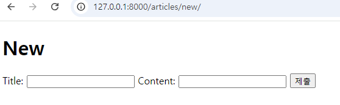

# Django_06

날짜: 2024년 9월 25일

# Form

## HTML ‘form’

지금까지 사용자로부터 데이터를 제출 받기 위해 활용한 방법

- 그러나 비정상적 혹은 악의적인 요청을 필터링 할 수 없음
    
    → 유효한 데이터인지에 대한 확인이 필요
    

## 유효성 검사

수집한 데이터가 정확하고 유효한지 확인하는 과정

### 유효성 검사 구현의 어려움

- 유효성 검사를 구현하기 위해서는 입력 값, 형식, 중복, 범위, 보안 등 많은 것들을 고려해야 함
    
    → 이런 과정과 기능을 직접 개발하는 것이 아닌 Django가 제공하는 Form을 사용
    

## Django Form

사용자 입력 데이터를 수집하고, 처리 및 유효성 검사를 수행하기 위한 도구

→ 유효성 검사를 단순화하고 자동화 할 수 있는 기능을 제공

### Form class 정의

```python
from django import forms

class ArticleForm(forms.Form):
    title = forms.CharField(max_length=10)
    content = forms.CharField()
```

- content - CharField 사용하는 이유
    - Form에는 Model과 달리 TextField가 없음

### View 파일의 new 함수 수정

```python
def new(request):
    form = ArticleForm()
    context = {
        'form' : form,
    }
    # 게시글 작성 페이지 응답
    return render(request, 'articles/new.html', context)
```

### new.html 수정

```html
<!DOCTYPE html>
<html lang="en">
<head>
  <meta charset="UTF-8">
  <meta name="viewport" content="width=device-width, initial-scale=1.0">
  <title>Document</title>
</head>
<body>
  <h1>New</h1>
  <form action="" method="POST">
    
    {{ form }}
     <div>
      <label for="title">Title: </label>
      <input type="text" name="title" id="title">
    </div>
    <div>
      <label for="content">Content: </label>
      <textarea name="content" id="content"></textarea>
    </div> 
    <input type="submit">
  </form>
</body>
</html>
```

### 실행결과



- label까지 생성된 것을 볼 수 있음
1. **{{ form.as_p}}** 사용 시 실행 결과


- P 태그로 감싸진 것을 확인 할 수 있음

## Widgets

HTML ‘input’ element의 표현을 담당

### Widget 적용

- Widget은 단순히 input 요소의 속성 및 출력되는 부분을 변경하는 것
    
    ```python
    # aritcles/forms.py
    from django import forms
    
    class ArticleForm(forms.Form):
        title = forms.CharField(max_length=10)
        content = forms.CharField(widget=forms.Textarea()) # widget 추가
    ```
    
    - 실행 결과
        
        
        
    

## Django ModelForm

- From
    - 사용자 입력 데이터를 DB에 저장하지 않을 때 (ex. 검색, 로그인)
- ModelForm
    - 사용자 입력 데이터를 DB에 저장해야 할 때 (ex. 게시글 작성, 회원가입)

## ModelForm

Model과 연결된 Form을 자동으로 생성해주는 기능을 제공

→ Form + Model

### ModelForm class 정의

- 기존 ArticleForm 클래스 수정
    
    ```python
    from django import forms
    from .models import Article
    
    class ArticleForm(forms.ModelForm):
        class Meta : 
            model = Article         # 모델 
            fields = '__all__'      # 모델 속성 중 어떤 것을 사용할 것인지
    ```
    
    - fields, model은 이미 정의된 변수명, 우리 마음대로 변경 X
- 실행 결과
    
    
    
    - widget을 따로 설정하지 않았지만 자동적으로 해석되어 설정됨.

## Meta class

Model Form의 정보를 작성하는 곳

### ‘fields’ 및 ‘exclude’ 속성

- exclude 속성을 사용하여 모델에서 포함하지 않을 필드를 지정할 수도 있음

```python
from django import forms
from .models import Article

class ArticleForm(forms.ModelForm):
    class Meta : 
        model = Article         # 모델 
        #fields = '__all__'      # 모델 속성 중 어떤 것을 사용할 것인지
        exclude = ('title',)
```

- 실행결과
    
    
    

### Meta class 주의사항

- Django에서 ModelForm에 대한 추가 정보나 속성을 작성하는 클래스 구조를 Meta 클래스로 작성 했을 뿐이며, 파이썬의 inner class와 같은 문법적인 관점으로 접근하지 말 것

## ModelForm 적용

1. create 로직
    
    ```python
    # articles/views.py
    def create(request):
        # 1. 모델폼 인스턴스 생성 (+ 사용자 입력 데이터를 통째로 인자로 작성)
        form = ArticleForm(request.POST)
    
        # 2. 유효성 검사
        if form.is_valid() :
            article = form.save()
            return redirect ('articles:detail', article.pk )
        context = {
            'form' : form
        }
        return render(request, 'articles/new.html', context)
    ```
    
    - 실행 결과
        
        
        
        - 공백을 넣으면 사유와 함께 페이지를 rendering 해줌 (유효성 검증)
2. edit 로직
    
    ```python
    # articles/views.py
    def edit(request, pk):
        # 어떤 게시글을 수정할지 조회
        article = Article.objects.get(pk=pk)
        form = ArticleForm(instance=article)
        context = {
            'article': article,
            'form':form,
        }
        return render(request, 'articles/edit.html', context)
    
    def update(request, pk):
    
        article = Article.objects.get(pk=pk)
        # 1. 모델폼 인스턴스 생송 (+ 사용자 입력 데이터 & 기존 데이터)
        form = ArticleForm(request.POST, instance=article)
        # 2. 유효성 검사
        if form.is_valid():
            form.save()
            return redirect('articles:detail', article.pk)
        context = {
            'article' : article,
            'form' : form,
        }
        
        return render(request, 'articles/edit.html', context)
    
    ```
    
    ```html
    <!DOCTYPE html>
    <html lang="en">
    <head>
      <meta charset="UTF-8">
      <meta name="viewport" content="width=device-width, initial-scale=1.0">
      <title>Document</title>
    </head>
    <body>
      <h1>Edit</h1>
      <form action="" method="POST">
        
        {{ form.as_p }}
         <div>
          <label for="title">Title: </label>
          <input type="text" name="title" id="title" value="{{ article.title }}">
        </div>
        <div>
          <label for="content">Content: </label>
          <textarea name="content" id="content">{{ article.content }}</textarea> 
         </div> 
        <input type="submit" value="수정">
      </form>
      <hr>
      <a href="">[back]</a>
    </body>
    </html>
    ```
    

### is_valid()

여러 유효성 검사를 실행하고, 데이터가 유효한지 여부를 Boolean으로 반환

### save()

데이터베이스 객체를 만들고 저장하는 ModelForm의 인스턴스 메서드

- 키워드 인자 instance 여부를 통해 생성할 지, 수정할 지를 결정

## Django Form 정리

- “사용자로부터 데이터를 수집하고 처리하기 위한 강력하고 유연한 도구”
- HTML form의 생성, 데이터 유효성 검사 및 처리를 쉽게 할 수 있도록 도움

# HTTP 요청 다루기

## view 함수 구조 변화

### new & create view 함수간 공통점과 차이점

1. 공통점 
    - 데이터 생성을 구현하기 위함
2. 차이점 
    - new는 GET method 요청만을, create는 POST method 요청만을 처리
    - new : 조회
    - create : 게시

→ **HTTP request method 차이점을 활용해 동일한 목적을 가지는 2개의 view함수를 하나로 구조화** 

## new & create 함수 결합

```python
# articles/view.py
def create(request) :
    # 요청 메서드가 POST일 때
    if request.method == 'POST' :
        form = ArticleForm(request.POST)
        # 유효성 검사
        if form.is_valid() :
            article = form.save()
            return redirect ('articles:detail', article.pk )
    # 요청 메서드가 POST가 아닐 때
    else : 
        form = ArticleForm()
    context = {
        'form' : form,
    }
    # 게시글 작성 페이지 응답
    return render(request, 'articles/create.html', context)  # 경로 주의
```

```python
# articles/urls.py
# new path 죽이기
from django.urls import path
from . import views

app_name = 'articles'
urlpatterns = [
    path('', views.index, name='index'),
    path('<int:pk>/', views.detail, name='detail'),
    #path('new/', views.new, name='new'),
    path('create/', views.create, name='create'),
    path('<int:pk>/delete/', views.delete, name='delete'),
    path('<int:pk>/edit/', views.edit, name='edit'),
    path('<int:pk>/update/', views.update, name='update'),
]

```

```html
# index.html
<!DOCTYPE html>
<html lang="en">
<head>
  <meta charset="UTF-8">
  <meta name="viewport" content="width=device-width, initial-scale=1.0">
  <title>Document</title>
</head>
<body>
  <h1>Articles</h1>
  <a href="">CREATE</a> # 여기 바꿔줌!
   <p>{{ articles }}</p> 
  
    <p>글 번호: {{ article.pk }}</p>
    <a href="">
      <p>글 제목: {{ article.title }}</p>
    </a>
    <p>글 내용: {{ article.content }}</p>
    <hr>
  

</body>
</html>
```

→ request 메서드에 따른 요청 변환

## edit & update 함수 결합

```python
# articles/views.py
def update(request):
    article = Article.objects.get(pk=pk)
    if request.methode == 'POST':
        form = ArticleForm(request.POST, instance=article)
    # 2. 유효성 검사
        if form.is_valid():
            form.save()
            return redirect('articles:detail', article.pk)
    else : 
        form = ArticleForm(instance=article)
    context = {
        'article': article,
        'form':form,
    }
    return render(request, 'articles/update.html', context)
```

# 참고

## ModelForm의 키워드 인자 구성

- data는 첫 번째에 위치한 키워드 인자이기 때문에 생략 가능
- instance는 9번째에 위치한 키워드 인자이기 때문에 생략할 수 없었음


## Widgets 응용