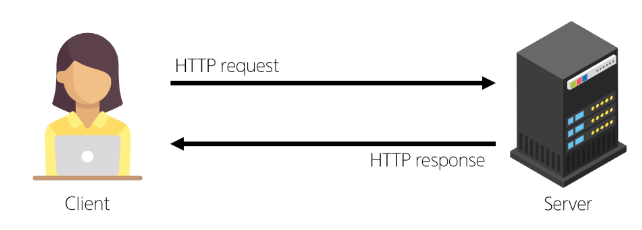

# Django_07

날짜: 2024년 9월 26일

# Static files

서버 측에서 변경되지 않고 고정적으로 제공되는 파일 (이미지, JS, CSS 파일 등)

## 웹 서버와 정적 파일

- 웹 서버의 기본동작은 특정 위치(RUL)에 있는 자원을 요청(HTTP request) 받아서 응답(HTTP response)을 처리하고 제공하는 것
- 이는 “자원에 접근 가능한 주소가 있다”라는 의미
- 웹 서버는 요청 받은 URL로 서버에 존재하는 정적 자원을 제공함

→ 정적 파일을 제공하기 위한 경로(URL)가 있어야함



## Static files 경로

1. 기본 경로
2. 추가 경로

## Static files 기본 경로

app폴더/static/

### 기본 경로 static file 제공하기

- articles/static/articles/ 경로에 이미지 파일 배치


```html
# static은 built-in이 아니니까 load해줘야함


<!DOCTYPE html>
<html lang="en">
<head>
  <meta charset="UTF-8">
  <meta name="viewport" content="width=device-width, initial-scale=1.0">
  <title>Document</title>
</head>
<body>
	# static 이미지 경로 설정
  
  <h1>Articles</h1>
  <a href="">CREATE</a>
  
    <p>글 번호: {{ article.pk }}</p>
    <a href="">
      <p>글 제목: {{ article.title }}</p>
    </a>
    <p>글 내용: {{ article.content }}</p>
    <hr>
  

</body>
</html>
```

- static files 경로는 DTL의 static tag를 사용해야함
- built-in tag가 아니기 때문에 load tag를 사용해 import 후 사용 가능
- extends 태그는 모든 태그 보다 최상단에 있어야한다. → load할 때 extends 아래에 작성해야함!
- base.html에서 load static을 한다면 자식 템플릿에서도 load static이 될까? → 적용 안됨XXX

### STATIC_URL

기본 경로 및 추가 경로에 위치한 정적 파일을 참조하기 위한 URL

→ 실제 파일이나 디렉토리 경로가 아니며, URL로만 존재

```python
# settings.py
STATIC_URL = 'static/'
```

- URL + STATIC_URL + 정적 파일 경로
    
    [http://127.0.0.1:8000/static/articles/sample-1.png](http://127.0.0.1:8000/static/articles/sample-1.png)
    

## Static files 추가 경로

STATICFILES_DIR에 문자열 값으로 추가 경로 설정

```python
# settings.py
STATICFILES_DIRS = [
    # Python의 객체지향 경로 시스템
    BASE_DIR / 'static', 
]
```

# Media files

사용자가 웹에서 업로드 하는 정적 파일 (user-uploaded) 

## 이미지 업로드

### ImageField()

이미지 업로드에 사용하는 모델 필드 (문자열 필드)

- 이미지 객체가 직접 DB에 저장되는 것이 아닌 ‘이미지 파일의 경로’ 문자열이 저장됨

### 미디어 파일을 제공하기 전 준비사항

1. settings.py에 MEDIA_ROOT, MEDIA_URL 설정
2. 작성한 MEDIA_ROOT와 MEDIA_URL에 대한 URL 지정

### MEDIA_ROOT

미디어 파일들이 위치하는 디렉토리의 절대 경로

### MEDIA_URL

MEDIA_ROOT에서 제공되는 미디어 파일에 대한 주소를 생성

(STATIC_URL과 동일한 역할) 

```python
# crud/settings.py
MEDIA_ROOT = BASE_DIR / 'media'

MEDIA_URL = 'media/'
```

### MEDIA_ROOT와 MEDIA_URL에 대한 URL 지정

- 업로드 된 파일의 URL == settings.MEDIA_URL
- MEDIA_URL을 통해 참조하는 파일의 실제 위치 == settings.MEDIA_ROOT

```python
# crud/urls.py
from django.contrib import admin
from django.urls import path, include
from django.conf import settings
from django.conf.urls.static import static

urlpatterns = [
    path('admin/', admin.site.urls),
    path('articles/', include('articles.urls')),
] + static(settings.MEDIA_URL, document_root=settings.MEDIA_ROOT)  # static(URL 주소, 미디어 파일의 실제 위치)
```

- blank=True 속성을 작성해 빈 문자열이 저장될 수 있도록 제약 조건 설정
    
    → 게시글 작성 시 이미지 업로드 없이도 작성 할 수 있도록 하기 위함
    
- 기존 필드 사이에 작성해도 실제 테이블 생성 시에는 가장 우측(뒤)에 추가 됨

```python
# articles/models.py
from django.db import models

# Create your models here.
class Article(models.Model):
    title = models.CharField(max_length=10)
    content = models.TextField()
    image = models.ImageField(blank=True)   # 빈 문자열 저장 가능하게
    created_at = models.DateTimeField(auto_now_add=True)
    updated_at = models.DateTimeField(auto_now=True)
```

- migration 진행
- ImageField를 사용하려면 반드시 Pillow 라이브러리가 필요

```bash
$ pip install pillow
$ python manage.py makemigrations
Migrations for 'articles':
  articles\migrations\0003_article_image.py
    - Add field image to article
(venv) 
SSAFY@2□□PC170 MINGW64 /c/Dev/새 폴더/django/07-staticfiles (master)
$ python manage.py migrate
Operations to perform:
  Apply all migrations: admin, articles, auth, contenttypes, sessions
Running migrations:
  Applying articles.0003_article_image... OK
(venv) 
SSAFY@2□□PC170 MINGW64 /c/Dev/새 폴더/django/07-staticfiles (master)
$ pip freeze > requirements.txt 
(venv) 
```

- ImageField()이지만 varchar(문자열)로 들어가는 것을 확인할 수 있음
    
    
    
- 실행화면_ 파일 선택 페이지 생성


- 생성 시 파일 제출해도 Database에 저장되지 않음을 확인


- 공식 문서 참고
    
    [`enctype`](https://developer.mozilla.org/en-US/docs/Web/HTML/Element/form#enctype)
    
    If the value of the `method` attribute is `post`, `enctype` is the [MIME type](https://en.wikipedia.org/wiki/Mime_type) of the form submission. Possible values:
    • `application/x-www-form-urlencoded`: The default value.
    • `multipart/form-data`: Use this if the form contains [`<input>`](https://developer.mozilla.org/en-US/docs/Web/HTML/Element/input) elements with `type=file`. !!! 여기가 우리가 해야할 설정!!!!! 
    • `text/plain`: Useful for debugging purposes.
    This value can be overridden by [`formenctype`](https://developer.mozilla.org/en-US/docs/Web/HTML/Element/button#formenctype) attributes on [`<button>`](https://developer.mozilla.org/en-US/docs/Web/HTML/Element/button), [`<input type="submit">`](https://developer.mozilla.org/en-US/docs/Web/HTML/Element/input/submit), or [`<input type="image">`](https://developer.mozilla.org/en-US/docs/Web/HTML/Element/input/image) elements.
    
    - • `application/x-www-form-urlencoded`: The default value.
    - • `multipart/form-data`: Use this if the form contains [`<input>`](https://developer.mozilla.org/en-US/docs/Web/HTML/Element/input) elements with `type=file`.
    - • `text/plain`: Useful for debugging purposes.
- create.html에 enctype = ‘`multipart/form-data`' 추가
    
    ```html
    # create.html
    <!DOCTYPE html>
    <html lang="en">
    <head>
      <meta charset="UTF-8">
      <meta name="viewport" content="width=device-width, initial-scale=1.0">
      <title>Document</title>
    </head>
    <body>
      <h1>Create</h1>
      ### 여기에 넣어줌 ###
      <form action="" method="POST" enctype="multipart/form-data">
        
        {{ form.as_p }}
        <input type="submit">
      </form>
    </body>
    </html>
    
    ```
    
- 실행화면


- 여전히 Database에 없음
    
    
    
- view 함수에 request.FILES 추가하기
    
    ```python
    # views.py
    def create(request):
        if request.method == 'POST':
    		    ### request.FILES 추가 ###
            form = ArticleForm(request.POST, request.FILES)
            if form.is_valid():
                article = form.save()
                return redirect('articles:detail', article.pk)
        else:
            form = ArticleForm()
        context = {
            'form': form,
        }
        return render(request, 'articles/create.html', context)
    ```
    
- 실행화면
    
    
    
- 파일 생성됨을 확인
    
    
    
- Database에도 생김
    
    
    
    - MEDIA_ROOT 뒤의 경로가 작성된 것을 확인할 수 있음

## 업로드 이미지 제공

- ‘url’ 속성을 통해 업로드 파일의 경로 값을 얻을 수 있음
- article.image.url
    - 업로드 파일의 경로
- article.image
    - 업로드 파일의 파일 이름
    
    ```html
    <!DOCTYPE html>
    <html lang="en">
    <head>
      <meta charset="UTF-8">
      <meta name="viewport" content="width=device-width, initial-scale=1.0">
      <title>Document</title>
    </head>
    <body>
      # 여기 보세요!!! 이미지 넣었어요!!! 
      
      <h1>Detail</h1>
      <h3>{{ article.pk }}번째 글</h3>
      <hr>
      <p>제목: {{ article.title }}</p>
      <p>내용: {{ article.content }}</p>
      <p>작성일: {{ article.created_at }}</p>
      <p>수정일: {{ article.updated_at }}</p>
      <hr>
      <a href="">수정</a><br>
      <form action="" method="POST">
        
        <input type="submit" value="삭제">
      </form>
      <a href="">[back]</a>
    </body>
    </html>
    ```
    
- media 주소 생성 확인
    
    
    
- 같은 이미지 다시 게시물로 작성 시,  장고가 알아서 이름 붙여주고 경로를 넣어줌
    
    
    

- 이미지가 없는 기존 파일들은 aritlcles/detail/pk 경로가 오류가 남
    
    ```html
    # detail.html
    <!DOCTYPE html>
    <html lang="en">
    <head>
      <meta charset="UTF-8">
      <meta name="viewport" content="width=device-width, initial-scale=1.0">
      <title>Document</title>
    </head>
    <body>
    	### if 문 추가해서 오류 잡기 ####
      
        
      
      
      <h1>Detail</h1>
      <h3>{{ article.pk }}번째 글</h3>
      <hr>
      <p>제목: {{ article.title }}</p>
      <p>내용: {{ article.content }}</p>
      <p>작성일: {{ article.created_at }}</p>
      <p>수정일: {{ article.updated_at }}</p>
      <hr>
      <a href="">수정</a><br>
      <form action="" method="POST">
        
        <input type="submit" value="삭제">
      </form>
      <a href="">[back]</a>
    </body>
    </html>
    
    ```
    

## 업로드 이미지 수정

- 수정 페이지 form 요소에 enctype 속성 추가
    
    ```html
    # update.html
    <!DOCTYPE html>
    <html lang="en">
    <head>
      <meta charset="UTF-8">
      <meta name="viewport" content="width=device-width, initial-scale=1.0">
      <title>Document</title>
    </head>
    <body>
      <h1>Update</h1>
      ### 여기 ectpye 추가 ### 
      <form action="" method="POST" ectype="multipart/form-data">
        
        {{ form.as_p }}
        <input type="submit" value="수정">
      </form>
      <hr>
      <a href="">[back]</a>
    </body>
    </html>
    ```
    
- update view 함수에서 업로드 파일에 대한 추가 코드 작성
    
    ```python
    
    # views.py
    def update(request, pk):
        article = Article.objects.get(pk=pk)
        if request.method == 'POST':
    		    ### request.FILES ###
            form = ArticleForm(request.POST, request.FILES, instance=article)
            if form.is_valid():
                form.save()
                return redirect('articles:detail', article.pk)
        else:
            form = ArticleForm(instance=article)
        context = {
            'article': article,
            'form': form,
        }
        return render(request, 'articles/update.html', context)
    ```
    

# 참고

## 미디어 파일 추가 경로

### ‘upload_to’ argument

- ImageField()의 upload_to 속성을 사용해 다양한 추가 경로 설정
    - upload_to = ‘image/’,  upload_to='%Y/%m/%d/'
        
        ```python
        # articles/models.py
        from django.db import models
        
        # Create your models here.
        class Article(models.Model):
            title = models.CharField(max_length=10)
            content = models.TextField()
            ### 여기 upload_to ## 
            image = models.ImageField(blank=True, upload_to = 'image/')
            created_at = models.DateTimeField(auto_now_add=True)
            updated_at = models.DateTimeField(auto_now=True)
        ```
        
        ```python
        from django.db import models
        
        # Create your models here.
        class Article(models.Model):
            title = models.CharField(max_length=10)
            content = models.TextField()
            ### 여기 upload_to ## 
            image = models.ImageField(blank=True, upload_to='%Y/%m/%d/')
            created_at = models.DateTimeField(auto_now_add=True)
            updated_at = models.DateTimeField(auto_now=True)
        ```
        
    - 실행 화면
        - 이미지 파일 생성됨, images/의 경로를 가진 파일로 DataBase에 저장 되어짐을 확인
        - 2024/09/26 파일 생성됨. 2024/09/26/의 경로를 가진 파일로 DataBase에 저장 되어짐을 확인


