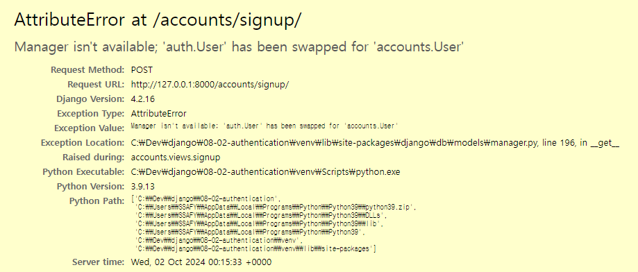

# Django_9(Authentication System 02)

날짜: 2024년 10월 2일

# 회원가입

User 객체를 Create 하는 과정

## UserCreationForm()

회원 가입시 사용자 입력 데이터를 받는 built-in ModelForm

1. accounts/urls.py
    
    ```python
    from django.urls import path
    from . import views
    
    app_name = 'accounts'
    urlpatterns = [
        path('login/', views.login, name='login'),
        path('logout/', views.logout, name='logout'),
        path('signup/', views.signup, name='signup')
    ]
    
    ```
    
2. accounts/views.py
    
    ```python
    def signup(request) :
        if request.method == 'POST':
            pass
        else :
            form = UserCreationForm()
        context = {
            'form' : form,
        }
    
        return render(request, 'accounts/signup.html', context)
    ```
    
3. accounts/signup.html
    
    ```html
    <!DOCTYPE html>
    <html lang="en">
    <head>
      <meta charset="UTF-8">
      <meta name="viewport" content="width=device-width, initial-scale=1.0">
      <title>Document</title>
    </head>
    <body>
      <h1>회원가입</h1>
      <form action="" method="POST">
        
        {{ form.as_p }}
        <input type="submit">
      </form>
    </body>
    </html>
    ```
    
4. accounts/views.py
    
    ```python
    def signup(request) :
        if request.method == 'POST':
            form = UserCreationForm(request.POST)
            if form.is_valid():
                form.save()
                return redirect('articles:index')
        else :
            form = UserCreationForm()
        context = {
            'form' : form,
        }
    
        return render(request, 'accounts/signup.html', context)
    ```
    
    - 실행 결과
        
        
        
        - auth.user를 우리가 accounts.user로 바꿔놨었자나! 이게 작동되지 않아서 오류가 나는 것을 확인할 수 있음
        - UserCreationForm은 modelform임 →form.py의 Meta에 model에 대한 설정이 필요하다.
5. 회원가입 로직 에러 
    - 회원가입에 사용하는 UserCreationForm이 대체한 커스텀 유저 모델이 아닌 과거 Django의 기본 유저 모델로 인해 작성도니 클래스이기 때문
6. 커스텀 유저 모델을 사용하려면 다시 작성해야하는 Form
    - UserCreationForm & UserChangeForm
        - 두 From 모두 class Meta : model =User가 작성된 From이기 때문에 재작성 필요
    - Custom User model을 사용할 수 있도록 상속 후 일부분만 재작성
    
    ```python
    # acoounts/forms.py
    from django.contrib.auth.forms import UserCreationForm, UserChangeForm
    # django는 User 모델을 직접 참조하는 것을 권장하지 않는다. 
    from django.contrib.auth import get_user_model
    
    class CustomUserCreationForm(UserCreationForm) :
        class Meat(UserCreationForm.Meta):
            model = get_user_model()
    
    class CustomUserChangeForm(UserChangeForm):
        class Meta(UserChangeForm.Meta):
            model = get_user_model
    ```
    
    - get_user_model()
        
        “현재 프로젝트에서 활성화된 사용자 모델(active user model)”을 반환하는 함수
        
    - User 모델을 직접 참조하지 않는 이유
        - get_user_model()을 사용해 User 모델을 참조하면 커스텀 User 모델을 자동으로 반환해주기 때문
        - Django는 필수적으로 user 클래스를 직접 참조하는 대신 get_user_model()을 사용해 참조해야 한다고 강조하고 있음
        
        → User model 참조에 대한 자세한 내용은 추후 모델 관계에서 다룰 예정
        
7. 마무리하기! 
    
    ```python
    from .forms import CustomUserCreationForm
    
    def signup(request) :
        if request.method == 'POST':
            form = CustomUserCreationForm(request.POST)
            if form.is_valid():
                form.save()
                return redirect('articles:index')
        else :
            form = CustomUserCreationForm()
        context = {
            'form' : form,
        }
    
        return render(request, 'accounts/signup.html', context)
    
    ```
    
    - 회원가입 후 로그인 하면 django_session에 세션 저장되어 있는 것을 확인할 수 있다.

# 회원탈퇴

User 객체를 Delete 하는 과정

1. accounts/urls.py 
    
    ```python
    from django.urls import path
    from . import views
    
    app_name = 'accounts'
    urlpatterns = [
        path('login/', views.login, name='login'),
        path('logout/', views.logout, name='logout'),
        path('signup/', views.signup, name='signup'),
        path('delete/', views.delete, name='delete'),
    
    ```
    
2. accounts/views.py
    
    ```python
    def delete(request):
        # User모델에서 누가 회원탈퇴를 요청한건지 검색
        # -> 이건 필요가 없음. User객체는 request에 들어가 있음
        # user = request.user
        # user.delete()
        request.user.delte()
        return redirect('articles:index')
    ```
    
3. articles/index.html
    
    ```html
    <!DOCTYPE html>
    <html lang="en">
    <head>
      <meta charset="UTF-8">
      <meta name="viewport" content="width=device-width, initial-scale=1.0">
      <title>Document</title>
    </head>
    <body>
      <p>안녕하세요 {{ user.username }}</p>
    
      <h1>Articles</h1>
      # 로그인
      <a href="">LOGIN</a>
      # 회원가입
      <a href="{ }">회원가입</a>
      # 회원 탈퇴
      <form action="" method="POST">
        
        <input type="submit" value="회원탈퇴">
      </form>
    ```
    
- DB의 accounts_user에서 지워진 것을 확인할 수 있음

# 회원정보 수정

User 겍체를 update 하는 과정

## UserChangeForm()

회원정보 수정 시 사용자 입력 데이터를 받는 built-in ModelForm

1. accountss/urls.py
    
    ```python
    from django.urls import path
    from . import views
    
    app_name = 'accounts'
    urlpatterns = [
        path('login/', views.login, name='login'),
        path('logout/', views.logout, name='logout'),
        path('signup/', views.signup, name='signup'),
        path('delete/', views.delete, name='delete'),
        path('update/', views.update, name='update'), 
    ]
    ```
    
2. accounts/views.py
    
    ```python
    def update(request): 
    
        if request.method == "POST" :
            pass
        else : 
            form = CustomUserChangeForm(instance=request.user)
        context = {
            'form' : form
        }
        return render(request, 'accounts/update.html', context)
    ```
    
3. accounts/update.html
    
    ```html
    <!DOCTYPE html>
    <html lang="en">
    <head>
      <meta charset="UTF-8">
      <meta name="viewport" content="width=device-width, initial-scale=1.0">
      <title>Document</title>
    </head>
    <body>
      <h1>회원정보 수정</h1>
      <form action="" method="POST">
        
        {{ form.as_p }}
        <input type="submit">
      </form>
    </body>
    </html>
    
    ```
    
4. articles/index.html
    
    ```html
    <a href="">회원정보 수정</a>
    ```
    
5. UserChangeForm 사용 시 문제 점
    - User 모델의 모든 정보들(fields)까지 모두 출력됨
    - 일반 사용자들이 접근해서는 안되는 정보는 출력하지 않도록 해야 함
    
    → CustomUserChangeForm에서 출력 필드를 다시 조정하기
    
    ```python
    # accounts/forms.py
    class CustomUserChangeForm(UserChangeForm):
        
        class Meta(UserChangeForm.Meta):
            model = get_user_model()
            fields = ('first_name', 'last_name', 'email',)
    
    ```
    
6. accounts/views.py
    
    ```python
    def update(request): 
    
        if request.method == "POST" :
            form = CustomUserChangeForm(request.POST, instance=request.user)
            if form.is_valid():
                form.save()
                
                return redirect('articles:index')
        else : 
            form = CustomUserChangeForm(instance=request.user)
        context = {
            'form' : form
        }
        return render(request, 'accounts/update.html', context)
    ```
    
    - DB의 accounts_user을 확인했을 때 회원정보가 변경되어 있는 것을 확인할 수 있음

# 비밀번호 변경

인증된 사용자의 Session 데이터를 Update 하는 과정

## PasswordChangeForm()

비밀번호 변경 시 사용자 입력 데이터를 받는 built-in Form

→ django는 비밀번호 변경 페이지를 회원정보 수정 form 하단에서 별도 주소로 안내 ⇒ 프로젝트 url에서 변경 해야함

1. crud/urls.py

```python
from django.contrib import admin
from django.urls import path, include
from accounts import views

urlpatterns = [
    path('admin/', admin.site.urls),
    path('articles/', include('articles.urls')),
    path('accounts/', include('accounts.urls')),
    path('<int:user_pk>/password/', views.change_password, name='change_password'),
]
```

1. accounts/views.py

```python
from django.contrib.auth.forms import AuthenticationForm, PasswordChangeForm

def change_password(request, user_pk):
    if request.method == 'POST' :
        pass
    else : 
        form = PasswordChangeForm(request.user)
    context = {
        'form' : form,
    }
    return render(request, 'accounts/change_password.html',context)
```

1. accounts/change_password.html

```html
<!DOCTYPE html>
<html lang="en">
<head>
  <meta charset="UTF-8">
  <meta name="viewport" content="width=device-width, initial-scale=1.0">
  <title>Document</title>
</head>
<body>
  <h1>비밀번호 변경</h1>
  <form action="" method="POST">
    
    {{ form.as_p }}
    <input type="submit">
  </form>
</body>
</html>
```

1. accounts/views.py

```python
def change_password(request, user_pk):
    if request.method == 'POST' :
        form = PasswordChangeForm(request.user, request.POST)
        if form.is_valid():
            form.save()
            return redirect('articles:index')
    else : 
        form = PasswordChangeForm(request.user)
    context = {
        'form' : form,
    }
    return render(request, 'accounts/change_password.html',context)
```

## 세션 무효화 방지

### 암호 변경 시 세션 무효화

- 비밀번호가 변경되면 기존 세션과 회원 인증 정보가 일치하지 않게 되어 버려 로그인 상태가 유지되지 못하고 로그아웃 처리됨
- 비밀번호가 변경되면서 기존 세션과의 회원 인증 정보가 일치하지 않기 때문

### update_session_auth_hash(request, user)

암호 변경 시 세션 무효화를 막아주는 함수

→ 암호가 변경되면 새로운 password의 Session Data로 기존 sesison을 자동으로 갱신

1. accounts/views.py

```python
# accounts/views.py
from django.contrib.auth import update_session_auth_hash

def change_password(request, user_pk):
    if request.method == 'POST' :
        form = PasswordChangeForm(request.user, request.POST)
        if form.is_valid():
            user = form.save()
            update_session_auth_hash(request, user) # 세션 무효화 방지
            return redirect('articles:index')
    else : 
        form = PasswordChangeForm(request.user)
    context = {
        'form' : form,
    }
    return render(request, 'accounts/change_password.html',context)
```

# 인증된 사용자에 대한 접근 제한

## 1. is_authenticated 속성

사용자가 인증 되었는지 여부를 알 수 있는 User model의 속성

→ 모든 User 인스턴스에 대해 항상 True인 읽기 전용 속성

→ 비인증 사용자에 대해서는 항상 False

1. articles/index.html

```html
<!DOCTYPE html>
<html lang="en">
<head>
  <meta charset="UTF-8">
  <meta name="viewport" content="width=device-width, initial-scale=1.0">
  <title>Document</title>
</head>
<body>
  <h1>Articles</h1>
  ## 인증된다면 ## 
  
  <p>안녕하세요 {{ user.username }}</p>
  <form action="" method="POST">
  <form action="" method="POST">
    
    <input type="submit" value="회원탈퇴">
  </form>
  
    <input type="submit" value="LOGOUT">
  </form>
	
	## 인증되어 있지 않다면 ##
  
  <a href="">LOGIN</a> 
  <a href="{ }">회원가입</a>
  
  
```

### 인증된 사용자라면 로그인/회원가입 로직을 수행할 수 없도록 하기

```python
# accounts/views.py
# Create your views here.
def login(request):
    if request.user.is_authenticated:
        return redirect('articles:index')
    
    if request.method == 'POST':
        form = AuthenticationForm(request, request.POST)
        if form.is_valid():
            auth_login(request, form.get_user())
            return redirect('articles:index')
    else:
        form = AuthenticationForm()
    context = {
        'form': form,
    }
    return render(request, 'accounts/login.html', context)
```

```python
def signup(request) :
    if request.user.is_authenticated:
        return redirect('articles:index')
    if request.method == 'POST':
        form = CustomUserCreationForm(request.POST)
        if form.is_valid():
            form.save()
            return redirect('articles:index')
    else :
        form = CustomUserCreationForm()
    context = {
        'form' : form,
    }

    return render(request, 'accounts/signup.html', context)
```

- 회원가입과 로그인은 인증되어있으면 필요하지 않음!

## 2. login_required 데코레이터

인증된 사용자에 대해서만 view 함수를 실행시키는 데코레이터

→ 비인증 사용자의 경우 /accounts/login/주소로 redirect 시킴

1. articles/views.py
    - 인증된 사용자만 게시글을 작성/수정/삭제 할 수 있도록 수정
    
    ```python
    from django.contrib.auth.decorators import login_required
    
    @login_required
    def create(request):
        if request.method == 'POST':
            form = ArticleForm(request.POST)
            if form.is_valid():
                article = form.save()
                return redirect('articles:detail', article.pk)
        else:
            form = ArticleForm()
        context = {
            'form': form,
        }
        return render(request, 'articles/create.html', context)
    
    @login_required
    def update(request, pk):
        article = Article.objects.get(pk=pk)
        if request.method == 'POST':
            form = ArticleForm(request.POST, instance=article)
            if form.is_valid():
                form.save()
                return redirect('articles:detail', article.pk)
        else:
            form = ArticleForm(instance=article)
        context = {
            'article': article,
            'form': form,
        }
        return render(request, 'articles/update.html', context)
    
    @login_required
    def delete(request, pk):
        article = Article.objects.get(pk=pk)
        article.delete()
        return redirect('articles:index')
    
    ```
    
2. accounts/views.py
    - 인징된 사용자만 로그아웃/ 탈퇴/ 수정/ 비밀번호 변경 할 수 있도록 수정
    
    ```python
    from django.contrib.auth.decorators import login_required
    
    # Create your views here.
    @login_required
    def login(request):
        if request.user.is_authenticated:
            return redirect('articles:index')
        
        if request.method == 'POST':
            form = AuthenticationForm(request, request.POST)
            if form.is_valid():
                auth_login(request, form.get_user())
                return redirect('articles:index')
        else:
            form = AuthenticationForm()
        context = {
            'form': form,
        }
        return render(request, 'accounts/login.html', context)
    
    @login_required
    def delete(request):
        # User모델에서 누가 회원탈퇴를 요청한건지 검색
        # -> 이건 필요가 없음. User객체는 request에 들어가 있음
        # user = request.user
        # user.delete()
        request.user.delete()
        return redirect('articles:index')
        
    @login_required
    def update(request): 
    
        if request.method == "POST" :
            form = CustomUserChangeForm(request.POST, instance=request.user)
            if form.is_valid():
                form.save()
                
                return redirect('articles:index')
        else : 
            form = CustomUserChangeForm(instance=request.user)
        context = {
            'form' : form
        }
        return render(request, 'accounts/update.html', context)
    
    @login_required
    def change_password(request, user_pk):
        if request.method == 'POST' :
            form = PasswordChangeForm(request.user, request.POST)
            if form.is_valid():
                user = form.save()
                update_session_auth_hash(request, user) # 세션 무효화 방지
                return redirect('articles:index')
        else : 
            form = PasswordChangeForm(request.user)
        context = {
            'form' : form,
        }
        return render(request, 'accounts/change_password.html',context)
    ```