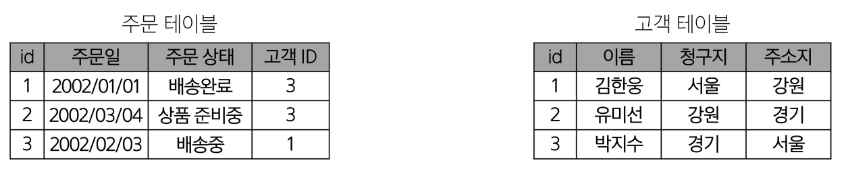

# DB_01(SQL)

날짜: 2024년 10월 10일

# Database

체계적인 데이터 모음

## 데이터

저장이나 처리에 효율적인 형태로 변환된 정보

### 기존 데이터 저장 방식

1. 파일을 이용한 데이터 관리
    - 어디에서나 쉽게 사용 가능
    - 데이터 구조적으로 관리하기 어려움
2. 스프레드 시트 이용
    - 테이블의 열과 행을 사용해 데이터를 구조적으로 관리 가능
    - 스트레드 시트의 한계
        - 크기
            - 일반적으로 약 100만 행까지만 저장가능
        - 보안
            - 단순히 파일이나 링크 소유 여부에 따른 단순한 접근 권한 가능 제공
        - 정확성
            - 데이터가 여러 시트에 분산되어 있다면 변경에 누락이 생기거나 추가 문제가 발생할 수 있음

## 데이터 베이스 역할

데이터를 저장하고 조작 **CRUD**

# Relational Database

데이터 간에 관계가 있는 데이터 항목들의 모음

- 테이블, 행, 열의 정보를 구조화하는 방식
- 서로 관련된 데이터 포인터를 저장하고 이에 대한 엑세스를 제공
    
    
    

## 관계

여러 테이블 간의 (논리적) 연결

- 이 관계로 인해 두 테이블을 사용하여 데이터를 다양한 형식으로 조회할 수 있음
    - 특정 날짜에 구매한 모든 고객 조회
    - 지난 달에 배송이 지연된 고객 조회 등

### 예시

- 다음과 같이 고객 데이터가 테이블에 저장되어 있다고 가정
- 고객 데이터 간 비교를 위해서 어떤 값을 활용해야 하는가?
    
    → 각 데이터에 고유한 식별 값을 부여하기 (기본키, Primary Key)
    


- 다음과 같이 각 고객이 주문한 주문데이터가 테이블에 저장되어 있다고 가정
- 누가 어떤 주문을 했는지 식별하는가
    
    → 주문 정보에 고객의 고유한 식별 값을 저장하기 (외래 키, Foreign Key)
    

## 관련 용어 정리

1. Table (*aka* Relation)
    - 데이터를 기록하는 곳
2. Field (aka Column, Attribute)
    - 각 필드에는 고유한 데이터 형식(타입)이 지정됨
3. Record (aka Row, Tuple)
    - 각 레코드에 구체적인 데이터 값이 저장됨
4. Database (aka Schema)
    - 테이블의 집합
5. Primary key (기본키, PK)
    - 각 레코드의 고유한 값
    - 관계형 데이터베이스에서 레코드의 식별자로 활용
6. Foreign Key (외래 키, FK) 
    - 테이블의 필드 중 다른 테이블의 레코드를 식별할 수 있는 키
    - 다른 테이블의 기본 키를 참조
    - 각 레코드에서 서로 다른 테이블 간의 관계를 만드는 데 사용

# RDBMS

## DBMS (Database Management System)

데이터베이스를 관리하는 소프트웨어 프로그램

- 데이터 저장 및 관리를 용이하게 하는 시스템
- 데이터베이스와 사용자 간의 인터페이스 역할
- 사용자가 데이터 구성, 업데이트, 모니터링, 백업, 복구 등을 할 수 있도록 도움

## RDBMS(Relational Database Management System)

관계형 데이터 베이스를 관리하는 소프트웨어 프로그램

### 종류

- SQLite
    - 경량의 오픈 소스 데이터베이스 관리 시스템
    
    → 컴퓨터나 모바일 기기에 내장되어 간단하고 효율적인 데이터 저장 및 관리를 제공
    

### 데이터베이스 정리

- Table은 데이터가 기록되는 곳
- Table에는 행에서 고유하게 식별 가능한 기본 키라는 속성이 있으며, 외래 키를 사용하여 각 행에서 서로 다른 테이블 간의 관계를 만들 수 있음
- 데이터는 기본 키 또는 외래 키를 통해 결합(join)될 수 있는 여러 테이블에 걸쳐 구조화 됨

# SQL (Structure Query Language)

데이터베이스에 정보를 저장하고 처리하기 위한 프로그래밍 언어

- 테이블 형태로 구조화된 관계형 데이터베이스에게 요청을 질의(요청)

## SQL Syntax

```sql
SELECT column_name FROM table_name;
```

1. SQL 키워드는 대소문자를 구분하지 않음
    - 하지만 대문자로 작성하는 것을 권장 (명시적 구분)
2. 각 SQL Statements의 끝에는 세미콜론(’;’)이 필요
    - 세미콜론은 각 SQL Statements을 구분하는 방법

## SQL Statements

SQL을 구성하는 가장 기본적인 코드 블록

```sql
SELECT column_name FROM table_name;
```

- 해당 예시 코드는 SELECT Statement라 부름
- 이 Statement는 SELECT, FROM 2개의 keyword로 구성 됨

### 수행 목적에 따른 SQL Statements 4가지 유형

1. DDL - 데이터 정의
2. DQL - 데이터 검색

| 유형 |  |  |
| --- | --- | --- |
| DDL
(Data Definition Language) | 데이터의 기본 구조 및 형식 변경 | CREATE
DROP
ALTER |
| DQL
(Data Query Language) | 데이터 검색  | SELECT |
| DML
(Data Definition Language) | 데이터 조작 (추가, 수정, 삭제) | INSERT
UPDATE
DELETE |
| DCL
(Data Definition Language) | 데이터 및 작업에 대한 사용자 권한 제어 | COMMIT
ROLLBACK
GRANT
REVOKE |

### SQL 학습

- 단순히 SQL 문법을 암기하고 상황에 따라 실행만 하는 것이 아닌 SQL을 통해 관계형 데이터베이스를 잘 이해하고 다루는 방법을 학습

# 참고

## Query

- “데이터베이스로부터 정보를 요청”하는 것
- 일반적으로 SQL로 작성하는 코드를 쿼리문이라고 함

## SQL 표준

- SQL은 미국 국립 표준 협회(ANSI)와 국제 표준화 기구(ISO)에 의해 표준이 채택됨
- 모든 RDBMS에서 SQL 표준을 지원
- 다만 각 RDBMS마다 독자적인 기능에 따라 표준을 벗어나는 문법이 존재하니 주의

# Single Table Queries (Querying data)

## SELECT

### SELECT statement

테이블에서 데이터를 조회

### SELECT syntax

```sql
SELECT
	select_list
FROM 
	tabel_name;
```

- SELECT 키워드 이후 데이터를 선택하려는 필드를 하나 이상 지정
- FROM 키워드 이후 데이터를 선택하려는 테이블의 이름을 지정

### SELECT 활용

1. 테이블 employees에서 LastName 필드의 모든 데이터를 조회
- 실행 코드
    
    ```sql
    -- 01. Querying data
    SELECT 
        LASTNAME
    FROM
        employees;
    ```
    
- 실행 결과


1. 테이블 employees에서 LastName, FisrtName 필드의 모든 데이터를 조회
    - 실행 코드
        
        ```sql
        SELECT
            LastName, FirstName
        FROM
            employees;
        ```
        
    - 실행 결과
        
        
        

1. 테이블 employees에서 모든 필드 데이터를 조회
    - 실행 코드
        
        ```sql
        # 전체 탐색은 *
        SELECT
            *
        FROM 
            employees
        ```
        
    - 실행 결과
        
        
        
        - 모든 필드가 다 나오는 것을 확인할 수 있다.
2. 테이블 employees에서 FirstName 필드의 모든 데이터를 조회
    - 실행 코드
        
        ```sql
        SELECT
            FirstName AS '이름'
        FROM
            employees;
        ```
        
    - 실행 결과
        
        
        
3. 테이블 tracks에서 Name, Milliseconds
    - 실행 코드
        
        ```sql
        SELECT
            Name,
            Milliseconds / 60000
        FROM
            tracks
        ```
        
    - 실행 결과
        
        
        
    - 실행 코드
        
        ```sql
        SELECT
            Name,
            Milliseconds / 60000 AS '재생 시간(분)'
        FROM
            tracks
        ```
        
    - 실행 결과
        
        
        

## SELECT 정리

- 테이블의 데이터를 조회 반환
- ‘*’를 사용하여 모든 필드 선택

# Sorting Data

## ORDER BY statement

조회 결과의 레코드를 정렬

- FROM clause 뒤에 위치
- 하나 이상의 컬럼을 기준으로 결과를 오름차순(ASC, 기본 값), 내림차순(DESC)으로 정렬

```sql
SELECT
    select_list
FROM
    table_name
ORDER BY
    column1 [ASC|DESC],
    column2 [ASC|DESC],
    ...;
```

### ORDER BY 활용

1. 테이블 employees에서 FirstName 필드의 모든 데이터를 오름차순으로 조회
    - 실행 코드
        
        ```sql
        SELECT
            FirstName
        FROM
            employees
        ORDER BY
            FirstName ASC;
        ```
        
    - 실행 결과
        
        
        
2. 테이블 employees에서 FirstName 필드의 모든 데이터를 내림차순으로 조회
    - 실행 코드
        
        ```sql
        SELECT
            FirstName
        FROM
            employees
        ORDER BY
            FirstName DESC;
        ```
        
    - 실행 결과


1. 테이블 customers에서 Country 필드를 기준으로 내림차순 정렬한 다음 City 필드 기준으로 오름차순 정렬하여 조회
    - 실행 코드
        
        ```sql
        SELECT 
            Country,
            City
        FROM
            customers
        ORDER BY
            Country DESC,
            City ASC;
        ```
        
    - 실행 결과
        
        
        
2. 테이블 tracks에서 Milliseconds 필드를 기준으로 내림차순 정렬한 다음 Name, Milliseconds 필드의 모든 데이터를 조회 (단, Milliseconds 필드는 60,000으로 나눠 분 단위 값으로 출력)
    - 실행코드
        
        ```sql
        SELECT
            Name,
            Milliseconds / 60000 AS '재생 시간(분)'
        FROM
            tracks
        ORDER BY
            Milliseconds DESC
        ```
        
    - 실행결과
        
        
        
3. 정렬에서의 NULL
    
    NULL 값이 존재할 경우 오름차순 정렬 시 결과에 NULL이 먼저 출력
    
    - 실행 코드
        
        ```sql
        SELECT
            ReportsTo
        FROM
            employees
        ORDER BY
            ReportsTo
        ```
        
    - 실행 결과
        
        
        

### SELECT statement 실행 순서

FROM → SELECT → ORDER BY

# Filtering data

## Filtering data 관련 Keywords

- clause
    - DISTINCT
    - WHERE
    - LIMIT
- Operator
    - BETWEEN
    - IN
    - LIKE
    - Comparison
    - Logical

# DISTINCT statement

조회 결과에서 중복된 레코드를 제거

## DISTICNT Syntax

- SELECT 키워드 바로 뒤에 작성해야 함
- SELECT DISTINCT 키워드 다음에 고유한 값을 선택하려는 하나 이상의 필드를 지정

```sql
SELECT DISTINCT
    select_list
FROM
    table_name;
```

### DISTINCT 활용

1. 테이블 customers에서 Country 필드의 모든 데이터를 중복 없이 오름차순 조회
    - 실행 코드
        
        ```sql
        SELECT DISTINCT
            Country
        FROM
            customers
        ORDER BY
            Country;
        ```
        
    - 실행 결과
        
        
        

# WHERE statement

조회 시 특정 검색 조건을 지정

## WHERE syntax

- FROM clause 뒤에 위치
- search_condition은 비교연산자 및 논리연사자(AND, OR, NOT 등)를 사용하는 구문이 사용됨

```sql
SELECT
    select_list
FROM
    table_name
WHERE
    search_condition;
```

### WHERE 활용

1. 테이블 customers에서 City 필드 값이 ‘Prague’인 데이터의 LastName, FirstName, City 조회
    - 실행 코드
        
        ```sql
        SELECT
            LastName,
            FirstName,
            City
        FROM
            customers
        WHERE
            City = 'Prague';
        ```
        
    - 실행 결과
        
        
        
2. 테이블 customers에서 City 필드 값이 ‘Prague’가 아닌 데이터의 LastName, FirstName, City 조회
    - 실행 코드
        
        ```sql
        SELECT
            LastName,
            FirstName,
            City
        FROM
            customers
        WHERE
            City != 'Prague';
        ```
        
    - 실행 결과
        
        
        
        - 전체 59 데이터 중 프라하 2개가 빠져 57개 검색된 것을 확인할 수 있음
3. 테이블 customers에서 Company 필드 값이 NULL이고 Country 필드 값이 ‘USA’인 데이터의 LastName, FirstName, Country, Company 조회
    - 실행 코드
        
        ```sql
        SELECT
            LastName,
            FirstName,
            Company,
            Country
        FROM
            customers
        WHERE
            Company IS NULL     # NULL은 IS를 사용한다!!
            AND Country = 'USA'
        ```
        
    - 실행 결과
        
        
        
4. 테이블 customers에서 Company 필드 값이 NULL이거나 Country 필드 값이 ‘USA’인 데이터의 LastName, FirstName, Country, Company 조회
    - 실행 코드
        
        ```sql
        SELECT
            LastName,
            FirstName,
            Company,
            Country
        FROM
            customers
        WHERE
            Company IS NULL
            OR Country = 'USA'
        ```
        
    - 실행 결과
        
        
        
5. 테이블 tracks에서 Bytes 필드 값이 10,000 이상 50,000이하인 데이터의 Name, Bytes 조회
    - 실행 코드
        
        ```sql
        SELECT
            Name, Bytes
        FROM 
            tracks
        WHERE 
            Bytes BETWEEN 10000 AND 500000;
        ```
        
        ```sql
        SELECT
            Name, Bytes
        FROM 
            tracks
        WHERE 
            Bytes >= 10000
            AND Bytes < 50000;
        ```
        
    - 실행 결과
        
        
        
6. 테이블 tracks에서 Bytes 필드 값이 10,000 이상 50,000이하인 데이터의 Name, Bytes를 Bytes 기준으로 오름차순 조회
    - 실행 코드
        
        ```sql
        SELECT
            Name, Bytes
        FROM 
            tracks
        WHERE 
            Bytes BETWEEN 10000 AND 500000
        ORDER BY
            Bytes;
        ```
        
    - 실행 결과
        
        
        
7. 테이블 customers에서 Country 필드 값이 ‘Canada’ 또는 ‘ Germany’ 또는 ‘France’인 데이터의 LastName, FirstName, Country 조회
    - 실행 코드
        
        ```sql
        SELECT
            LastName, FirstName, Country
        FROM
            customers
        WHERE
            Country IN ('Canada','Germany','France');
        ```
        
        ```sql
        SELECT
            LastName, FirstName, Country
        FROM
            customers
        WHERE
            Country = 'Canada'
            OR Country = 'Germany'
            OR Country = 'France';
        ```
        
    - 실행 결과
        
        
        
8. 테이블 customers에서 Country 필드 값이 ‘Canada’ 또는 ‘ Germany’ 또는 ‘France’가 아닌 데이터의 LastName, FirstName, Country 조회
    - 실행 코드
        
        ```sql
        SELECT
            LastName, FirstName, Country
        FROM
            customers
        WHERE
            Country NOT IN ('Canada','Germany','France');
        ```
        
    - 실행 결과
        
        
        
9. 테이블 customers에서 LastName 필드 값이 ‘son’으로 끝나는 데이터의 LastName, FirstName 조회
    - 실행 코드
        
        ```sql
        SELECT 
            LastName, FirstName
        FROM
            customers
        WHERE
            Lastname LIKE '%son'
        ```
        
    - 실행 결과
        
        
        
10. 테이블 customers에서 FirstName 필드 값이 4자리이면서 ‘a’로 끝나는 데이터의 LastName, FirstName 조회
    - 실행 코드
        
        ```sql
        SELECT 
            LastName, FirstName
        FROM
            customers
        WHERE
            Firstname LIKE '___a'
        ```
        
    - 실행 결과
        
        
        

# Operators

### Comparison Operators (비교 연산자)

=, ≥, ≤, ≠, IS, LIKE, IN, BETWEEN… AND

### Logical Operators

AND(&&), OR(||), NOT(!)

### IN Operator

값이 특정 목록 안에 있는지 확인

### Like Operator

값이 특정 패턴에 일치하는지 확인 (Wildcards와 함께 사용)

- Wildcard Characters
    - ‘%’ : 0개 이상의 문자열과 일치 하는지 확인
    - ‘_’ : 단일 문자와 일치하는지 확인

# LIMIT

## LIMIT clause

조회하는 레코드 수를 제한

## LIMIT syntax

- 하나 또는 두 개의 인자를 사용 (0 또는 양의 정수)
- row_count는 조회하는 최대 레코드 수를 지정
    
    ```sql
    SELECT
        select_list
    FROM
        table_name
    LIMIT [offset,] row_count;
    ```
    

LIMIT 활용

1. 테이블 tracks에서 TrackId, Name, Bytes 필드 데이터를 Bytes 기준으로 7개만 조회
    - 실행 코드
        
        ```sql
        SELECT
            TrackId, Name, Bytes
        FROM
            tracks
        ORDER BY
            Bytes DESC
        LIMIT 7
        ```
        
    - 실행 결과
        
        
        
2. 테이블 tracks에서 TrackId, Name, Bytes 필드 데이터를 Bytes 기준으로 내림차순으로 4번째부터 7번째 데이터만 조회
    - 실행 코드
        
        ```sql
        SELECT
            TrackId, Name, Bytes
        FROM
            tracks
        ORDER BY
            Bytes DESC
        LIMIT 3,4
        ```
        
        ```sql
        SELECT
            TrackId, Name, Bytes
        FROM
            tracks
        ORDER BY
            Bytes DESC
        LIMIT 4 OFFSET 3;
        ```
        
    - 실행 결과
        
        
        

# Grouping Data

## GROUP BY clause

레코드를 그룹화하여 요약본 생성 (’집계 함수’와 함께 사용)

### Aggregation Funtions (집계 함수)

값에 대한 계산을 수행하고 단일한 값을 반환하는 함수 (SUM, AVG, MAX, MIN, COUNT)

## GROUP BY syntax

- FROM 및 WHERE 절 뒤에 배치
- GROUP BY 절 뒤에 그룹화 할 필드 목록을 작성

```sql
SELECT
	  c1, c2,...,cn, aggregate_functions(ci)
FROM
    table_name
GROUP BY
	  c1, c2,..., cn;
```

### GROUP BY 예시

1. Country 필드를 그룹화 후 COUNT 함수가 각 그룹에 대한 집계된 값을 계산 

```sql
SELECT
    Country, COUNT(*)
FROM
    customers
GROUP BY
    Country;
```

