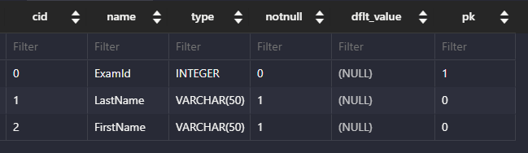

# DB_01(Managing Tables)

날짜: 2024년 10월 10일

# Create Table

## CREATE TABLE statement

테이블 생성

## CREATE TABLE syntax

```sql
CREATE TABLE table_name (
	column_1 data_type contraints,
	column_2 data_type contraints,
	...,
);
```

- 각 필드에 적용할 데이터 타입 작성
- 테이블 및 필드에 대한 제약조건(constraints) 작성
- 공백을 기준으로 나누어져있음

### CREATE TABLE 활용

- examples 테이블 생성 및 확인
    
    ```sql
    CREATE TABLE examples (
    	ExamId INTEGER PRIMARY KEY AUTOINCREMENT,
        LastName VARCHAR(50) NOT NULL,
        FirstName VARCHAR(50) NOT NULL
    );
    ```
    

### PRAGMA

- 테이블 schema(구조) 확인
    
    ```sql
    -- Table 구조 확인
    PRAGMA table_info('examples');
    ```
    
    
    
- “cid”
    - column ID를 의미하며 각 컬럼의 고유한 식별자를 나타내는 정수 값
    - 직접 사용하지 않으며 PRAGMA 명령과 같은 메타데이터 조회에서 출력 값으로 활용됨

### 데이터타입

```sql
CREATE TABLE examples (
	ExamId INTEGER PRIMARY KEY AUTOINCREMENT,
    LastName VARCHAR(50) NOT NULL,
    FirstName VARCHAR(50) NOT NULL
);
```

- 데이터 타입을 미리 지정을 해야지 web으로 넘어갔을 때 유효성 검증이 된다.
- INTEGER : 데이터 타입
- PRIMARY KEY ,NOT NULL : 제약 조건
- AUTOINCREMENT 키워드 : AUTOINCREMENT

### SQLite 데이터 타입

1. NULL
    - 아무런 값도 포함하지 않음을 나타냄
2. INTEGER
    - 정수
3. REAL
    - 부동 소수점
4. TEXT
    - 문자열
5. BLOB
    - 이미지, 동영상, 문서 등의 바이너리 데이터 (길고 큰 애들 저장할 때 쓰는 친구들)

## Contraint(제약 조건)

테이블의 필드에 적용되는 규칙 또는 제한 사항

→ 데이터의 무결성을 유지하고 데이터베이스의 일관성을 보장

### 대표 제약 조건 3가지

- PRIMARY KEY
    - 해당 필드를 기본 키로 지정
    - INTEGER 타입에만 적용되며 INT, BIGINT 등과 같은 다른 정수 유형은 적용되지 않음
- NOT NULL
    - 해당 필드에 NULL 값을 허용하지 않도록 지정
- FOREIGN KEY
    - 다른 테이블과의 외래 키 관계를 정의

## AUTOINCREMENT keyword

자동으로 고유한 정수 값을 생성하고 할당하는 필드 속성

- 필드의 자동 증가를 나타내는 특수한 키워드
- 주로 PRIMARY KEY 필드에 적용
- INTEGER PRIMARY KEY AUTOINCREMENT가 작성된 필드는 항상 새로운 레코드에 대해 이전 최대 값보다 큰 값을 할당
- 삭제된 값은 무시되며 재사용할 수 없게 됨

# Modifying table fields

## ALTER TABLE statement

테이블 및 필드 조작

## ALTER TABLE 역할

| 명령어 | 역할 |
| --- | --- |
| ALTER TABLE ADD COLUMN | 필드 추가 |
| ALTER TABLE RENAME COLUMN | 필드 이름 변경 |
| ALTER TABLE DROP COLUMN | 필드 삭제 |
| ALTER TABLE RENAME TO | 테이블 이름 변경 |

## 1.  ALTER TABLE ADD COLUMN syntax

```sql
ALTER TABLE
	table_name
ADD COLUMN
	column_definition;
```

- ADD COLUMN 키워드 이후 추가하고자 하는 새 필드 이름과 데이터 타입 및 제약 조건 작성
- 단, 추가하고자 하는 필드에 NOT NULL 제약 조건이 있을 경우 NULL이 아닌 기본 값 설정 필요

### ALTER TABLE ADD COLUMN 활용

1. examples 테이블에 다음 조건에 맞는 Country 필드 추가
    - 테이블 생성시 정의한 필드는 기본 값이 없어도 NOT NULL 제약조건으로 생성되며 내부적으로 Default value는 NULL로 설정됨
    - 실행코드
        
        ```sql
        ALTER TABLE
            examples
        ADD COLUMN
            Country VARCHAR(100) NOT NULL ; 
        
        ALTER TABLE
            examples
        ADD COLUMN
            City VARCHAR(100) NOT NULL DEFAULT 'SEOUL'; 
        ```
        
    - 실행 결과
        
        
        
2. examples 테이블에 다음 조건에 맞는 Age, Address 필드 추가
    - 실행 코드
        
        ```sql
        ALTER TABLE
            examples
        ADD COLUMN  
            AGE INTEGER NOT NULL DEFAULT 0
        
        ALTER TABLE
            examples
        ADD COLUMN  
            Address VARCHAR(100) NOT NULL DEFAULT 'defualt value'
        ```
        
        - SQLite는 단일문을 사용하여 한번에 여러 필드를 추가할 수 없음
    - 실행 결과
        
        
        
    

## 2. ALTER TABLE RENAME COLUMN syntax

```sql
ALTER TABLE
	table_name
RENAME COLUMN
	create_name TO new_name;
```

- RENAME COLUMN 키워드 뒤에 이름을 바꾸려는 필드의 이름을 지정하고 TO 키워드 뒤에 새 이름을 지정

### ALTER TABLE RENAME COLUMN 활용

1. examples 테이블 Address 필드의 이름을 PostCode로 변경
    - 실행코드
        
        ```sql
        ALTER TABLE
            examples
        RENAME COLUMN
            Address TO PostCodd;
        ```
        
    - 실행화면
        
        
        
        - 6번이 Postcodd로 변경된 것을 확인할 수 있음

## 3. ALTER TABLE DROP COLUMN syntax

```sql
ALTER TABLE
	table_name
DROP COLUMN
	column_name;
```

- DROP COLUMN 키워드 뒤에 삭제 할 필드 이름 지정

### ALTER TABLE DROP COLUMN 활용

1. exmaples 테이블의 PostCode 필드를 삭제
    - 실행 코드
        
        ```sql
        ALTER TABLE
            examples
        DROP COLUMN
            PostCodd;
        ```
        
    - 실행 화면
        
        
        

## 4. ALTER TABLE RENAME TO syntax

```sql
ALTER TABLE
	table_name
RENAME TO
	new_table_name;
```

- RENAME TO 키워드 뒤에 새로운 테이블 이름 지정

### ALTER TABLE RENAME TO 활용

1. examples 테이블 이름을 new_examples로 변경
    - 실행 코드
        
        ```sql
        ALTER TABLE
            examples
        RENAME TO
            new_examples;
        ```
        
    - 실행 화면
        
        ```sql
        PRAGMA table_info('new_examples');
        ```
        
        - 이걸로 실행해야지 table을 찾을 수 있음

## DROP TABLE statement

테이블 삭제

## DROP TABLE Syntax

```sql
DROP TABLE table_name;
```

- DROP TABLE statement 이후 삭제할 테이블 이름 작성

### DROP TABLE 활용

- new_examples 테이블 삭제
    
    ```sql
    DROP TABLE new_examples;
    ```
    

# 참고

## SQLite 타입 선호도의 목적

1. 유연한 데이터 타입 지원
    - 데이터 타입을 명시적으로 지정하지 않고도 데이터를 저장하고 조회할 수 있음
    - 컬럼에 저장되는 값의 특성을 기반으로 데이터 타입을 유추
2. 간편한 데이터 처리
    - INTEGER Type Affinity를 가진 열에 문자열 데이터를 저장해도 SQLite는 자동으로 숫자로 변환하여 처리
3. SQL 호환성
    - 다른 데이터베이스 시스템과 호환성을 유지

## 반드시 NOT NULL 제약을 사용할 필요 X

- 하지만 데이터베이스를 사용하는 프로그램에 따라 NULL을 저장할 필요가 없는 경우가 많으므로 대분분 NOT NULL을 정의
- “값이 없다” 라는 표현을 테이블에 기록하는 것은 “0”이나 “빈 문자열” 등을 사용하는 것으로 대체하는 것을 권장

# Modifying Data

## INSERT statement

테이블 레코드 삽입

## INSERT syntax

```sql
Insert INTO table (c1, c2, ...)
Values (v1, v2, ...)
```

- INSERT INTO 절 다음에 테이블 이름과 괄호 안에 필드 목록 작성
- VALUES 키워드 다음 괄호 안에 해당 필드에 삽입할 값 목록 작성

### INSERT 활용

```sql
CREATE TABLE articles (
  id INTEGER PRIMARY KEY AUTOINCREMENT,
  title VARCHAR(100) NOT NULL,
  content VARCHAR(200) NOT NULL,
  createdAt DATE NOT NULL
);
```

1. articles 테이블에 다음과 같은 데이터 입력
    
    ```sql
    INSERT INTO articles (title, content, createdAt)
    VALUES ('hello', 'world', '2000-01-01');
    ```
    
2. 여러개 한번에 입력하기
    - 실행 코드
        
        ```sql
        INSERT INTO articles (title, content, createdAt)
        VALUES 
            ('title1', 'content1', '2000-01-01'),
            ('title2', 'content2', '2000-01-01'),
            ('title3', 'content3', '2000-01-01');
        ```
        
    - 실행 결과
        
        
        

## UPDATE statement

테이블 레코드 수정

## UPDATE syntax

```sql
UPDATE table_name
SET column_name = expression,
[WHERE
	condition];
```

- SET 절 다음에 수정 할 필드와 새 값을 지정
- WHERE 절에서 수정 할 레코드를 지정하는 조건 작성
- WHERE 절을 작성하지 않으면 모든 레코드를 수정
1. articles 테이블 1번 레코드의 title 필드 값을 ‘update Title’로 변경
    - 실행 코드
        
        ```sql
        UPDATE articles
        SET title = 'update Title'
        WHERE id = 1; 
        ```
        
    - 실행 결과
        
        
        
2. articles 테이블 2번 레코드의 title, content 필드 값을 각각 ‘update Title’, ‘update Content’로 변경
    - 실행 코드
        
        ```sql
        UPDATE articles
        SET 
        title = 'update Title', 
        content = 'update content'
        WHERE id = 2; 
        ```
        
- 실행 결과


## DELETE statement

테이블 레코드 삭제

## DELETE syntax

```sql
DELETE FROM table_name
[WHERE
   condition];
```

### DELETE 활용 1

1. articles 테이블의 1번 레코드 삭제
- 실행 코드
    
    ```sql
    DELETE FROM
      articles
    WHERE
      id = 1;
    ```
    
- 실행 화면
    
    
    
1. articles 테이블에서 작성일이 오래된 순으로 레코드 2개 삭제
- 실행 코드
    
    ```sql
    DELETE FROM
        articles
    WHERE id IN (
        SELECT id FROM articles
        ORDER BY createdAt
        LIMIT 2
    );
    ```
    
- 실행 결과
    
    
    

# Multi table queries

## Join

### 관계

여러 테이블 간의 (논리적) 연결

### 관계의 필요성

- 커뮤니티 게시판에 필요한 데이터 생각해보기
- 테이블을 나누어서 분류할 필요 있음

## Join이 필요한 순간

- 테이블을 분리하면 데이터 관리는 용이해질 수 있으나 출력 시에는 문제가 있음
- 테이블 한 개 만을 출력할 수 밖에 없어 다른 테이블과 결합하여 출력하는 것이 필요해짐
    
    → 이때 사용하는 것이 ‘JOIN’
    

## JOIN clause

둘 이상의 테이블에서 데이터를 검색하는 방법

### 사전 준비

Users 및 articles 테이블 생성

```sql
-- 실습용 데이터
CREATE TABLE users (
  id INTEGER PRIMARY KEY AUTOINCREMENT,
  name VARCHAR(50) NOT NULL
);

CREATE TABLE articles (
  id INTEGER PRIMARY KEY AUTOINCREMENT,
  title VARCHAR(50) NOT NULL,
  content VARCHAR(100) NOT NULL,
  userId INTEGER NOT NULL,
  FOREIGN KEY (userId) 
    REFERENCES users(id)
);
```

```sql
INSERT INTO 
  users (name)
VALUES 
  ('하석주'),
  ('송윤미'),
  ('유하선');

INSERT INTO
  articles (title, content, userId)
VALUES 
  ('제목1', '내용1', 1),
  ('제목2', '내용2', 2),
  ('제목3', '내용3', 1),
  ('제목4', '내용4', 4),
  ('제목5', '내용5', 1);
```

## INNER JOIN clause

두 테이블에서 값이 일치하는 레코드에 대해서만 결과를 반환

## INNER JOIN syntaz

```sql
SELECT
	select_list
FROM
	table_a
INNER JOIN table_b
	ON table_b.fk = table_a.pk;
```

- FROM 절 이후 메인 테이블 지정(table_a)
- INNER JOIN 절 이후 메인 테이블과 조인할 테이블 지정 (table_b)
- ON 키워드 이후 조인 조건을 작성
- 조인 조건은 table_a와 table_b 간의 레코드를 일치시키는 규칙을 지정

### INNER JOIN 예시


- 작성자가 있는 (존재하는 회원) 모든 게시글을 작성자 정보와 함께 조회
- 실행 코드
    
    ```sql
    SELECT * FROM articles
    INNER JOIN users
      ON users.id = articles.userId;
      
    ```
    
- 실행 결과
    
    
    
- 실행 코드
    
    ```sql
    SELECT articles.title, users.name
    FROM articles
    INNER JOIN users
    ON users.id = articles.userId;
    ```
    
    - UserID만 출력
- 실행 결과
    
    
    
- 1번 회원이 작성한 모든 게시물의 제목과 작성자명을 조회
    
    ```sql
    SELECT articles.title, users.name
    FROM articles
    INNER JOIN users
      ON users.id = articles.userId
    WHERE users.id = 1;
    ```
    
- 실행결과
    
    
    

## LEFT JOIN clause

오른쪽 테이블의 일치하는 레코드와 함께 왼쪽 테이블의 모든 레코드 반환

## LEFT JOIN syntax

```sql
SELECT
	select_list
FROM
	table_a
LEFT JOIN table_b
	ON table_b.fk = table_a.pk;
```

- FROM 절 이후 왼쪽 테이블 지정(table_a)
- LEFT JOIN 절 이후 오른쪽 테이블 지정(table_b)
- ON 키워드 이후 조인 조건을 작성
    - 왼쪽 테이블의 각 레코드를 오른쪽 테이블의 모든 레코드와 일치시킴

### LEFT JOIN 활용

- 게시글을 작성한 이력이 없는 회원 정보 조회
    
    ```sql
    SELECT * FROM users
    LEFT JOIN articles
    ON articles.userID = users.id
    WHERE articles.userId IS NULL;
    ```
    
- 실행 결과
    
    