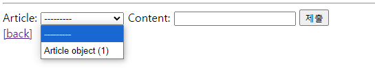

# DB_03(Many to one relationship 01)

날짜: 2024년 10월 11일

# Many to one relationship 01

## 모델 관계

### Many to one relationship (N:1 or 1:N)

한 테이블의 0개 이상의 레코드가 다른 테이블의 레코드 한 개와 관련된 관계

### Comment - Article

0개 이상의 댓글은 1개의 게시글에 작성될 수 있다.

## 댓글 모델 정의

### ForeignKey(to, on_delete)

한 모델이 다른 모델을 참조하는 관계를 설정하는 필드

→ N : 1 관계 표현

→ 데이터베이스에서 외래 키로 구현

- to
    - 참조하는 모델 class 이름
- on_delete
    - 외래 키가 참조하는 객체(1)가 사라졌을 때, 외래 키를 가진 객체(N)를 어떻게 처리할 지를 정의하는 설정(데이터 무결성)
- on_delete의 ‘CASCADE’
    - 참조 된 객체(부모 객체)가 삭제 될 때 이를 참조하는 모든 객체도 삭제되도록 지정

### Migration 이후 댓글 테이블 확인

- 댓글 테이블의 article_id 외래 키 필드 확인
- 만들어지는 필드 이름
    - ‘참조 대상 클래스 이름’ + ‘_’ + ‘클래스 이름’
    
    → 참조하는 클래스 이름을 소문자로 작성하는 것이 권장되었던 이유
    

### 댓글 모델 정의

- ForeignKey 클래스의 인스턴스 이름을 참조하는 모델 클래스 이름의 단수형으로 작성하는 것을 권장
- 외래 키는 ForeignKey 클래스를 작성하는 위치와 관계없이 테이블의 마지막 필드로 생성됨
1. articles/models.py
    
    ```python
    class Comment(models.Model):
        article = models.ForeignKey(Article, on_delete=models.CASCADE)
        content = models.CharField(max_length=200)
        created_at = models.DateTimeField(auto_now_add=True)
        updated_at = models.DateTimeField(auto_now=True)
    ```
    

### Migration 이후 댓글 테이블 확인

```bash
In [1]: Article.objects.create(title = 'title', content = 'content')
Out[1]: <Article: Article object (1)>

In [2]: comment = Comment()

In [4]: comment.content = '댓글내용'

In [5]: comment.save()

NOT NULL constraint failed: articles_comment.article_id
```

```bash
In [6]: article = Article.objects.get(pk=1)

In [7]: comment.article = article

In [8]: comment.save()
```

```bash
In [9]: comment.pk
Out[9]: 1

In [10]: comment.content
Out[10]: '댓글내용'

In [11]: comment.article
Out[11]: <Article: Article object (1)>

In [12]: comment.article_id
Out[12]: 1

In [13]: comment.article.pk
Out[13]: 1

In [14]: comment.article.content
Out[14]: 'content'

In [15]: comment = Comment(content='second comment', article = article)

In [16]: comment.pk

In [17]: comment.save()

In [18]: comment.pk
Out[18]: 2

In [19]: comment
Out[19]: <Comment: Comment object (2)>

In [20]: comment.article.pk
Out[20]: 1
```

# 관계모델참조

## 역참조

- N:1 관계에서 1에서 N을 참조하거나 조회하는 것(1→N)
- 모델 간의 관계에서 관계를 정의한 모델이 아닌, 관계의 대상이 되는 모델에서 연결된 객체들에 접근하는 방식

→ N은 외래 키를 가지고 있어 물리적으로 참조 가능하지만, 1은 N에 대한 참조 방법이 존재하지 않아 별도의 역참조 키워드가 필요

### 역참조 사용 예시

article.comment_set.all() : 모델 인스턴스.related manager(역참조 이름).QuerySetAPI

→ 특정 게시글에 작성된 댓글 전체를 조회하는 요청

## related manager

N:1 혹은 M:N 관계에서 역참조 시에 사용하는 매니저

→ ‘objects’ 매니저를 통해 QuerySet API를 사용했던 것처럼 related manager를 통해 QuerySet API를 사용할 수 있게됨

### related manager 이름 규칙

- N:1 관계에서 생성되는  Related manager의 이름은 “모델명_set” 형태로 자동 생성도미
    - 관계를 직접 정의하지 않은 모델에서 연결된 객체들을 조회할 수 있게 함
- 특정 댓글의 게시글 참조 (Comment → Article)
    - comment.article
- 특정 게시글의 댓글 목록 참조 (Article → comment)
    - article.comment_set.all()

# 댓글 구현

수정은 자바 스크립트를 이용하여 시행 → CRD만 진행할 예정

## 댓글 CREATE

1. articles/forms.py
    
    ```python
    from .models import Article, Comment
    
    class CommentForm(forms.ModelForm):
        class Meta:
            model = Comment
            fields = '__all__'
    ```
    
2. views.py
    
    ```python
    from .forms import ArticleForm, CommentForm
    
    def detail(request, pk):
        article = Article.objects.get(pk=pk)
        comment_form = CommentForm()
        context = {
            'article': article,
            'comment_form' : comment_form,
        }
        return render(request, 'articles/detail.html', context)
    ```
    
3. detail.html
    
    ```html
    <!DOCTYPE html>
    <html lang="en">
    <head>
      <meta charset="UTF-8">
      <meta name="viewport" content="width=device-width, initial-scale=1.0">
      <title>Document</title>
    </head>
    <body>
      <h1>Detail</h1>
      <h3>{{ article.pk }}번째 글</h3>
      <hr>
      <p>제목: {{ article.title }}</p>
      <p>내용: {{ article.content }}</p>
      <p>작성일: {{ article.created_at }}</p>
      <p>수정일: {{ article.updated_at }}</p>
      <hr>
      <a href="">수정</a><br>
      <form action="" method="POST">
        
        <input type="submit" value="삭제">
      </form>
      <hr>
      <form action="" method="POST">
        
        {{ comment_form }}
        <input type="submit">
      </form>
      <a href="">[back]</a>
    </body>
    </html>
    
    ```
    

5.  실행결과



- comment 클래스의 외래 키 필드 article 또한 데이터 입력이 필요한 필드이기 때문에 출력 되는 것
- 하지만, 외래 키 필드 데이터는 사용자로 부터 입력 받는 값이 아닌 view 함수 내에서 다른 방법으로 전달 받아 저장되어야 함
1. articles/forms.py
    
    ```python
    class CommentForm(forms.ModelForm):
        class Meta:
            model = Comment
            fields = ('content',)
    ```
    
    CommentForm의 출력 필드 조정하여 외래 키 필드가 출력되지 않도록 함
    
    - 출력에서 제외된 외래 키 데이터는 어디서 받아와야 할까?
    - detail 페이지의 URL을 살펴보면 paht(’<int:pk>/’, views.detail, name=’detial’)에서 해당 게시글의 pk의 값이 사용됙 있음
    - 댓글의 외래 키 데이터에 필요한 정보가 바로 게시글의 pk 값
2. urls.py
    
    ```python
    from django.urls import path
    from . import views
    
    app_name = 'articles'
    urlpatterns = [
        path('', views.index, name='index'),
        path('<int:pk>/', views.detail, name='detail'),
        path('create/', views.create, name='create'),
        path('<int:pk>/delete/', views.delete, name='delete'),
        path('<int:pk>/update/', views.update, name='update'),
        path('<int:pk>/comments/', views.comments_create, name='comments_create'),
    ]
    ```
    
3. detail.html
    
    ```html
    <!DOCTYPE html>
    <html lang="en">
    <head>
      <meta charset="UTF-8">
      <meta name="viewport" content="width=device-width, initial-scale=1.0">
      <title>Document</title>
    </head>
    <body>
      <h1>Detail</h1>
      <h3>{{ article.pk }}번째 글</h3>
      <hr>
      <p>제목: {{ article.title }}</p>
      <p>내용: {{ article.content }}</p>
      <p>작성일: {{ article.created_at }}</p>
      <p>수정일: {{ article.updated_at }}</p>
      <hr>
      <a href="">수정</a><br>
      <form action="" method="POST">
        
        <input type="submit" value="삭제">
      </form>
      <hr>
      <form action="" method="POST">
        
        {{ comment_form }}
        <input type="submit">
      </form>
      <a href="">[back]</a>
    </body>
    </html>
    ```
    
4. [views.py](http://views.py)
    
    GET 요청이 올 일이 없음
    
    ```python
    def comments_create(request,pk):
        article=Article.objects.get(pk=pk)
        comment_form  = CommentForm(request.POST)
        if comment_form.is_valid():
            comment_form.save()
            return redirect('articles:detail', article.pk)
        context = {
            'article' : article,
            'comment_form' : comment_form,
        }
        return render(request, 'articles/detail.html', context)
    ```
    
5. 실행결과
`NOT NULL constraint failed: articles_comment.article_id`
    
    → 에러 발생!!!!!
    
6. [views.py](http://views.py)
    
    ```python
    def comments_create(request,pk):
        article=Article.objects.get(pk=pk)
        comment_form  = CommentForm(request.POST)
        if comment_form.is_valid():
            # 외래 키를 넣는 타이밍이 필요
            # 외래 키를 넣으려면 2가지 조건이 필요
            # 1. comment 인스턴스 필요
            # 2. save 메서드가 호출 되기 전이어야 함
            # 그런데 comment 인스터스는 save 메서드가 호출되어야 생성됨
            # 그래서 django의 save 메서드는 인서턴스만 제공하고, 실제 저장은 잠시 대기하는 옵션을 제공함
            comment = comment_form.save(commit=False)
            comment.article = article
            comment_form.save()
            return redirect('articles:detail', article.pk)
        context = {
            'article' : article,
            'comment_form' : comment_form,
        }
        return render(request, 'articles/detail.html', context)
    ```
    

## 댓글 READ 구현

1. [views.py](http://views.py)
    
    ```python
    def detail(request, pk):
        article = Article.objects.get(pk=pk)
        comment_form = CommentForm()
        # 해당 게시글에 작성된 모든 댓글 조회(역참조)
        comments = article.comment_set.all()
        context = {
            'article': article,
            'comment_form' : comment_form,
            'comments' : comments,
        }
        return render(request, 'articles/detail.html', context)
    ```
    
2. detail.html
    
    ```html
    <!DOCTYPE html>
    <html lang="en">
    <head>
      <meta charset="UTF-8">
      <meta name="viewport" content="width=device-width, initial-scale=1.0">
      <title>Document</title>
    </head>
    <body>
      <h1>Detail</h1>
      <h3>{{ article.pk }}번째 글</h3>
      <hr>
      <p>제목: {{ article.title }}</p>
      <p>내용: {{ article.content }}</p>
      <p>작성일: {{ article.created_at }}</p>
      <p>수정일: {{ article.updated_at }}</p>
      <hr>
      <a href="">수정</a><br>
      <form action="" method="POST">
        
        <input type="submit" value="삭제">
      </form>
      <hr>
       댓글 출력 
      <ul>
        
          <li>{{ comment.content }}</li>
        
      </ul>
       댓글 작성 
      <form action="" method="POST">
        
        {{ comment_form }}
        <input type="submit">
      </form>
      <a href="">[back]</a>
    </body>
    </html>
    ```
    
3. 실행화면


## 댓글 DELETE

1. detail.html
    
    ```html
      댓글 출력 
      <ul>
        
          <li>
            {{ comment.content }}
            <form action="#" method="POST">
              
              <input type="submit" value='삭제'>
            </form>
          </li>
        
      </ul>
    ```
    
    - 댓글 출력에 삭제 버튼
2. [urls.py](http://urls.py)
    
    ```python
    from django.urls import path
    from . import views
    
    app_name = 'articles'
    urlpatterns = [
        path('', views.index, name='index'),
        path('<int:pk>/', views.detail, name='detail'),
        path('create/', views.create, name='create'),
        path('<int:pk>/delete/', views.delete, name='delete'),
        path('<int:pk>/update/', views.update, name='update'),
        path('<int:pk>/comments/', views.comments_create, name='comments_create'),
        # 아래 PK만 comment의 pk, 위에는 articles의 pk자나
        path('<int:article_pk>/comments/delete', views.comments_delete, name='comments_delete'),
    ]
    ```
    
3. [views.py](http://views.py) 
    
    ```python
    def comments_delete(request,pk) :
        comment = Comment.objects.get(pk=pk)
        article_pk = comment.article.pk
        comment.delete()
        # return redirect('articles:detail', 삭제되는 댓글의 게시글 PK)
        return redirect('articles:detail', article_pk)
    ```
    
    - 삭제되기 전에 article_pk를 조회하기
4. ulrs.py
    
    url에서 pk를 분리해서 오자
    
    ```python
    from django.urls import path
    from . import views
    
    app_name = 'articles'
    urlpatterns = [
        path('', views.index, name='index'),
        path('<int:pk>/', views.detail, name='detail'),
        path('create/', views.create, name='create'),
        path('<int:pk>/delete/', views.delete, name='delete'),
        path('<int:pk>/update/', views.update, name='update'),
        path('<int:pk>/comments/', views.comments_create, name='comments_create'),
        path('<int:article_pk>/comments/<int:comment_pk>/delete', views.comments_delete, name='comments_delete'),
    ]
    ```
    
5. [views.py](http://views.py)
    
    ```python
    def comments_delete(request,article_pk, comment_pk) :
        comment = Comment.objects.get(pk=comment_pk)
        # detail에 article_pk를 넘기는 두번째 방법
        comment.delete()
        # return redirect('articles:detail', 삭제되는 댓글의 게시글 PK)
        return redirect('articles:detail', article_pk)
    ```
    
    - 두 개의 인자를 받아옴
    - detail.html에서 모든 것을 받아오면 됨
6. detail.html
    
    ```html
    <!DOCTYPE html>
    <html lang="en">
    <head>
      <meta charset="UTF-8">
      <meta name="viewport" content="width=device-width, initial-scale=1.0">
      <title>Document</title>
    </head>
    <body>
      <h1>Detail</h1>
      <h3>{{ article.pk }}번째 글</h3>
      <hr>
      <p>제목: {{ article.title }}</p>
      <p>내용: {{ article.content }}</p>
      <p>작성일: {{ article.created_at }}</p>
      <p>수정일: {{ article.updated_at }}</p>
      <hr>
      <a href="">수정</a><br>
      <form action="" method="POST">
        
        <input type="submit" value="삭제">
      </form>
      <hr>
       댓글 출력 
      <ul>
        
          <li>
            {{ comment.content }}
            <form action="" method="POST">
              
              <input type="submit" value='삭제'>
            </form>
          </li>
        
      </ul>
       댓글 작성 
      <form action="" method="POST">
        
        {{ comment_form }}
        <input type="submit">
      </form>
      <a href="">[back]</a>
    </body>
    </html>
    ```
    

# 참고

## 데이터 무결성

- 데이터베이스에 저장된 데이터의 정확성, 일관성, 유효성을 유지하는 것
- 데이터베이스에 저장된 데이터 값의 정확성을 보장하는 것
- 중요성
    1. 데이터의 신뢰성 확보
    2. 시스템 안정성
    3. 보안 강화

## 댓글 개수 출력하기

1. [html.py](http://html.py)

```html
   댓글 목록 
  <h4>댓글 목록</h4>
  <p>{{ comments|length }}개의 댓글이 있습니다.</p>
  <ul>
    
      <li>
        {{ comment.content }}
        <form action="" method="POST">
          
          <input type="submit" value='삭제'>
        </form>
      </li>
    
  </ul>
```

# Many to one relationships 02

## User와 다른 모델 간의 모델 관계 설정

### Article(N) - User(1)

0개 이상의 게시글은 1명의 회원에 의해 작성 될 수 있다.

### Comment(N) - User(1)

0개 이상의 댓글은 1명의 회원에 의해 작성 될 수 있다.

# Article -& User

## 모델 관계 설정

### User 모델을 참조하는 2가지 방법

1. get_user_model()
    - 현재 활성화된 user model 반환
2. setting.AUTH_USER_MODEL
    - 문자열
3. 정리본 (암기 필수)

|  | get_user_model | setting.AUTH_USER_MODEL |
| --- | --- | --- |
| 반환 값 | User Object(객체) | ‘accounts.User’(문자열) |
| 사용 위치 | [models.py](http://models.py)가 아닌 다른 모든 위치 | models.py |

### USER 외래 키 설정

1. articles/[models.py](http://models.py)
    
    ```python
    from django.db import models
    from django.conf import settings
    
    # Create your models here.
    class Article(models.Model):
        user = models.ForeignKey(settings.AUTH_USER_MODEL, on_delete = models.CASCADE)
        title = models.CharField(max_length=10)
        content = models.TextField()
        created_at = models.DateTimeField(auto_now_add=True)
        updated_at = models.DateTimeField(auto_now=True)
    ```
    
2. migrations
    
    

## 게시물 CREATE

1. articles/forms.py
    
    ```python
    class CommentForm(forms.ModelForm):
        class Meta:
            model = Comment
            fields = ('title','content',)
    ```
    
2. articles/views.py
    
    ```python
    @login_required
    def create(request):
        if request.method == 'POST':
            form = ArticleForm(request.POST)
            if form.is_valid():
    		        # 여기가 추가 된거임
                article = form.save(commit=False)
                article.user = request.user
                return redirect('articles:detail', article.pk)
        else:
            form = ArticleForm()
        context = {
            'form': form,
        }
        return render(request, 'articles/create.html', context)
    ```
    
    - 게시글 작성 시 작성자 정보가 함께 저장될 수 있도록 save의 commit 옵션 활용

## 게시글 READ

1. articles/detail.html
    
    ```html
    <!DOCTYPE html>
    <html lang="en">
    <head>
      <meta charset="UTF-8">
      <meta name="viewport" content="width=device-width, initial-scale=1.0">
      <title>Document</title>
    </head>
    <body>
      <h1>Detail</h1>
      <h3>{{ article.pk }}번째 글</h3>
      <hr>
      <p>제목: {{ article.title }}</p>
       여기 유저 정보 추가 
      <p>작성자 : {{ article.user }}</p>
      <p>내용: {{ article.content }}</p>
      <p>작성일: {{ article.created_at }}</p>
      <p>수정일: {{ article.updated_at }}</p>
      <hr>
    ```
    

## 게시글 UPDATE

1. articles/views.py
- 게시글 수정 요청 사용자와 게시글 작성 사용자를 비교하여 본인의 게시글만 수정할 수 있도록 하기
    
    ```python
    @login_required
    def update(request, pk):
        article = Article.objects.get(pk=pk)
        # 여기서 체크!!
        if request.user == article.user:
            if request.method == 'POST':
                form = ArticleForm(request.POST, instance=article)
                if form.is_valid():
                    form.save()
                    return redirect('articles:detail', article.pk)
            else:
                form = ArticleForm(instance=article)
            context = {
                'article': article,
                'form': form,
            }
    
            return render(request, 'articles/update.html', context)
        # user가 다르면 못바꾸게
        else : 
            return redirect('article:index')
    ```
    
1. articles/detail.html
    
    ```html
    <!DOCTYPE html>
    <html lang="en">
    <head>
      <meta charset="UTF-8">
      <meta name="viewport" content="width=device-width, initial-scale=1.0">
      <title>Document</title>
    </head>
    <body>
      <h1>Detail</h1>
    
      <h3>{{ article.pk }}번째 글</h3>
      <hr>
      <p>제목: {{ article.title }}</p>
       여기 유저 정보 추가 
      <p>작성자 : {{ article.user }}</p>
      <p>내용: {{ article.content }}</p>
      <p>작성일: {{ article.created_at }}</p>
      <p>수정일: {{ article.updated_at }}</p>
      <hr>
      
      <a href="">수정</a><br>
      <form action="" method="POST">
        
        <input type="submit" value="삭제">
      </form>
      
    ```
    

## 게시글 DELETE

1. articles/views.py
    - 삭제를 요청하려는 사람과 게시글을 작성한 사람을 비교하여 본인의 게시글만 삭제 할 수 있도록 하기
    
    ```python
    @login_required
    def delete(request, pk):
        article = Article.objects.get(pk=pk)
        if request.user == article.user:
            article.delete()
        return redirect('articles:index')
    ```
    

# Comment & User

## Comment - User 모델 관계 설정

- User 외래 키 정의
1. articles

## Allowed HTTP methods

특정 HTTP method로만 View 함수에 접근할 수 있도록 제한하는 데코레이터

1. require_http_methods([”METHOD1”, “METHOD2”, …])
    - 지정된 HTTP method만 허용
2. require_safe()
    - GET과 HEAD methdod만 허용
3. require_POST()
    - POST method만 허용

### HTTP methods 예시

1. require_POST

```python
@require_POST
@login_required
def simple_delete(request, pk):
    article = Article.objects.get(pk=pk)
    article.delete()
    
@login_required
def delete(request, pk):
    article = Article.objects.get(pk=pk)
    if request.user == article.user:
        article.delete()
    return redirect('articles:index')
```

- 위가 데코레이터 사용한 것
1. require_http_methods

```python
# variable routing으로 pk 값을 받아온다. 
# pk 값을 받아서 활용할 수 있는 모든 요청을
#  하나의 view 함수로 처리 할 수 있겠죠?
# 다른 요청이 들어오면 HTTP 405를 반환한다.
@require_http_methods(['GET', 'POST'])
def func_sample(request,pk):
    pass
```

1. require_safe()
    - GET과 HEAD method만 허용
    - 웹 표준 준수
        - GET과 HEAD는 “안전한” 메소드로 간주됨
    - 호환성
        - 일부 소프트웨어는 HEAD 요청에 의존
    
    ⇒ 웹 표준을 준수하고, 더 넓은 범위의 클라이언트와 호환되며, 안전한 HTTP 메소드만을 허용하는 view 함수를 구현할 수 있음
    

## ERD

- “Entity-Relationship Diagram”
- 데이터베이스의 구조를 시각적으로 표현하는 도구
- Entity(개체), 속성, 그리고 엔티티 간의 관계를 그래픽 형태로 나타내어 시스템의 논리적 구조를 모델링하는 다이어그램

### ERD 구성 요소

1. Entity
    - 데이터베이스에 저장되는 객체나 개념
    - ex) 고객, 주문, 제품
2. 속성
    - 엔티티의 특성이나 성질
    - ex) 고객(이름,주소,전화번호)
3. 관계
    - 엔티티 간의 연관성
    - ex) 고객이 ‘주문’한 제품

