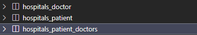

# DB_03(Many to many relationships 1)

날짜: 2024년 10월 14일

# Many to many relationships (N:M or M:N)

한 테이블의 0개 이상의 레코드가 다른 테이블의 0개 이상의 레코드와 관련된 경우

→ 양쪽 모두에게 N:1 관계를 가짐

## M:N 관계의 역할과 필요성 이해하기

- 병원 진료 시스템 모델 관계를 만들며 M:N  관계의 역할과 필요성 이해하기
- 환자와 의사 2개의 모델을 사용하여 모델 구조 구상하기

### 의사와 환자 간 모델 관계 설정

1. 한명의 의사에게 여러 환자가 예약할 수 있도록 설계

```python
# hotels/models.py
from django.db import models

class Doctor(models.Model):
    name = models.TextField()

    def __str__(self):
        return f'{self.pk}번 의사 {self.name}'

class Patient(models.Model):
    doctor = models.ForeignKey(Doctor, on_delete=models.CASCADE)
    name = models.TextField()

    def __str__(self):
        return f'{self.pk}번 환자 {self.name}'

```

### 의사와 환자 데이터 생성

```bash
# 의사와 환자 데이터 생성
doctor1 = Doctor.objects.create(name='allie')
doctor2 = Doctor.objects.create(name='barbie')
patient1 = Patient.objects.create(name='carol', doctor=doctor1)
patient2 = Patient.objects.create(name='duke', doctor=doctor2)
```

### N:1 한계 상황

1번 환자(Carol)가 두 이사 모두에게 진료를 받고자 한다면 환자 테이블에 1번 환자 데이터가 중복으로 입력될 수 밖에 없음

→ 동시에 예약을 남길 수는 없는가?

- 동일한 환자지만 다른 의사에게도 진료 받기 위해 예약하기 위해서는 객체를 하나 더 만들어 진행해야함
- 외래 키 컬럽 ‘1,2’ 형태로 저장하는 것은 DB 타입 문제로 불가능
    
    ⇒ 예약 테이블을 따로 만들자
    

## 중개 모델

### 1. 예약 모델 생성

- 환자 모델의 외래 키를 삭제하고 별도의 예약 모델을 새로 생성
- 예약 모델은 의사와 환자에 각각 N:1 관계를 가짐

```python

from django.db import models

class Doctor(models.Model):
    name = models.TextField()

    def __str__(self):
        return f'{self.pk}번 의사 {self.name}'

# 외래키 삭제
class Patient(models.Model):
    name = models.TextField()

    def __str__(self):
        return f'{self.pk}번 환자 {self.name}'

# 중개모델 작성
class Reservation(models.Model):
    doctor = models.ForeignKey(Doctor, on_delete=models.CASCADE)
    patient = models.ForeignKey(Patient, on_delete=models.CASCADE)

    def __str__(self):
        return f'{self.doctor_id}번 의사의 {self.patient_id}번 환자'
```

### 2. 예약 데이터 생성

- 데이터베이스 초기화 후 Migration 진행 및 shell_plus 실행
- 의사와 환자 생성 후 예약 만들기

```bash
In [1]: doctor1 = Doctor.objects.create(name='allie')

In [2]: patient1 = Patient.objects.create(name='carol')

In [3]: Reservation.objects.create(doctor=doctor1, patient=patient1)
Out[3]: <Reservation: 1번 의사의 1번 환자>
```

### 3. 예약 정보 조회

- 의사와 환자가 예약 모델을 통해 각각 본인의 진료 내역 확인(역참조)

```bash
In [4]: doctor1.reservation_set.all()
Out[4]: <QuerySet [<Reservation: 1번 의사의 1번 환자>]>

In [5]: patient1.reservation_set.all()
Out[5]: <QuerySet [<Reservation: 1번 의사의 1번 환자>]>
```

### 4. 추가 예약 생성

- 1번 의사에게 새로운 환자 예약 생성

```bash
In [6]: patient2 = Patient.objects.create(name='duke')

In [7]: Reservation.objects.create(doctor=doctor1, patient=patient2)
Out[7]: <Reservation: 1번 의사의 2번 환자>

In [8]: doctor1.reservation_set.all()
Out[8]: <QuerySet [<Reservation: 1번 의사의 1번 환자>, <Reservation: 1번 의사의 
2번 환자>]>
```

## ManyToManyField()

M:N 관계 설정 모델 필드

1. 환자 모델에 ManyToManyField 작성
    - 의사 모델에 작성해도 상관 없으며 참조/역참조 관계만 잘 기억할 것
        
        ```python
        from django.db import models
        
        class Doctor(models.Model):
            name = models.TextField()
        
            def __str__(self):
                return f'{self.pk}번 의사 {self.name}'
        
        class Patient(models.Model):
            # ManyToManyField 작성
            doctors = models.ManyToManyField(Doctor)
            name = models.TextField()
        
            def __str__(self):
                return f'{self.pk}번 환자 {self.name}'
        
        # 가진 쪽에서 갖지 못한 곳을 참조
        ```
        
    - 중개 테이블 생성 (중개 모델이 생성됨)
        
        
        
    - 객체 생성
        
        ```bash
        In [1]: doctor1 = Doctor.objects.create(name='allie')
        
        In [2]: patient1 = Patient.objects.create(name='carol')
        
        In [3]: patient2 = Patient.objects.create(name='duke')
        
        In [4]: doctor1
        Out[4]: <Doctor: 1번 의사 allie>
        
        In [5]: patient1
        Out[5]: <Patient: 1번 환자 carol>
        
        In [6]: patient2
        Out[6]: <Patient: 2번 환자 duke>
        ```
        
    - 참조(환자가 예약)
        
        ```bash
        # 생성하는 'add' 메서드 사용
        In [7]: patient1.doctors.add(doctor1)
        
        In [8]: patient1.doctors.all()
        Out[8]: <QuerySet [<Doctor: 1번 의사 allie>]>
        
        In [9]: doctor1.patient_set.all()
        Out[9]: <QuerySet [<Patient: 1번 환자 carol>]>
        
        ```
        
    - 역참조(의사가 예약)
        
        ```bash
        In [10]: doctor1.patient_set.add(patient2)
        
        In [11]: doctor1.patient_set.all()
        Out[11]: <QuerySet [<Patient: 1번 환자 carol>, <Patient: 2번 환자 duke>]>
        
        In [12]: patient2.doctors.all()
        Out[12]: <QuerySet [<Doctor: 1번 의사 allie>]>
        
        In [13]: patient1.doctors.all()
        Out[13]: <QuerySet [<Doctor: 1번 의사 allie>]>
        ```
        
    - 의사가 예약 취소(역참조)
        
        ```bash
        In [14]: doctor1.patient_set.remove(patient1)
        
        In [15]: doctor1.patient_set.all()
        Out[15]: <QuerySet [<Patient: 2번 환자 duke>]>
        
        In [16]: patient1.doctors.all()
        Out[16]: <QuerySet []>
        ```
        
    - 환자가 예약 취소(참조)
        
        ```bash
        In [20]: patient2.doctors.remove(doctor1)
        
        In [21]: patient2.doctors.all()
        Out[21]: <QuerySet []>
        
        In [22]: doctor1.patient_set.all()
        Out[22]: <QuerySet []>
        ```
        
- 추가 정보가 포함되어야 한다면? (병 증상, 예약일 등)

### ‘through’ argument

중개 테이블에 ‘추가 데이터’를 사용해 M:N 관계를 형성하려는 경우에 사용

- Reservation Class 재작성 및 through 설정
    - 이제는 예약 정보에 “증상”과 “예약일”이라는 추가 데이터가 생김
        
        ```python
        from django.db import models
        
        class Doctor(models.Model):
            name = models.TextField()
        
            def __str__(self):
                return f'{self.pk}번 의사 {self.name}'
        
        class Patient(models.Model):
            doctors = models.ManyToManyField(Doctor, through='Reservation')
            name = models.TextField()
        
            def __str__(self):
                return f'{self.pk}번 환자 {self.name}'
        
        class Reservation(models.Model):
            doctor = models.ForeignKey(Doctor, on_delete=models.CASCADE)
            patient = models.ForeignKey(Patient, on_delete=models.CASCADE)
            symptom = models.TextField()
            reserved_at = models.DateTimeField(auto_now_add=True)
        
            def __str__(self):
                return f'{self.doctor.pk}번 의사의 {self.patient.pk}번 환자'
        ```
        
- 데이터베이스 초기화 후 Migration 진행 및 shell_plus 실행
- 의사 1명과 환자 2명 생성
    
    ```bash
    # 기존 방식
    In [1]: doctor1 = Doctor.objects.create(name='allie')
    
    In [2]: patient1 = Patient.objects.create(name='carol')
    
    In [3]: patient2 = Patient.objects.create(name='duke')
    
    ```
    
- 예약 생성 방법 1
    - Reservation class 통합 예약 생성
        
        ```bash
        In [4]: reservation1 = Reservation(doctor=doctor1, patient=patient1, symptom='headache')
        
        In [5]: reservation1.save()
        
        In [6]: doctor1.patient_set.all()
        Out[6]: <QuerySet [<Patient: 1번 환자 carol>]>
        
        In [7]: patient1.doctors.all()
        Out[7]: <QuerySet [<Doctor: 1번 의사 allie>]>
        ```
        
- 예약 생성 방법 2
    - Patient 또는 Doctor의 인스턴스를 통한 예약 생성(through_defaults)
        
        ```bash
        In [8]: patient2.doctors.add(doctor1, through_defaults={'symptom': 'flu'})
        
        In [9]: doctor1.patient_set.all()
        Out[9]: <QuerySet [<Patient: 1번 환자 carol>, <Patient: 2번 환자 duke>]>
        
        In [10]: patient2.doctors.all()
        Out[10]: <QuerySet [<Doctor: 1번 의사 allie>]>
        
        ```
        
- 생성된 예약 확인
    
    
    

## M:N 관계 주요 사항

- M:N 관계로 맺어진 두 테이블에는 물리적인 변화가 없음
- ManyToManyField는 중개 테이블을 자동으로 생성
- ManyToManyField는 M:N 관계를 맺는 두 모델 어디에 위치해도 상관 ㅇ벗음
    - 대신 필드 작성 위치에 따라 참조와 역참조 방향을 주의할 것
- N:1은 완전 종속의 관계였지만 M:N은 종속적인 관계가 아니며 ‘의사에게 진찰받는 환자& 환자를 진찰하는 의사’ 이렇게 2가지 형태 모두 표현 가능

## ManyToManyField(to, **options)

M:N 관계 설정 시 사용하는 모델 필드

### 특징

- 양방향 관계
    - 어느 모델에서든 관련 객체에 접근할 수 있음
- 중복 방지
    - 동일한 관계는 한 번만 저장됨

### 인자 3가지

1. ‘related_name’ arguments
    - 역참조시 사용하는 manager name을 변경
    - 충돌 방지를 위해 필수적으로 써야할 경우가 발생함
    
    ```python
    class Patient(models.Model):
        doctors = models.ManyToManyField(Doctor, related_name='patients')
        name = models.TextField()
    
        def __str__(self):
            return f'{self.pk}번 환자 {self.name}'
        
    # 변경 전
    doctor.patient_set.all()
    
    # 변경 후 
    doctor.patients.all()
    ```
    
2. ‘symmetrical’ arguments
    - 관계 설정 시 대칭 유무 설정
    - ManyToManyField가 동일한 모델을 가리키는 정의에서만 사용
    - 기본 값 : True
    
    ```python
    class Person(models.model):
    	friends = models.ManyToManyField('self')
    	# friends = models.ManyToManyField('self', symmetrical=False)
    ```
    
    - True일 경우
        - source 모델의 인스턴스가 target 모델의 인스턴스를 참조하면 자동으로  target 모델 인스턴스도 source 모델 인스턴스를 자동으로 참조하도록 함(대칭)
        - 즉, 내가 당신의 친구라면 자동으로 당신도 내 친구가 됨
    - Flalse일 경우
        - True와 반대 (대칭되지 않음)
3. ‘through’ arguments
    - 사용하고자 하는 중개모델을 지정
    - 일반적으로 “추가 데이터 M:N 관계와 연결하려는 경우”에 활용
    
    ```python
    class Patient(models.Model):
        doctors = models.ManyToManyField(Doctor, through='Reservation')
        name = models.TextField()
    
        def __str__(self):
            return f'{self.pk}번 환자 {self.name}'
    
    class Reservation(models.Model):
        doctor = models.ForeignKey(Doctor, on_delete=models.CASCADE)
        patient = models.ForeignKey(Patient, on_delete=models.CASCADE)
        symptom = models.TextField()
        reserved_at = models.DateTimeField(auto_now_add=True)
    
        def __str__(self):
            return f'{self.doctor.pk}번 의사의 {self.patient.pk}번 환자'
    ```
    

## M:N에서의 대표 조작 methods

- add()
    - 관계 추가
    - “지정된 객체를 관련 객체 집합에 추가”
- remove()
    - 관계 제거
    - “관련 객체 집합에서 지정된 모델 객체를 제거”

# 좋아요 기능 구현

## Many to many relationships

한 테이블의 0개 이상의 레코드가 다른 테이블의 0개 이상의 레코드와 관련된 경우 → 양쪽 모두에서 N:1 관계를 가짐

## Article(M) - User(N)

0개 이상의 게시글은 0명 이상의 회원과 관련

⇒ 게시글은 회원으로부터 0개 이상의 좋아요를 받을 수 있고, 회원은 0개 이상의 게시글에 좋아요를 누를 수 있음

## 모델 관계 설정

- Article 클래스에 ManyToManyField 작성
    
    ```python
    # articles/models.py
    from django.db import models
    from django.conf import settings
    
    # Create your models here.
    class Article(models.Model):
        user = models.ForeignKey(
            settings.AUTH_USER_MODEL, on_delete=models.CASCADE
        )
        ### 이거 추가 #####
        like_users = models.ManyToManyField(settings.AUTH_USER_MODEL)
        title = models.CharField(max_length=10)
        content = models.TextField()
        created_at = models.DateTimeField(auto_now_add=True)
        updated_at = models.DateTimeField(auto_now=True)
    ```
    
- Migration 시 오류 발생
    
    ```bash
    $ python manage.py makemigrations
    SystemCheckError: System check identified some issues:
    
    ERRORS:
    articles.Article.like_users: (fields.E304) Reverse accessor 'User.article_set' for 'articles.Article.like_users' clashes with reverse accessor for 'articles.Article.user'.
            HINT: Add or change a related_name argument to the definition for 'articles.Article.like_users' or 'articles.Article.user'.
    articles.Article.user: (fields.E304) Reverse accessor 'User.article_set' for 'articles.Article.user' clashes with reverse accessor for 'articles.Article.like_users'.
            HINT: Add or change a related_name argument to the definition for 'articles.Article.user' or 'articles.Article.like_users'.
    ```
    
    - 역참조 에러 발생함(clashes with reverse accessor for 'articles.Article.user'.)
    - N:1
        - 유저가 작성한 게시글
        - user.article_set.all()
    - M: N
        - 유저가 좋아요 누른 게시글
        - user.article_set.all()
- relatedname 작성 후 migration 재 진행
    
    ```python
    class Article(models.Model):
        user = models.ForeignKey(
            settings.AUTH_USER_MODEL, on_delete=models.CASCADE
        )
        like_users = models.ManyToManyField(settings.AUTH_USER_MODEL, related_name='like_articles')
        title = models.CharField(max_length=10)
        content = models.TextField()
        created_at = models.DateTimeField(auto_now_add=True)
        updated_at = models.DateTimeField(auto_now=True)
    ```
    

### User-Article간 사용 가능한 전체 related manager

- article.user
    - 게시글을 작성한 유저
- user.article_set
    - 유저가 작성한 게시글(역참조) - N:1
- article.like_users
    - 게시글을 좋아요 한 유저 - M:N
- user.like_articles
    - 유저가 좋아요 한 게시글(역참조) - M:N

## 기능 구현

1. url 작성
    
    ```python
        # articles/urls.py
        path('<int:article_pk>/likes/', views.likes, name='likes'),
    ```
    
2. views 작성
    
    ```python
    # articles/views.py
    @login_required
    def likes(request, article_pk):
        # 어떤 글에 좋아요를 눌렀는지 글을 먼저 조회
        article = Article.objects.get(pk=article_pk)
        
        # 좋아요를 추가하는 것인지/ 취소하는 것
        # 만약 좋아요를 요청한 유저가 해당 글의 좋아요를 누른 목록에 포함되어 있다면 (좋아요 취소)
        if request.user in article.like_users.all():
            article.like_users.remove(request.user)
        # 그게 아니라 좋아요를 요청한 유저가 해당 글에 좋아요를 누른 유저 목록에 없다면 (좋아요 추가)
        else :
            article.like_users.add(request.user)
        return redirect('articles:index')
    
    ```
    
3. index.html
    
    ```html
    
        <p>작성자: {{ article.user.username }}</p>
        <p>글 번호: {{ article.pk }}</p>
        <a href="">
          <p>글 제목: {{ article.title }}</p>
        </a>
        <p>글 내용: {{ article.content }}</p>
         좋아요 for 버튼 
        <form action="" method="POST">
          
          
            <input type="submit" value="좋아요 취소">
          
            <input type="submit" value="좋아요">
          
        </form>
        <hr>
      
    ```