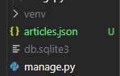

# DB_05(Many to many relationship 2)

날짜: 2024년 10월 15일

# 팔로우 기능 구현

## 프로필 페이지

- 각 회원의 개인 프로필 페이지에 팔로우 기능을 구현하기 위해 프로필 페이지를 먼저 구현하기

### 프로필 구현

1. accounts/urls.py

```python
from django.urls import path
from . import views

app_name = 'accounts'
urlpatterns = [
    path('login/', views.login, name='login'),
    path('logout/', views.logout, name='logout'),
    path('signup/', views.signup, name='signup'),
    path('delete/', views.delete, name='delete'),
    path('update/', views.update, name='update'),
    path('profile/<str:username>/', views.profile, name='profile'),
]
```

1. accounts/views.py

```python
from django.contrib.auth import get_user_model

def profile(request,username):
    # 어떤 유저의 프로필을 보여줄건지 유저를 조회(username을 사용해서 조회)
    User = get_user_model()
    person = User.objects.get(username=username)
    context = {
        'person' : person,
    }
    return render(request, 'accounts/profile.html', context)
```

1. profile.html

```html
<!DOCTYPE html>
<html lang="en">
<head>
    <meta charset="UTF-8">
    <meta name="viewport" content="width=device-width, initial-scale=1.0">
    <title>Document</title>
</head>
<body>
    <h1>{{ person.username }}의 프로필</h1>
     유저가 작성한 게시글 
    <h2>{{ person.username }} 작성한 게시글</h2>
    
        <p>{{ article }}</p>
    
     유저가 작성한 댓글 
    <h2>{{ person.username }} 작성한 댓글</h2>
    
        <p>{{ comment }}</p>
    
     유저가 좋아요한 게시글
    <h2>{{ person.username }} 좋아요한 게시글</h2>
    
        <p>{{ article }}</p>
    
</body>
</html>
```

1. articles/index.html

```html
<!DOCTYPE html>
<html lang="en">
<head>
  <meta charset="UTF-8">
  <meta name="viewport" content="width=device-width, initial-scale=1.0">
  <title>Document</title>
</head>
<body>
  <h1>Articles</h1>

  
    <p>안녕하세요 {{ user.username }}</p>
     이거 추가 
    <a href="">내 프로필</a>
    <a href="">CREATE</a>
    <form action="" method="POST">
      
      <input type="submit" value="LOGOUT">
    </form>
    <form action="" method="POST">
      
      <input type="submit" value="회원탈퇴">
    </form>
    <a href="">회원정보 수정</a>
  
    <a href="">LOGIN</a>
    <a href="">회원가입</a>
  

  
  
     여기 변경 
    <a href="">
      <p>작성자: {{ article.user.username }}</p>
    </a>
    <p>글 번호: {{ article.pk }}</p>
    <a href="">
      <p>글 제목: {{ article.title }}</p>
    </a>
    <p>글 내용: {{ article.content }}</p>
     좋아요 for 버튼 
    <form action="" method="POST">
      
      
        <input type="submit" value="좋아요 취소">
      
        <input type="submit" value="좋아요">
      
    </form>
    <hr>
  

</body>
</html>

```

## 모델 관계 설정

### User(M) - User(N)

0명 이상의 회원은 0명 이상의 회원과 관련

⇒ 회원은 0명 이상의 팔로워를 가질 수 있고, 0명 이상의 다른 회원들은 팔로잉 할 수 있음

### 모델 관계 설정

- ManyToManyField 작성
- 참조
    - 내가 팔로우하는 사람들(팔로잉, followings)
- 역참조
    - 상대방 입장에서 나는 팔로워 중 한 명 (팔로워, followers)
- 바뀌어도 상관 없으나 관계 조회 시 생각하기 편한 방향으로 정한 것
1. accounts.models.py

```python
from django.db import models
from django.contrib.auth.models import AbstractUser

# Create your models here.
class User(AbstractUser):
    followings = models.ManyToManyField('self', symmetrical=False, related_name='followers')

```

## 기능 구현

1. accounts/urls.py

```python
from django.urls import path
from . import views

app_name = 'accounts'
urlpatterns = [
    path('login/', views.login, name='login'),
    path('logout/', views.logout, name='logout'),
    path('signup/', views.signup, name='signup'),
    path('delete/', views.delete, name='delete'),
    path('update/', views.update, name='update'),
    path('profile/<str:username>/', views.profile, name='profile'),
    path('<int:user_pk/follow/', views.follow, name='follow'),
]
```

1. accounts/views.py 

```python
def follow(request, user_pk):
    User = get_user_model()
    # 팔로우 요청을 보내는 대상, 데이터 베이스에서 찾아 
    you = User.objects.get(pk=user_pk)
    # 나(팔로우 요청하는 사람), request 보낸 사람임
    me = request.user

    # 만약 내가 상대방의 팔로워 목록에 이미 있다면 팔로우 취소
    if me in you.followers.all():
        you.followers.remove(me)
        # me.followings.remove(you)
    else : 
        you.followers.add(me)
        # me.followings.add(you)
    return redirect('accounts:profile', you.username)
```

1. accounts/profile.html

```html
<!DOCTYPE html>
<html lang="en">
<head>
    <meta charset="UTF-8">
    <meta name="viewport" content="width=device-width, initial-scale=1.0">
    <title>Document</title>
</head>
<body>
    <h1>{{ person.username }}의 프로필</h1>
    <div>
        팔로윙 ㅣ {{ person.followings.all|length }} / 팔로워 : {{ person.followers.all|length }}
    </div>
    
    <div>
        <form action="" method="POST">
            
            
                <input type="submit" value='언팔로우'>
            
                <input type="submit" value='팔로우'>
            
        </form>
    </div>
    
     유저가 작성한 게시글 
    <h2>{{ person.username }} 작성한 게시글</h2>
    
        <p>{{ article }}</p>
    
     유저가 작성한 댓글 
    <h2>{{ person.username }} 작성한 댓글</h2>
    
        <p>{{ comment }}</p>
    
     유저가 좋아요한 게시글
    <h2>{{ person.username }} 좋아요한 게시글</h2>
    
        <p>{{ article }}</p>
    
</body>
</html>
```

1. accounts/views.py

```python
def follow(request, user_pk):
    User = get_user_model()
    # 팔로우 요청을 보내는 대상, 데이터 베이스에서 찾아 
    you = User.objects.get(pk=user_pk)
    # 나(팔로우 요청하는 사람), request 보낸 사람임
    me = request.user
    # 나와 팔로우 대상자가 같이 않을 경우만 진행(다른 사람과만 팔로우 할 수 있음)
    if me !=you:
    # 만약 내가 상대방의 팔로워 목록에 이미 있다면 팔로우 취소
        if me in you.followers.all():
            you.followers.remove(me)
            # me.followings.remove(you)
        else : 
            you.followers.add(me)
            # me.followings.add(you)
    return redirect('accounts:profile', you.username)
```

# Fixtures

Django가 데이터베이스로 가져오는 방법을 알고 있는 데이터 모음

→ 데이터는 데이터 베이스 구조에 맞추어 작성 되어있음

⇒ 초기 데이터 제공이 사용 목적

## fixtures 관련 명령어

- dumpdata (생성_데이터 추출)
- loaddata (로드_ 데이터 입력)

### dumpdata

데이터베이스의 모든 데이터를 추출

```bash
$ python manage.py dumpdata --indent 4 articles.article > articles.json
(venv) 
```



- json 파일이 생성됨
- 작성된 article이 딕셔너리 형태로 작성되어있음

```bash
$ python manage.py dumpdata --indent 4 articles.comment > comments.json
(venv)
$ python manage.py dumpdata --indent 4 accounts.user > users.json
```

⇒ Fixtures 파일을 직접 만들지 말 것 : 반드시 dumpdata 명령어를 사용하여 생성

### loaddata

Fixtures 데이터를 데이터베이스로 불러오기

### Fixtures 파일 기본 경로 (app_name/fixtures)

⇒ Django는 설치된 모든 app의 디렉토리에서 fixtures 폴더 이후의 경로로 fixtures 폴더 이후의 경로로 fixtures 파일을 찾아 load

### loaddata 활용

- db.sqlite3 파일 삭제 후 migrate 진행
- load 진행 후 데이터가 잘 입력되었는지를 확인

```bash
$ python manage.py loaddata articles.json user.json comments.json
```

# Improve query

“query 개선하기”

⇒ 같은 결과를 얻기 위해 DB 측에 보내는 query 개수를 점차 줄여 조회하기

## annoate

- SQL의 GROUP BY를 사용
- 쿼리셋의 각 객체에 계산된 필드를 추가
- 집계 함수 (Count, Sum 등)와 함께 자주 사용됨

```python
Book.objects.annotate(num_author=Count('authors'))
```

- 의미
    - 결과 객체에 ‘num_author’라는 새로운 필드를 추가
    - 이 필드는 각 책과 연관된 저자의 수를 계산
- 결과
    - 결과에는 기존 필드와 함께 ‘num_authors’ 필드를 가지게 됨
    - book.num_authors로 해당 책의 저자 수에 접근할 수 있게 됨
- 게시글을 조회하면서 댓글 개수까지 한번에 조회해서 가져오기
    
    ```python
    def index_1(request):
        #articles = Article.objects.order_by('-pk')
        articles = Article.objects.annotate(Count('comment')).order_by('-pk')
        context = {
            'articles': articles,
        }
        return render(request, 'articles/index_1.html', context)
    ```
    
    ```html
    <!DOCTYPE html>
    <html lang="en">
    <head>
      <meta charset="UTF-8">
      <meta name="viewport" content="width=device-width, initial-scale=1.0">
      <title>Document</title>
    </head>
    <body>
      <h1>Articles</h1>
      
        <p>제목 : {{ article.title }}</p>
         <p>댓글개수 : {{ article.comment_set.count }}</p> 
        <p>댓글개수 : {{ article.comment__count }}</p>
        <hr>
      
    </body>
    </html>
    ```
    
- 11 queries → 1 query

## select_related

- SQL의 INNER JOIN를 사용
- 1:1 또는 N:1 참조 관계에서 사용
    - ForeignKey나 OneToOneField 관계에 대해 JSON을 수행
- 단일 쿼리로 관련 객체를 함께 가져와 성능을 향상

```python
Book.objects.select_related('publisher')
```

- 의미
    - Book 모델과 연관된 publisher 모델의 데이터를 함께 가져옴
    - ForeignKey 관계인 ‘publisher’를 JOIN하여 단일 쿼리만으로 데이터를 조회
- 결과
    - Book 객체를 조회할 때 연관된 Publisher 정보도 함께 로드
    - book.publisher.name과 같은 접근이 추가적인 데이터베이스 쿼리 없이 가능
- 게시글을 조회하면서 유저 정보까지 한번에 조회해서 가져오기
    
    ```python
    def index_2(request):
        # articles = Article.objects.order_by('-pk')
        articles = Article.objects.select_related('user').order_by('-pk')
        context = {
            'articles': articles,
        }
        return render(request, 'articles/index_2.html', context)
    ```
    
    - 11 queries → 1 query

## prefetch_related

- SQL이 아닌 Python을 사용한 JSON을 진행
    - 관련 객체들을 미리 가져와 메모리에 저장하여 성능을 향상
- M:N 또는 N:1 역참조 관계에서 사용
    - ManyToManyField나 역참조 관계에 대해 별도의 쿼리를 실행

```python
Book.objects.prefetch_related('authors')
```

- 의미
    - Book과 Author는 ManyToMany 관계로 가정
    - Book 모델고 연관된 모든 Author 모델의 데이터를 미리 가져옴
    - Django가 별도로 쿼리로 Author 데이터를 가져와 관계를 설정
- 결과
    - Book 객체들을 조회한 후, 연관된 모든 Author 정보가 미리 로드 됨
    - for auth in book.authors.all()과 같은 반복이 추가적인 데이터베이스 쿼리 없이 실행됨
- 게시글을 조회하면서 참조된 댓글까지 한번에 조회해서 가져오기
    
    ```python
    def index_3(request):
        # articles = Article.objects.order_by('-pk')
        articles = Article.objects.prefetch_related('comment_set').order_by('-pk')
        context = {
            'articles': articles,
        }
        return render(request, 'articles/index_3.html', context)
    ```
    
    - 11 → 1

## select_related & prefetch_related

- 게시글 + 댓글 목록 + 댓글 작성자를 단계적으로 평가
- 게시글을 조회하면서 참조된 댓글까지 한번에 조회
    
    ```python
    def index_4(request):
        # articles = Article.objects.order_by('-pk')
        # articles = Article.objects.prefetch_related('comment_set').order_by('-pk')
        articles = Article.objects.prefetch_related(
            Prefetch('comment_set', queryset=Comment.objects.select_related('user'))
        ).order_by('-pk')
    
        context = {
            'articles': articles,
        }
        return render(request, 'articles/index_4.html', context)
    ```
    
    ```html
    <!DOCTYPE html>
    <html lang="en">
    <head>
      <meta charset="UTF-8">
      <meta name="viewport" content="width=device-width, initial-scale=1.0">
      <title>Document</title>
    </head>
    <body>
      <h1>Articles</h1>
      
        <p>제목 : {{ article.title }}</p>
        <p>댓글 목록</p>
        
          <p>{{ comment.user.username }} : {{ comment.content }}</p>
        
        <hr>
      
    </body>
    </html>
    
    ```