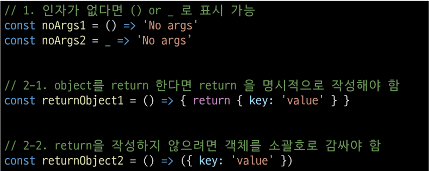

# JavaScript03_참조 자료형 01

날짜: 2024년 10월 23일

# 함수

## Function

참조 자료형에 속하며 모든 함수는 Function object

## 함수 정의

### 함수 구조

```jsx
function name ([param[,[param,[...,param]]]) {
	statements
	return value
}
```

- function 키워드
- 함수의 이름
- 함수의 매개변수
- 함수의 body를 구성하는 statements
- return 값이 없다면 undefined를 반환

### 함수 정의 2가지 방법

1. 선언식 (function declariation)
    
    ```jsx
    function funcName () {
    	statements
    }
    ```
    
2. 표현식 (function expression)
    
    ```jsx
    const funcName = function () {
    	statements
    } 
    ```
    

### 1. 함수 선언식 특징

- 호이스팅 됨
- 코드의 구조와 가독성 면에서는 표현식에 비해 장점이 있음
    
    ```jsx
    // 함수 선언식
        function add (num1, num2) {
          return num1 + num2
        }
        console.log(add(3, 9))
    ```
    

### 2. 함수 표현식 특징

- 호이스팅 되지 않음
    - 변수 선언만 호이스팅되고 함수 할당은 실행 시점에 이루어짐
- 함수 이름이 없는 ‘익명 함수’를 사용할 수 있음
    
    ```jsx
    // 함수 표현식
        const sub = function (num1, num2) {
          return num1 - num2
        }
        console.log(sub(3, 9))
    ```
    

### 함수 표현식 사용을 권장하는 이유

- 예측 가능성
    - 호이스팅의 영향을 받지 않아 코드의 실행 흐름을 더 명확하게 예측할 수 있음
- 유연성
    - 변수에 할당되므로 함수를 값으로 다루기 쉬움
- 스코프 관리
    - 블록 스코프를 가지는 let이나 const와 함께 사용하여 더 엄격한 스코프 관리가 가능

## 매개변수

### 매개변수 정의 방법

1. 기본 함수 매개변수 (Default function parameter)
    - 전달하는 인자가 없거나 undefined가 전달될 경우 이름 붙은 매개변수를 기본값으로 초기화
    
    ```jsx
     const greeting = function (name = 'rang') {
          return `Hi, ${name}`
        }
        console.log(greetins())
    ```
    
2. 나머지 매개변수
    - 임의의 수의 인자를 ‘배열’로 허용하여 가변 인자를 나타내는 방법
    - 작성 규칙
        - 함수 정의 시 나머지 매개변수는 하나만 작성할 수 있음
        - 나머지 매개변수는 함수 정의에서 매개변수 마지막에 위치해야 함
    
    ```
    const myFunc = function (params1, params2, ...restParams) {
          return [params1, params2, restParams]
        }
        console.log(myFunc(1, 2, 3, 4, 5)) // [1,2,[3,4,5]]
        console.log(myFunc(1, 2))    // [1,2,[]]
    ```
    
    ```jsx
      const threeArgs = function (num1, num2, num3) {
          return [num1, num2, num3]
        }
    
        console.log(threeArgs())    // [undefined, undefined, undefined]
        console.log(threeArgs(1))   // [1, undefined, undefined]
        console.log(threeArgs(1, 2))  // [1, 2, undefined]
    ```
    
    ```jsx
    // 2. 매개변수 개수 < 인자 개수
        const noArgs = function () {
          return 0
        }
    
        console.log(noArgs(1, 2, 3))  // 0  => 수 일치가 안되는 것을 무시함
    ```
    
    ```jsx
    const twoArgs = function (num1, num2) {
          return [num1, num2]
        }
    
        console.log(twoArgs(1, 2, 3, 4))  // [1, 2] => 오류를 발생시키지 X 
    ```
    

## Spread syntax

‘…’ (spread syntax) : 전개 구문

### 전개 구문

- 배열이나 문자열 같이 반복 가능한 항목을 펼치는 것(확장, 전개)
- 전개 대상에 따라 역할이 다름
    
    ⇒ 배열이나 객체의 요소를 개별적인 값으로 분리하거나 다른 배열이나 객체의 요소를 현재 배열이나 객체에 추가하는 등
    

### 전개 구문 활용처

1. 함수와의 사용
    1. 함수 호출 시 인자 확장
    2. 나머지 매개변수 (압축) → 선언할 때

### 전개 구문 활용

- 함수와의 사용
    1. 인자 확장
        
        ```jsx
            // 1. 인자 확장 (함수 호출 시)
            let numbers = [1, 2, 3]
            let numbers2 = [1, 2]
            function myFunc(x, y, z) {
              return x + y + z
            }
            console.log(myFunc(numbers[0], numbers[1], numbers[2]))   // 6
            console.log(myFunc(...numbers))   // 6
            console.log(myFunc(...numbers2))    //NaN => 마지막 애기를 undefined로 처리 
            // 1 + 2 + undefined = NaN (숫자가 아니다)
        ```
        
    2. 나머지 매개변수 (함수 선언시)
        
        ```jsx
         // 2. 나머지 매개변수 (함수 선언 시)
            const myFunc2 = function (a1, a2, ...restParams) {
              return [a1, a2, restParams]
            }
            console.log(myFunc2(1, 2, 3, 4, 5)) // [1, 2, [3, 4, 5]]
            console.log(myFunc2(1, 2)) // [1, 2, []]
        ```
        

## 화살표 함수 표현식 (Arrow function expressions)

함수 표현식의 간결한 표현법

```jsx
const arrow = function (name) {
	return `hello, ${name}`
} 

const arrow = name => `hello, ${name}`
```

- 위 두 개가 같은 함수

### 화살표 함수 작성 과정

1. function 키워드 제거 후 매개변수와 중괄호 사이에 화살표(⇒) 작성
2. 함수의 매개변수가 하나 뿐이라면, 매개변수의 ‘()’ 제거 가능 (단, 생략하지 않는 것을 권장)
3. 함수 본문의 표현식이 한 줄이라면, ‘{}’와 ‘return’ 제거 가능

```jsx
 		const arrow1 = function (name) {
      return `hello, ${name}`
    }
    // 1. function 키워드 삭제 후 화살표 작성
    const arrow2 = (name) => {
      return `hello, ${name}`
    }

    // 2. 인자의 소괄호 삭제 (인자가 1개일 경우에만 가능)
    const arrow3 = name => {
      return `hello, ${name}`
    }

    // 3. 중괄호와 return 삭제 (함수 본문이 return을 포함한 표현식 1개일 경우에만 가능)
    const arrow4 = name => `hello, ${name}`
```

# 참고

## 화살표 함수 심화

