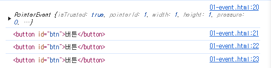

# JavaScript06_Controlling event

날짜: 2024년 10월 28일

# 이벤트

## 웹에서의 이벤트

- 화면을 스크롤 하는 것
- 버튼을 클릭했을 때 팝업 창이 출력되는 것
- 마우스 커서의 위치에 따라 드래그 앤 드롭하는 것
- 사용자의 키보드 입력 값에 따라 새로운 요소를 생성하는 것

⇒ 웹에서의 모든 동작은 이벤트 발생과 함께 한다.

## event 객체

무언가 일어났다는 신호, 사건

⇒ 모든 DOM 요소는 이러한 event를 만들어 냄

### ‘event’ object

- DOM에서 이벤트가 발생했을 때 생성되는 객체
- 이벤트 종류
    - mouse, input, keyboard, touch

⇒ DOM 요소에서 event가 발생하면, 해당 event는 연결된 이벤트 처리기에 의해 처리 됨

## event handler

특정 이벤트가 발생했을 때 실행되는 함수

⇒ 사용자의 행동에 어떻게 반응할지를 JavaScript 코드로 표현한 것

### .addEventListener()

대표적인 이벤트 핸들러 중 하나

⇒ 특정 이벤트를 DOM 요소가 수신할 때마다 콜백 함수를 호출

- EventTarget.addEventListener(type, handler)
- DOM 요소, 수신할 이벤트, 콜백함수
    
    ⇒ 대상에 특정 Event가 발생하면, 지정한 이벤트를 받아 할 일을 등록한다.
    

### addEventListener의 인자

```tsx
element.addEventListner('click', function(event) {
		// 이벤트 처리 로직
})
```

- type
    - 수신할 이벤트 이름
    - 문자열로 작성(ex. ‘click’)
- handler
    - 발생한 이벤트 객체를 수신하는 콜백 함수
    - 이벤트 핸들러는 자동으로 event 객체를 매개변수로 받음

### addEventListener 활용

- “버튼을 클릭하면 버튼 요소 출력하기”
    
    ⇒ 버튼에 이벤트 처리기를 부착하여 클릭 이벤트가 발생하면 이벤트가 발생한 버튼정보를 출력
    

```jsx
<button id="btn">버튼</button>

  <script>
    // 1. 버튼 선택
    const btn = document.querySelector('#btn')

    // 2. 콜백 함수
    const detectClick = function (event) {
      console.log(event)
      console.log(event.currentTarget)
      console.log(event.target)
      console.log(this)
    }

    // 3. 버튼에 이벤트 핸들러를 부착
    btn.addEventListener('click', detectClick)
```



- 요소에 addEventListener를 연결하게 되면 내부의 this 값은 연결된 요소를 가리키게 됨 (event 객체의 currentTarget 속성 값과 동일)

### addEventListner의 콜백 함수 특징

- 이벤트 핸들러 내부의 this는 이벤트 리스너에 연결된 요소(currentTarget)를 가리킴
- 이벤트가 발생하면 event 객체가 생성되어 첫 번째 인자로 전달
    - event 객체가 필요 없는 경우 생략 가능
- 반환 값 없음

## 버블링

- form > div > p 형태의 중첩된 구조에 각각 이벤트 핸들러가 연결되어 있을때 만약 <p> 요소를 클릭하면 어떻게 될까?
    
    ```jsx
    <body>
      <form id="form">
        form
        <div id="div">
          div
          <p id="p">p</p>
        </div>
      </form>
    
      <script>
        const formElement = document.querySelector('#form')
        const divElement = document.querySelector('#div')
        const pElement = document.querySelector('#p')
    
        const clickHandler1 = function (event) {
          console.log('form이 클릭되었습니다.')
        }
        const clickHandler2 = function (event) {
          console.log('div가 클릭되었습니다.')
        }
        const clickHandler3 = function (event) {
          console.log('p가 클릭되었습니다.')
        }
    
        formElement.addEventListener('click', clickHandler1)
        divElement.addEventListener('click', clickHandler2)
        pElement.addEventListener('click', clickHandler3)
      </script>
    </body>
    ```
    
    
    

### 버블링(bubbling)

- “한 요소에 이벤트가 발생하면, 이 요소에 할당된 핸들러가 동작하고, 이어서 부모 요소의 핸들러가 동작하는 현상”
- 가장 최상단의 조상 요소(document)를 만날 때까지 이 과정이 반복되면서 요소 각각에 할당된 핸들러가 동작

⇒ 이벤트가 제일 깊은 곳에 있는 요소에서 시작해 부모 요소를 거슬러 올라가며 발생하는 것이 마치 물속 거품과 닮았기 때문

⇒ 최하휘의 <p> 요소를 클릭하면 p → div → form 순서로 3개의 이벤트 핸들러가 모두 순차적으로 동작했던 것

### 이벤트가 정확히 어디서 발생했는지 접근할 수 있는 방법

- event.currentTarget
- event.target

### ‘currentTarget’ & ‘target’ 속성

- ‘currentTarget’ 속성
    - ‘현재’ 요소
    - 항상 이벤트 핸들러가 연결된 요소만을 참조하는 속성
    - ‘this’와 같음
- ‘target’ 속성
    - 이벤트가 발생한 가장 안쪽의 요소(target)를 참조하는 속성
    - 실제 이벤트가 시작된 요소
    - 버블링이 진행 되어도 변하지 않음

### ‘currentTarget’ & ‘target’ 예시

- 세 요소 중 가장 최상위 요소인 outerouter 요소에만 핸들러가 연결
- 각 요소를 클릭 했을 때 event의 target과 currentTarget의 차이 비교

```jsx
<body>
  <div id="outerouter">
    outerouter
    <div id="outer">
      outer
      <div id="inner">inner</div>
    </div>
  </div>

  <script>
    const outerOuterElement = document.querySelector('#outerouter')
    const outerElement = document.querySelector('#outer')
    const innerElement = document.querySelector('#inner')

    const clickHandler = function (event) {
      console.log('currentTarget:', event.currentTarget.id)
      console.log('target:', event.target.id)
    }

    outerOuterElement.addEventListener('click', clickHandler)
  </script>
```


- ‘currentTarget’
    - 핸들러가 연결된 outerouter 요소만을 가리킴
- ‘target’
    - 실제 이벤트가 발생하는 요소를 가리킴
- 핸들러는 outerouter에만 연결되어 있지만 하위 요소 outer와 inner를 클릭해도 해당 핸들러가 동작함
    
    ⇒ 클릭 이벤트가 어디서 발생했든 상관없이 outerouter까지 이벤트가 버빌링 되어 핸들러를 실행시키기 때문
    

## 캡처링과 버블링

### 캡처링(capturing)

- 이벤트가 하위 요소로 전파되는 단계 (버블링과 반대)
    
    
    

### 캡처링과 버블링

- table의 하위 요소 td를 클릭하면 이벤트는 먼저 최상위 요소부터 아래로 전파됨(캡처링)
- 실제 이벤트가 발생한 지점(event.target)에서 실행된 후 다시 위로 전파 (버블링)
    - 이 전파 과정에서 상위 요소에 할당된 이벤트 핸들러들이 호출되는 것
    
    ⇒ 캡처링은 실제 개발자가 다루는 경우가 거의 없으므로 버블링에 집중하기
    

## 버블링의 필요성

- 만약 각자 다른 동작을 수행하는 버튼이 여러 개가 있다고 가정
- 그렇다면 각 버튼마다 서로 다른 이벤트 핸들러를 할당해야 할까?
    
    ⇒ 각 버튼의 공통 조상인 div 요소에 이벤트 핸들러 단 하나만 할당하기
    

```jsx
<body>
  <div>
    <button>버튼1</button>
    <button>버튼2</button>
    <button>버튼3</button>
    <button>버튼4</button>
    <button>버튼5</button>
  </div>
  <script>
    const divTag = document.querySelector('div')

    const clickHandler = function (event) {
      console.log(event.target)
    }

    divTag.addEventListener('click', clickHandler)
  </script>
</body>
```

- 요소의 공통 조상에 이벤트 핸들러를 단 하나만 할당하면, 여러 버튼 요소에서 발생하는 이벤트를 한꺼번에 다룰 수 있음
- 공통 조상에 할당한 핸들러에서 event.target을 이용하면 실제로 어떤 버튼에서 이벤트가 발생했는지 알 수 있기 때문

## event handler 활용

### event handler 활용 실습

1. 버튼을 클릭하면 숫자를 1씩 증가해서 출력하기
2. 사용자 입력 값을 실시간으로 출력하기
3. 사용자 입력 값을 실시간으로 출력하기 + 버튼을 클릭하면 출력된 값의 CSS 스타일을 변경하기
4. todo 프로그램 구현
5. 로또 번호 생성기 구현

### 1. click 이벤트 실습

- 버튼을 클릭하면 숫자를 1씩 증가

```jsx
<body>
  <button id="btn">버튼</button>
  <p>클릭횟수 : <span id="counter">0</span></p>

  <script>
    // 1. 초기값
    let countNumber = 0

    // 2. 버튼 요소 선택
    const btn = document.querySelector('#btn')
    // 3. 이벤트 핸들러의 콜백 함수
    const clickHandler = function () {
      // 3.1 초기값을 +1 증가
      countNumber += 1

      // 3.2 숫자를 콘텐츠로 가지고 있는 span 태그를 선택
      const spanTag = document.querySelector('#counter')

      // 3.3 span 태그의 콘텐츠 값을 countNumber 값으로 변경
      spanTag.textContent = countNumber
    }
    // 4. 선택 버튼에 이벤트 핸들러 부착
    btn.addEventListener('click', clickHandler)
  </script>
</body>
```

### 2. input 이벤트 실습

- 사용자의 입력 값을 실시간으로 출력하기

```jsx
<body>
  <input type="text" id="text-input">
  <p></p>

  <script>
    // 1. input 요소를 선택 (이벤트가 발생하는 지점)
    const inputTag = document.querySelector('#text-input')
    // 2. p 요소 선택
    const pTag = document.querySelector('p')
    // 3. 콜백 함수 (input 요소에 input 이벤트가 발생할 때 마다 실행될 코드)
    const inputHandler = function (event) {
      // 3.1 이벤트 객체에서 사용자가 입력한 값을 찾아 저장
      // console.log(event)
      // console.log(event.currentTarget)
      // console.log(this)
      console.log(event.currentTarget.value)
      // this.value로 사용해도 동일함
      // this가 달라지는 경우가 있어서 this를 사용하는 것을 추천하지 않음
      const inputData = event.currentTarget.value 
      // 3.2 선택한 p요소의 텍스트 콘텐츠에 할당
      pTag.textContent = inputData
    }
    // 4. 선택한 input 요소에 이벤트 핸들러를 부착
    inputTag.addEventListener("input", inputHandler)
  </script>
</body>
```

### ‘currentTarget’ 주의사항

- console.log()로 event 객체를 출력할 경우 currentTarget 키의 값은 null을 가짐
- currentTarget은 이벤트가 처리되는 동안에만 사용할 수 있기 때문
- 대신 console.log(event.currentTarget)을 사용하여 콘솔에서 확인 가능
    
    ⇒ currentTarget 이후의 속성 값들은 ‘target’을 참고해서 사용하기
    

### 3. click & input 이벤트 실습

- 사용자의 입력 값을 실시간으로 출력
    - ‘+’ 버튼을 클릭하면 출력한 값의 CSS 스타일을 변경하기

```jsx
<body>
  <h1></h1>
  <button id="btn">클릭</button>
  <input type="text" id="text-input">

  <script>
    // 1. input 구현
    // 1.1 input & h1 요소 선택
    const inputTag = document.querySelector('#text-input')
    const h1Tag = document.querySelector('h1')

    // 1.2 
    const inputHandler = function (event) {
      // 1.2.1 사용자 입력 데이터 추출
      const inputData = event.currentTarget.value
      // 1.2.2 추출한 데이터를 h1 요소의 콘텐츠로 할당
      h1Tag.textContent = inputData
    }

    inputTag.addEventListener('input', inputHandler)

    // 2. 버튼 기능 구현
    // 2.1 버튼 요소 선택
    const btn = document.querySelector('#btn')
    // 2.2 콜백 함수
    const clickHandler = function (event) {
      // 2.2.1 h1 요소의 클래스 목록에 blue 문자열 추가
      // h1Tag.classList.add('blue')
      // 2.2.2 혹은 토글 메서드로 구현 가능
      h1Tag.classList.toggle('blue')
    }

    // 2.3 버튼에 이벤트 핸들러 부착
    btn.addEventListener('click', clickHandler)
  </script>
</body>
```

### 4. todo 실습

- todo 추가 기능 구현
    - 빈 문자열 입력 방지
    - 입력이 없을 경우 경고 대화상자를 띄움

```jsx
<script>
    // 1. 필요한 요소들 일단 선택
    const inputTag = document.querySelector('.input-text')
    const btn = document.querySelector('#btn')
    const ulTag = document.querySelector('ul')

    // 2. 콜백 함수 (실제 todo 데이터를 생성 후 추가하는 로직)
    // const addTodo = function (event) {
    //   // 2.1 사용자 입력 데이터 저장
    //   const inputData = inputTag.value

    //   // 2.2 li 태그 생성 
    //   const liTag = document.createElement('li')

    //   // 2.3 li 태그의 텍스트 콘텐츠로 사용자 입력데이터 할당
    //   liTag.textContent = inputData
    //   console.log(liTag)
      
    //   // 2.4 ul 태그의 자식태그로 완성된 li 태그를 자식으로추가
    //   ulTag.appendChild(liTag)

    //   // 2.5 todo 추가 후에 input에 작성한 데이터 지워주기 
    //   inputTag.value = ''
    // }

    const addTodo = function (event) {
      const inputData = inputTag.value

      if (inputData.trim()) {
        const liTag = document.createElement('li')
        liTag.textContent = inputData
        console.log(liTag)
        ulTag.appendChild(liTag)
        inputTag.value = ''
      } else {
        alert("todo를 입력해주세요")
        //window.alert("todo를 입력해주세요")
      }
    } 
    // 3. 버튼에 이벤트 핸들러 부착
    btn.addEventListener('click', addTodo)
  </script>
</body>
```

### 5. 로또 번호 생성기 실습

```jsx
<body>
  <h1>로또 추천 번호</h1>
  <button id="btn">행운 번호 받기</button>
  <div></div>
  <script src="https://cdn.jsdelivr.net/npm/lodash@4.17.21/lodash.min.js"></script>
  <script>
    // 1. 필요한 모든 요소를 선택
    const btn = document.querySelector('#btn')
    const divTag = document.querySelector('div')

    // 2. 로또 번호를 생성하는 함수
    const getNumbers = function () {
      // 2.1 1부터 45까지의 배열을 생성 
      const numbers = _.range(1, 46)

      // 2.2 45개의 요소 중 랜덤으로 6개를 추출
      const sixNumbers = _.sampleSize(numbers, 6)
      return sixNumbers
    }
    // 3. 로또 번호를 화면에 출력하는 함수 (이벤트 핸들러의 콜백 함수)
    const getLottery = function (event) {
      // 3.1 추출한 6개 로또 번호 할당
      const numbers = getNumbers()
      // 3.2 6개의 리스트 요소를 담을 ul tag 생성
      const ulTag = document.createElement('ul')
      // 3.3 추출한 6개 로또 번호를 반복하면서 li 태그를 생성
      numbers.forEach((number) => {
        // 3.4 번호를 담을 li 태그 생성
        const liTag = document.createElement('li')
        // 3.5 반복을 통해 나온 번호를 li 태그의 값으로 할당
        liTag.textContent = number
        // 3.6 완성된 li 태그를 부모 ul 태그의 자식으로 추가
        ulTag.appendChild(liTag)
      })
      // 3.7 완성된 ul 태그를 div 태그의 자식으로 추가
      divTag.appendChild(ulTag)
    }

    // 4. 버튼에 이벤트 핸들러 부착
    btn.addEventListener('click', getLottery)
  </script>
</body>
```

## 이벤트 기본 동작 취소하기

- HTML의 각 요소가 기본적으로 가지고 있는 이벤트가 때로는 방해가 되는 경우가 있어 이벤트의 기본 동작을 취소할 필요가 있음
- 예시
    - form 요소의 제출 이벤트를 취소하여 페이지 새로고침을 막을 수 있음
    - a 요소를 클릭 할 때 페이지 이동을 막고 추가 로직을 수행할 수 있음

### .preventDefault()

- 해당 이벤트에 대한 기본 동작을 실행하지 않도록 지정

```jsx
<body>
  <h1>중요한 내용</h1>

  <form id="my-form">
    <input type="text" name="username">
    <button type="submit">Submit</button>
  </form>

  <script>
    // 1
    const h1Tag = document.querySelector('h1')

    h1Tag.addEventListener('copy', function (event) {
      console.log(event)
      event.preventDefault()
      alert('복사 할 수 없습니다.')
    })

    // 2
    const formTag = document.querySelector('#my-form')

    const handleSubmit = function (event) {
      event.preventDefault()
    }

    formTag.addEventListener('submit', handleSubmit)

  </script>
</body>
```

- form 제출 시 페이지 새로고침 동작 취소
    - form 요소의 submit 동작 (action 값으로 요청)을 취소 시킴

# 참고

## addEventListener와 화살표 함수 관계

- 화살표 함수는 자신만의 this를 생성하지 않음
- 대신, 화살표 함수가 정의된 곳의 상위 스코프의 this를 그대로 사용
- 대부분의 경우, 이는 전역 객체(브라우저에서는 window)를 가리키게 됨
- 해결책
    1. 일반 함수로 사용하기
    2. 화살표 함수일 경우 event.currentTarget을 사용하기
    
    ```jsx
    <body>
      <button id="function">function</button>
      <button id="arrow">arrow function</button>
    
      <script>
        // 일반적인 this 바인딩 규칙
        // 1. 일반 함수 호출: window
        // 2. 메서드 호출: 메서드를 소유한 객체
    
        // addEventListener는 위의 일반적인 규칙과 다르게 동작하는데, 
        // 이는 JavaScript 엔진이 addEventListener 메서드를 특별하게 처리하기 때문
        // 내부 구현 참고 (https://developer.mozilla.org/en-US/docs/Web/API/EventTarget/addEventListener)
    
        const functionButton = document.querySelector('#function')
        const arrowButton = document.querySelector('#arrow')
    
        // 1. 일반 함수 사용
        functionButton.addEventListener('click', function () {
          console.log(this) // <button id="function">function</button>
        })
    
        // 2. 화살표 함수 사용
        arrowButton.addEventListener('click', () => {
          console.log(this) // window
        })
    
        // 3. 화살표 함수에서는 event.currentTarget으로 대체 가능
        arrowButton.addEventListener('click', (event) => {
          console.log(event.currentTarget) // <button id="arrow">arrow function</button>
        })
      </script>
    </body>
    ```