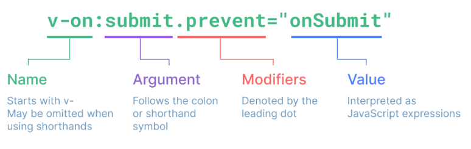

# Vue02_Basic Syntax01

날짜: 2024년 11월 4일

# Template Syntax

DOM을 기본 구성 요소 인스턴스의 데이터에 선언적으로 바인딩할 수 있는 HTML 기반 템플릿 구문을 사용

## Template Syntax 종류

1. Text Interpolation
2. Raw HTML
3. Attribute Bindings
4. JavaScript Expression

# Directive

‘v-’ 접두사가 있는 특수 속성

## Directive 특징

- Directive의 속성 값은 단일 JavaScript 표현식이어야 함 (v-for, v-on)
- 표현식 값이 변경될 때 DOM에 반응적으로 업데이트를 적용

```html
<p v-if="seen">Hi There</p>
```

## Directive 전체 구문



## Directive - “Arguments”

- 일부 directive는 directive 뒤에 콜론 (”:”)으로 표시되는 인자를 사용할 수 있음
- 아래 예시의 href는 HTML <a> 요소의 href 속성 값을 myUrl 값에 바인딩하도록 하는 v-bind의 인자
    
    ```html
    <a v-bind:href="myUrl">Link</a>
    ```
    
- 아례 예시의 click은 이벤트 수신할 이벤트 이름을 작성하는 v-on의 인자
    
    ```html
    <button v-on:click="doSomething">button</button>
    ```
    

## Direcitve - “Modifiers”

- “. (dot)”로 표시되는 특수 접미사로, directive가 특별한 방식으로 바인딩되어야 함을 나타냄
- 아래 예시의 .prevent는 발생한 이벤트에서 event.preventDefault()를 호출하도록 v-on에 지시하는 modifier
    
    ```html
    <form v-on:submit.prevent="onSubmit">
          <input type="submit">
        </form>
    ```
    

### Built-in Directive

- v-text
- v-show
- v-if
- v-for

# Dynamically data binding

## v-bind

하나 이상의 속성 또는 컴포넌트 데이터를 표현식에 동적으로 바인딩

1. Attribute Bindings
2. Class and Style Bindings

### Attirbute Bindings (속성 바인딩)

- HTML의 속성 값을 Vue의 상태 속성 값과 동기화 되도록 함
    
    ```html
    
    <a v-bind:href="myUrl">Move to url</a>
    ```
    
- v-bind shorthand (약어)
    - ‘:’ (colon)
        
        ```html
        
        <a :href="myUrl">Move to url</a>
        ```
        

### Dynamic attribute name (동적 인자 이름)

- 대괄호([])로 감싸서 directive argument에 JavaScript 표현식을 사용할 수 있음
- 표현식에 따라 동적으로 평가된 값이 최종 argument 값으로 사용됨
    
    ```html
    <p :[dynamicattr]="dynamicValue">Dynamic Attr</p>
    ```
    
    - 대괄호 안에 작성하는 이름은 반드시 소문자로만 구성 가능 (브라우저가 속성 이름을 소문자로 강제 변환하기 때문)

### Attribute Bindings 예시

```html
<body>
  <div id="app">
    
    <a :href="myUrl">Move to url</a>
    <p :[dynamicattr]="dynamicValue">Dynamic Attr</p>
  </div>

  <script src="https://unpkg.com/vue@3/dist/vue.global.js"></script>
  <script>
    const { createApp, ref } = Vue

    const app = createApp({
      setup() {
        const imageSrc = ref('https://picsum.photos/200')
        const myUrl = ref('https://www.google.co.kr/')
        const dynamicattr = ref('title')
        const dynamicValue = ref('Hello Vue.js')
        return {
          imageSrc,
          myUrl,
          dynamicattr,
          dynamicValue
        }
      }
    })

    app.mount('#app')
  </script>
</body>
```

## Class and Style Bindings

- class와 style은 모두 HTML 속성이므로 다른 속성과 마찬가지로 v-bind를 사용하여 동적으로 문자열 값을 할당할 수 있음
- Vue는 class 및 style 속성 값을 v-bind로 사용할 때 객체 또는 배열을 활용하여 작성할 수 있도록 함
    
    → 단순히 문자열 연결을 사용하여 이러한 값을 생성하는 것은 번거롭고 오류가 발생하기 쉽기 때문
    

### 1.1 Binding HTML Classes - Binding to Objects

- 객체를 :class에 전달하여 클래스를 동적으로 전환할 수 있음
    
    ```jsx
    const isActive = ref(false)
    ```
    
    ```html
    <div :class="{ 'active':isActive }">Text</div>
    ```
    
- 객체에 더 많은 필드를 포함하여 여러 클래스를 전환할 수 있음
    
    ```jsx
    const app = createApp({
          setup() {
            const isActive = ref(true)
            const hasInfo = ref(false)
            const classObj = ref({
              active: isActive,
              'text_primary': hasInfo
            })
            return {
              isActive,
              hasInfo,
              classObj
            }
          }
        })
    ```
    
    ```html
    <div :class="{ 'active':isActive }">Text</div>
    <div class="static" :class="{ active: isActive, 'text-primary': hasInfo }">Text</div>
    <div class="static" :class="classObj">Text</div>
    ```
    
- 반드시 inline 방식으로 작성하지 않아도 됨
- 반응형 변수를 활용해 객체를 한번에 작성하는 방법
    
    ```jsx
    const classObj = ref({
              active: isActive,
              'text_primary': hasInfo
     })
    ```
    
    ```html
    <div class="static" :class="classObj">Text</div>
    ```
    

### 1.2 Binding HTML Classes - Binding to Arrays

- :class를 배열에 바인딩하여 클래스 목록을 적용할 수 있음
- 배열 구문 내에서 객체 구문을 사용하는 경우
    
    ```jsx
    const activeClass = ref('active')
    const infoClass = ref('text-primary')
    ```
    
    ```html
    <!-- Binding to Arrays -->
    <div :class="[activeClass, infoClass]">Text</div>
    <div :class="[{active:isActive}, infoClass]">Text</div>
    ```
    

### 2.1 Binding Inline Styles - Binding to Objects

- :style은 JavaScript 객체 값에 대한 바인딩을 지원 (HTML style 속성에 해당)
- 실제 CSS에서 사용하는 것처럼 :style은 kebab-cased 키 문자열도 지원
    
    (단, camelCase 작성을 권장)
    
    ```jsx
    const app = createApp({
          setup() {
            const activeColor = ref('crimson')
            const fontSize = ref(50)
            return {
              activeColor,
              fontSize
            }
          }
        })
    ```
    
    ```html
    <div :style="{color : activeColor, fontSize : fontSize + 'px'}">Text</div>
    <div :style="{color : activeColor, 'font-size' : fontSize + 'px'}">Text</div>
    ```
    
- 반드시 inline 방식으로 작성하지 않아도 도미
- 반응형 변수를 활용해 객체를 한번에 작성하는 방법
    
    

# Event Handling

## v-on

DOM 요소에 이벤트 리스너를 연결 및 수신

### v-on 구성

```html
v-on:event="handler"
```


- handler 종류
    1. Inline handlers : 이벤트가 트리거 될 때 실행 될 JavaScript 코드
    2. Method handlers : 컴포넌트에 정의된 메서드 이름
- v-on shorthand (약어)
    - @
    
    ```html
    @event="handler"
    ```
    

### 1. Iline handlers

- Inline handlers는 주로 간단한 상황에 사용

### Method handlers

## Modifiers

### Event Modifiers

- Event Modifier를 활용해 event.preventDefualt()와 같은 구문을 메서드에서 작성하지 않도록 함
- stop, prevent, self 등 다양한 modifiers를 제공
    
    ⇒ 메서드는 DOM 이벤트에 대한 처리보다는 데이터에 관한 논리를 작성하는 것에 집중할 것
    

```html
<form @submit.prevent="onSubmit">
      <input type="submit">
</form>
```

```jsx
const onSubmit = function () {
          console.log('onSubmit')
        }
```

### Key Modifiers

- 키보드 이벤트를 수신할 때 특정 키에 관한 별도 modifiers를 사용할 수 있음
- 예시
    - Key가 Enter 일 때만 onSubmit 이벤트를 호출하기

```html
<input @keyup.enter="onSubmit">
```

# Form Input Bindings

- form을 처리할 때 사용자가 input에 입력하는 값을 실시간으로 JavaScript 상태에 동기화해야 하는 경우 (양방향 바인딩)
- 양방향 바인딩 방법
    1. v-bind와 v-on 함께 사용
    2. v-model 사용

## 1. v-bind with v-on

1. v-bind를 사용하여 input 요소의 value 속성 값을 입력 값으로 사용
2. v-on을 사용하여  input 이벤트가 발생 할 때마다 input 요소의 value 값을 별도 반응형 변수에 저장하는 핸들러를 호출
    
    ```jsx
    const app = createApp({
          setup() {
            const inputText1 = ref('')
            const onInput = function (event) {
              inputText1.value = event.currentTarget.value
            }
            return {
              inputText1,
              onInput
            }
          }
        })
    ```
    
    ```html
    <p>{{ inputText1 }}</p>
        <input :value="inputText1" @input="onInput">
    ```
    

## 2. v-model

form input 요소 또는 컴포넌트에서 양방향 바인딩을 만듦

- 사용자 입력 데이터와 반응형 변수를 실시간 동기화
    
    ```jsx
    const inputText2 = ref('')
    ```
    
    ```html
    <p>{{ inputText2 }}</p>
    <input v-model="inputText2">
    ```
    

⇒ IME가 필요한 언어(한국어, 중국어, 일본어 등)의 경우 v-model이 제대로 업데이트되지 않음

⇒ 해당 언어에 대해 올바르게 응답하려면 v-bind와  v-on 방법을 사용해야 함

### v-model 활용

- v-model은 단순 Text input 뿐만 아니라 Checkbox, Radio, Select 등 다양한 타입의 사용자 입력 방식과 함께 사용 가능

### Checkbox 활용

1. 단일 체크박스와 boolean 값 활용
    
    ```jsx
    const checked = ref(false)
    ```
    
    ```html
    <input type="checkbox" id="checkbox" v-model="checked">
    <label for="checkbox">{{ checked }}</label>
    ```
    
2. 여러 체크박스와 배열 활용
    - 해당 배열에는 현재 선택된 체크박스의 값이 포함됨
        
        ```jsx
        const checkedNames = ref([])
        ```
        
        ```html
        <div>Checked names: {{ checkedNames }}</div>
        
        <input type="checkbox" id="alice" value="Alice" v-model="checkedNames">
        <label for="alice">Alice</label>
        
        <input type="checkbox" id="bella" value="Bella" v-model="checkedNames">
        <label for="bella">Bella</label>
        
        ```
        

### Select 활용

- select에서 v-model 표현식의 초기 값이 어떤 option과도 일치하지 않는 경우 select 요소는 “선택되지 않은(unselected)” 상태로 렌더링 됨
    
    ```jsx
    const selected = ref('')
    ```
    
    ```html
    <div>Selected: {{ selected }}</div>
    
    <select v-model="selected">
      <option disabled value="">Please select one</option>
      <option>Alice</option>
      <option>Bella</option>
      <option>Cathy</option>
    </select>
    ```
    

# 참고

## 접두어 $

### ‘$’ 접두어가 붙은 변수

- Vue 인스턴스 내에서 제공되는 내부 변수

→ 사용자가 지정한 반응형 변수나 메서드와 구분하기 위함

→ 주로 Vue 인스턴스 내부 상태를 다룰 때 사용

## IME (Input Method Editor)

- 사용자가 입력 장치에서 기본적으로 사용할 수 없는 문자(비영어권 언어)를 입력할 수 있도록 하는 운영 체제 구성 프로그램
- 일반적으로 키보드 키보다 자모가 더 많은 언어에서 사용해야 함

→ IME가 동작하는 방식과 Vue의 양방향 바인딩(v-model) 동작 방식이 상충하기 때문에 한국어 입력 시 예상대로 동작하지 않았던 것