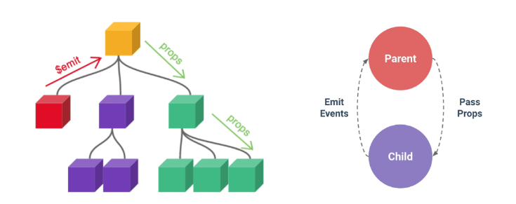

# Vue 05 _ Component State Flow

날짜: 2024년 11월 7일

# Passing Props

## Props

부모 컴포넌트로부터 자식 컴포넌트로 데이터를 전달하는데 사용되는 속성



부모는 자식에게 데이터를 전달(Pass Props)하며, 자식은 자신에게 일어난 일을 부모에게 알림(Emit event)

## Props 특징

- 부모 속성이 업데이트되면 자식으로 전달되지만 그 반대는 안됨
- 즉, 자식 컴포넌트 내부에서 props를 변경하려고 시도해서는 안되며 불가능
- 또한 부모 컴포넌트가 업데이트될 때마다 이를 사용하는 자식 컴포넌트의 모든 props가 최신 값으로 업데이트 됨

⇒ 부모 컴포넌트에서만 변경하고 이를 내려 받는 자식 컴포넌트는 자연스럽게 갱신

## One-Way Data Flow

모든 props는 자식 속성과 부모 속성 사이에 하향식 단방향 바인딩을 형성 (one-way-down binding)

### 단방향인 이유

- 하위 컴포넌트가 실수로 상위 컴포넌트의 상태를 변경하여 앱에서 데이터 흐름을 이해하기 어렵게 만드는 것을 방지하기 위함

⇒ 데이터 흐름의 ‘일관성’ 및 ‘단순화’

## Props 선언

### 사전 준비

1. vue 프로젝트 생성
2. 초기 생성된 컴포넌트 모두 삭제 (App.vue 제외)
3. scr/assets 내부 파일 모두 삭제
4. main.js 해당 코드 삭제 
5. App > Parent > ParentChild 컴포넌트 관계 작성
6. App 컴포넌트 작성

```jsx
// App.vue
<template>
  <div>

  </div>
</template>

<script setup>
  import Parents from '@/components/Parents.vue';
  
</script>
<style scoped>

</style>
```

```jsx
// Parent.vue
<template>
  <div>
    <Parent/>
  </div>
</template>

<script setup>
  import Parent from '@/components/Parent.vue';

</script>
<style scoped>

</style>
```

### Props 선언

부모 컴포넌트에서 내려 보낸 props를 사용하기 위해서는 자식 컴포넌트에서 명시적인 props 선언이 필요

### Props 작성

- 부모 컴포넌트 Parent에서 자식 컴포넌트 ParentChild에 보낼 props 작성

### props 선언

- `defineProps()` 를 사용하여 props를 선언
- `defineProps()` 에 작성하는 인자의 데이터 타입에 따라 선언 방식이 나뉨

```jsx
// ParentChild.vue
<script setup>
// 내려 받은 props를 선언 
defineProps()
</script>
```

### Props 선언 2가지 방식

1. “문자열 배열”을 사용한 선언
    - 배열의 문자열 요소로 props 선언
    - 문자열 요소의 이름은 전달된 props의 이름
    
    ```jsx
    // ParentChild.vue
    <script setup>
    // 내려 받은 props를 선언 
    // 1. 배열 선언 방식
    defineProps(['myMsg'])
    </script>
    ```
    
2. 객체를 사용한 선언
    - 각 객체 속성의 키가 전달받은 props 이름이 되며, 객체 속성의 값은 값이 될 데이터의 타입에 해당하는 생성자 함수 (Number, String…)여야 함
    - 객체 선언 문법 권장
    
    ```jsx
    // ParentChild.vue
    <script setup>
    // 2. 객체 선언 방식
    defineProps({
        myMsg: String
    })
    </script>
    ```
    

### props 데이터 사용

- props 선언 후 템플릿에서 반응형 변수와 같은 방식으로 활용
- props를 객체로 반환하므로 필요한 경우 JavaScript에서 접근 가능
- props 출력 결과 확인
    
    ```jsx
    // ParentChild.vue
    <script setup>
    // props 데이터를 활용해야하는 경우
    const props = defineProps({ myMsg : String})
    console.log(props)
    console.log(props.myMsg)
    </script>
    ```
    

### 한 단계 더 props 내려 보내기

- ParentChild 컴포넌트를 부모로 갖는 ParentGrandChild 컴포넌트 생성 및 등록
    
    ```jsx
    // ParentChild.vue 
    <script setup>
    import ParentGrandChild from '@/components/ParentGrandChild.vue'
    ```
    
- 이후 위 Parent와 ParentChild 과정 반복!
- 출력 결과 확인
- ParentGrandChild가 받아서 출력하는 props은 parent에 정의 되어있는 props이며 Parent가 props을 변경할 경우 이를 전달 받고 있는 ParentChild, ParentGrandChild에서도 모두 업데이트 됨

## Props 세부사항

### 1. Props Name Casing (Props 이름 컨벤션)

- 자식 컴포넌트로 전달 시 (→ kebab-case)
    
    ```jsx
    <ParentChild my-msg="message" />
    ```
    
- 선언 및 템플릿 참조 시 (→ camelCase)
    
    ```jsx
    defineProps({
    	myMsg: String
    })
    ```
    
    ```jsx
    <p>{{ myMsg }}</p>
    ```
    

### 2. Static props & Dynamic props

- 지금까지 작성한 것은 Static(정적) props
- v-bind를 사용하여 동적으로 할당된 props를 사용할 수 있음
1. Dynamic props 정의
    
    ```jsx
    // Parent.vue
    <template>
      <div>
        <ParentChild 
            my-msg = "message"
            :dynamic-props="name"
        />
      </div>
    </template>
    
    <script setup>
    import ParentChild from '@/components/ParentChild.vue';
    import {ref} from 'vue'
    
    const name = ref('Alice')
    </script>
    
    <style scoped>
    
    </style>
    ```
    
2. Dynamic props 선언 및 출력
    
    ```jsx
    // ParentChild.vue
    // script
    defineProps({
        myMsg: String,
        dynamicProps: String
    })
    ```
    
    ```jsx
    // ParentChild.vue
    // template
    <p>{{ dynamicProps }}</p>
    ```
    

### 다른 디렉티브와 함께 사용

- v-for와 함께 사용하여 반복되는 요소를 props로 전달하기
- ParentItem 컴포넌트 생성 및 Parent의 하위 컴포넌트로 등록
- 데이터 정의 및 v-for 디렉티브의 반복 요소로 활용
- 각 반복 요소를 props로 내려보기
    
    ```jsx
    // Parnet.vue
    // script
    const items = ref([
        {id:1, name:'사과'},
        {id:2, name:'바나나'},
        {id:3, name:'딸기'}
    ])
    ```
    
    ```jsx
    // Parnet.vue
    // template
    <ParentItem
            v-for="item in items"
            :key="item.id"
            :my-prop="item"
     />
    ```
    
    ```jsx
    // ParentItem.vue
    <template>
        <div>
            <p>{{ myProp.id }}</p>
            <p>{{ myProp.name }}</p>
        </div>
    </template>
    
    <script setup>
    defineProps({
        myProp: Object
    })
    </script>
    ```
    

# Component Events

## Emit


부모는 자식에게 데이터를 전달(Pass Props)하며, 자식은 자신에게 일어난 일을 부모에게 알림(Emit Event)

⇒ 부모가 props 데이터를 변경하도록 소리쳐야 한다.

## `$emit()`

자식 컴포넌트가 이벤트를 발생시켜 부모 컴포넌트로 데이터를 전달하는 역할의 메서드

- $ 표기는 Vue 인스턴스의 내부 변수들을 가리킴
- Life cycle hooks, 인스턴스 메서드 등 내부 특정 속성에 접근할 때 사용

`$emit(event, ...args)`

- event
    - 커스텀 이벤트 이름
- args
    - 추가 인자

## 이벤트 발신 및 수신

- `$emit` 을 사용하여 템플릿 표현식에서 직접 사용자 정의 이벤트를 발신
    
    ```jsx
    // ParentChilde.vue
    // template
    <button @click="$emit('someEvent')">클릭</button>
    ```
    
- ParentChild의 부모 Parent는 v-on을 사용하여 발신된 이벤트를 수신
- 수신 후 처리할 로직 및 콜백함수 호출
    
    ```jsx
     // Parent.vue 
     // template
     <ParentChild @some-event="someCallback"/>
    ```
    
    ```jsx
    // Parent.vue
    // script
    const someCallback = function () {
        console.log('자식 컴포넌트에서 발신한 이벤트를 수신했어요')
    }
    
    ```
    

## emit 이벤트 선언

- `defineEmits()`를 사용하여 발신할 이벤트 선언
- props와 마찬가지로 `defineEmits()` 에 작성하는 인자의 데이터 타입에 따라 선언 방식이 나뉨 (배열, 객체)
- `defineEmits()`는 `$emit` 대신 사용할 수 있는 동등한 함수를 반환 (script에서는 `$emit` 메서드를 접근할 수 없기 때문)

```jsx
// Parentchild.vue
// Script
// emit 이벤트 선언 (배열방식, 객체 방식)
const emit = defineEmits(["someEvent"])

const buttonClick = function () {
    emit('someEvent')
}

```

```jsx
// Parentchild.vue
// template
button @click="buttonClick">클릭</button>
```

## 이벤트 전달

### 이벤트 인자 (Event Arguments)

- 이벤트 발신 시 추가 인자를 전달하여 값을 제공할 수 있음
- ParentChild에서 이벤트를 발신하여 Parent로 추가 인자 전달하기

```jsx
// ParentChild.vue 
// script
const emit = defineEmits(["someEvent", "emitArgs"])

const emitArgs = function () {
    emit('emitArgs', 1, 2, 3)
}
```

```jsx
// ParentChild.vue 
// template
<button @click="emitArgs">추가 인자 전달</button>
```

- ParentChild에서 발신한 이벤트를 Parent에서 수신

```jsx
// Parent.vue 
// template
<ParentChild 
        my-msg = "message"
        :dynamic-props="name"
        @some-event="someCallback"
        @emit-args="getNumbers"
 />
```

```jsx
// Parent.vue 
// Script
const getNumbers = function (...args) {
    console.log(args)
    console.log('자식에게 받은 ㅇㅉㄱ')
}
```

## 이벤트 세부사항

### Event Name Casing

- 선언 및 발신 시 (→ camelCase)
    
    ```jsx
    <button @click="$emit('someEvent')">클릭</button>
    
    const emit = defineEmits(["someEvent"])
    ```
    
- 부모 컴포넌트에서 수신 시 (→ kebab-case)
    
    ```jsx
    <ParentChild 
            my-msg = "message"
            :dynamic-props="name"
            @some-event="someCallback"
            @emit-args="getNumbers"
     />
    ```
    

## emit 이벤트 실습

- 최하단 컴포넌트 ParentGrandChild에서 Parent 컴포넌트의 name 변수 변경 요청하기
    
    
    
- ParentGrandChild에서 이름 변경을 요청하는 이벤트 발신

```jsx
<template>
    <div>
        <p>{{ myMsg }}</p>
        <button @click="updateName">이름 변경!</button>
    </div>
</template>

<script setup>
defineProps({
    myMsg: String
})

const emit = defineEmits(['updateName'])

const updateName = function () {
    emit('updateName')
}
</script>
```

- 이벤트 수신 후 이름 변경을 요청하는 이벤트 발신

```jsx
// ParentChild.vue 
// script
const emit = defineEmits(["someEvent", "emitArgs", "updateName"])

const updateName = function () {
    emit('updateName')
}
```

```jsx
// ParentChild.vue 
// template
<ParentGrandChild
	 :my-msg="myMsg" 
	 @update-name="updateName"    
/>
```

- 이벤트 수신 후 이름 변수 변경 메서드 호출
- 해당 변수를 props으로 받는 모든 곳에서 자동 업데이트

```jsx
// Parent.vue 
// script
const updateName = function () {
    name.value = 'Bella'
}
```

```jsx
// Parent.vue 
// template
<ParentChild 
        my-msg = "message"
        :dynamic-props="name"
        @some-event="someCallback"
        @emit-args="getNumbers"
        @update-name="updateName"
 />
```

# 참고

## 정적 & 동적 props 주의 사항

- 첫 번째는 정적 props로 문자열 “1”을 전달
- 두 번째는 동적 props로 숫자 “1”을 전달

```jsx
// 1번
<someComponent num-props="1" />
// 2번 
<someComponent :num-props="1" />
```

## Props & Emit 객체 선언 문법

### Props 선언 시 “객체 선언 문법”을 권정하는 이유

- 컴포넌트를 가독성이 좋게 문서화하는 데 도움이 되며, 다른 개발자가 잘못된 유형을 전달할 때에 브라우저 콘솔에 경고를 출력하도록 함
- 추가로 props에 대한 유효성 검사로써 활용 가능

```jsx
defineProps({
	// 여러 타입 허용
	propB = [String, Number],
	// 문자열 필수
	propC: {
		type:String,
		required: true
	},
	// 기본 값을 가지는 숫자형
	propD: {
		type: Number,
		default: 10
	},
```

### emit 이벤트도 “객체 선언 문법”으로 작성 가능

- emit 이벤트 또한 객체 구문으로 선언 된 경우 유효성을 검사할 수 있음